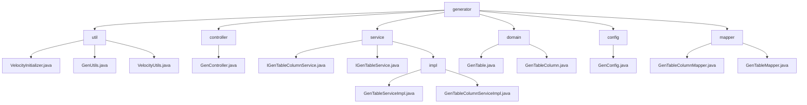

# 基础信息

|      |      |
|------|------|
| 编码语言 | .java |
| 代码路径 | ruoyi-system/ruoyi-generator/src/main/java/com/ruoyi |
| 包名 | ruoyi-system.ruoyi-generator.src.main.java.com.ruoyi |
| 概述说明 | VelocityInitializer类初始化引擎，GenUtils类处理表信息，VelocityUtils类生成模板，控制器处理数据操作，GenTableServiceImpl和GenTableColumnServiceImpl类管理业务数据，GenTable和GenTableColumn类描述表结构，GenConfig类配置生成器属性。 |

# 说明

VelocityInitializer类负责初始化Velocity引擎，配置资源加载器和字符集，确保引擎启动时具备所需资源和字符编码，为模板处理和渲染提供基础支持。GenUtils类主要用于表信息的初始化和列属性字段的设置，处理类名、包名、模块名和业务名等关键信息，并配置列类型、查询类型及HTML控件，确保表信息准确性和一致性，为业务处理提供基础支持。VelocityUtils类是一个工具类，用于生成模板上下文和文件路径，支持多种模板类型和配置选项，灵活处理不同模板需求，简化模板管理和使用过程。控制器处理代码生成，具备查询、导入、修改、删除、预览、下载及同步数据库等多种功能，确保系统能够高效地管理和维护数据。GenTableServiceImpl类实现了IGenTableService接口，提供业务数据的查询、修改、删除、导入及代码自动生成功能，显著提升开发效率和系统维护便捷性。GenTableColumnServiceImpl类负责业务字段的查询、新增、修改和删除操作，支持获取字段详细信息、添加新字段、更新字段属性及删除无用字段，确保业务字段管理的高效性和数据处理的准确性。GenTable类用于管理表信息，包含表ID、名称、描述、关联表、实体类名称、模板、包路径、模块名、业务名、功能名、作者、表单布局、生成方式、路径、主键、子表、列信息、树编码、父编码、名称字段、上级菜单ID和名称等属性，详细描述表的结构和配置信息，支持复杂的数据管理和生成操作。GenTableColumn类继承自BaseEntity，包含列ID、表ID、列名、列描述、列类型、Java类型、Java字段名、主键标识、自增标识、必填标识、插入标识、编辑标识、列表标识、查询标识、查询方式、显示类型、字典类型和排序等属性，用于定义数据库表中列的各种特征和行为，并通过相应方法进行管理和操作。GenConfig类配置生成器属性涵盖多个关键配置项，包括作者信息、包路径设置、表前缀处理方式以及文件覆盖权限控制，确保生成的代码符合特定需求和规范。

### 包内部结构视图

该流程图展示了`ruoyi-generator`模块的目录结构及其文件层级关系。`generator`作为根目录，包含`util`、`controller`、`service`、`domain`、`config`和`mapper`等子目录。每个子目录下进一步细分为具体的Java文件，如`VelocityInitializer.java`、`GenController.java`等，展示了模块内各功能组件的组织方式。

# 文件列表 File List

| 名称   | 类型  | 说明 |
|-------|------|-------------|
| [generator](generator/_module.md) | package | VelocityInitializer类初始化引擎，GenUtils类处理表信息，VelocityUtils类生成模板，控制器处理数据操作，GenTableServiceImpl和GenTableColumnServiceImpl类管理业务数据，GenTable和GenTableColumn类描述表结构，GenConfig类配置生成器属性。 |

