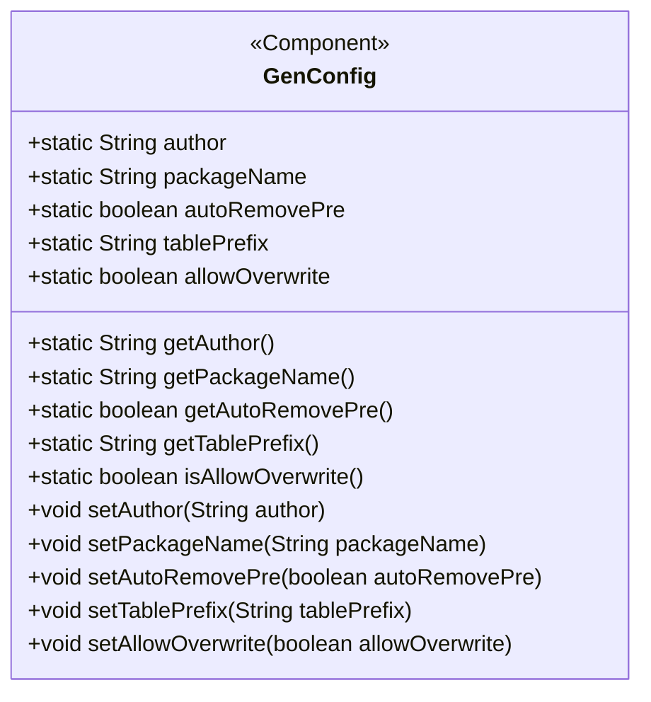

# 基础信息

|      |      |
|------|------|
| 编码语言 | .java |
| 代码路径 | ruoyi-system/ruoyi-generator/src/main/java/com/ruoyi/generator/config/GenConfig.java |
| 包名 | com.ruoyi.generator.config |
| 依赖项 | ['org.springframework.beans.factory.annotation.Value', 'org.springframework.boot.context.properties.ConfigurationProperties', 'org.springframework.context.annotation.PropertySource', 'org.springframework.stereotype.Component'] |
| 概述说明 | GenConfig类配置生成器属性，涵盖作者、包路径、表前缀处理及文件覆盖权限。 |

# 说明

GenConfig类配置生成器属性涵盖多个关键配置项，包括作者信息、包路径设置、表前缀处理方式以及文件覆盖权限控制。这些属性共同决定了生成器的行为，确保生成的代码符合特定需求和规范。

# 类列表 Class Summary

| 名称   | 类型  | 说明 |
|-------|------|-------------|
| GenConfig | class | GenConfig类配置生成器属性，包括作者、包路径、表前缀处理及文件覆盖权限。 |

## 类 GenConfig

|      |      |
|------|------|
| 访问范围 | @Component;@ConfigurationProperties(prefix = "gen");@PropertySource(value = { "classpath:generator.yml" });public |
| 类型 | class |
| 名称 | GenConfig |
| 说明 | GenConfig类配置生成器属性，包括作者、包路径、表前缀处理及文件覆盖权限。 |

### UML类图

**描述：**  
`GenConfig`类是一个Spring组件，用于配置代码生成器的相关属性。它通过`@ConfigurationProperties`注解绑定配置文件中的属性，并通过`@PropertySource`指定配置文件路径。类中包含多个静态字段，如作者、包路径、表前缀等，并提供了对应的getter和setter方法。这些方法通过`@Value`注解从配置文件中注入值，确保配置的灵活性和可维护性。

### 内部方法调用关系图

```mermaid
graph TD
    A["类GenConfig"]
    B["属性: static String author"]
    C["属性: static String packageName"]
    D["属性: static boolean autoRemovePre"]
    E["属性: static String tablePrefix"]
    F["属性: static boolean allowOverwrite"]
    G["方法: static String getAuthor()"]
    H["方法: @Value('${author}') void setAuthor(String author)"]
    I["方法: static String getPackageName()"]
    J["方法: @Value('${packageName}') void setPackageName(String packageName)"]
    K["方法: static boolean getAutoRemovePre()"]
    L["方法: @Value('${autoRemovePre}') void setAutoRemovePre(boolean autoRemovePre)"]
    M["方法: static String getTablePrefix()"]
    N["方法: @Value('${tablePrefix}') void setTablePrefix(String tablePrefix)"]
    O["方法: static boolean isAllowOverwrite()"]
    P["方法: @Value('${allowOverwrite}') void setAllowOverwrite(boolean allowOverwrite)"]

    A --> B
    A --> C
    A --> D
    A --> E
    A --> F
    A --> G
    A --> H
    A --> I
    A --> J
    A --> K
    A --> L
    A --> M
    A --> N
    A --> O
    A --> P
```

这段代码定义了一个名为 `GenConfig` 的配置类，用于管理代码生成器的配置属性。该类包含五个静态属性：`author`、`packageName`、`autoRemovePre`、`tablePrefix` 和 `allowOverwrite`，并为每个属性提供了对应的 `getter` 和 `setter` 方法。`setter` 方法使用 `@Value` 注解从配置文件中注入值。该类还使用了 `@Component` 和 `@ConfigurationProperties` 注解，表明它是一个 Spring 组件，并从指定的配置文件中加载属性。

### 字段列表 Field List

| 名称  | 类型  | 说明 |
|-------|-------|------|
| author | String | 声明一个静态字符串变量author。 |
| tablePrefix | String | 定义静态字符串变量tablePrefix。 |
| packageName | String | 静态字符串变量存储包名。 |
| autoRemovePre | boolean | 自动移除前缀的静态布尔变量。 |
| allowOverwrite | boolean | 静态布尔变量控制是否允许覆盖。 |

### 方法列表 Method List

| 名称  | 类型  | 说明 |
|-------|-------|------|
| getPackageName | String | 静态方法返回包名。 |
| getAuthor | String | 静态方法返回作者信息。 |
| getAutoRemovePre | boolean | 获取自动移除前置状态的方法。 |
| setAutoRemovePre | void | 设置自动移除前缀的布尔值配置。 |
| setAllowOverwrite | void | 设置允许覆盖配置的布尔值方法。 |
| isAllowOverwrite | boolean | 方法isAllowOverwrite返回布尔值allowOverwrite。 |
| setPackageName | void | 通过注解设置包名并更新配置。 |
| getTablePrefix | String | 获取表前缀的静态方法。 |
| setAuthor | void | 通过注解设置作者属性，并将其赋值给GenConfig类的静态变量author。 |
| setTablePrefix | void | 设置表前缀方法，将传入值赋给GenConfig的tablePrefix。 |

