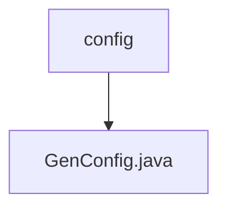

# 基础信息

|      |      |
|------|------|
| 编码语言 | .java |
| 代码路径 | ruoyi-system/ruoyi-generator/src/main/java/com/ruoyi/generator/config |
| 包名 | ruoyi-system.ruoyi-generator.src.main.java.com.ruoyi.generator.config |
| 概述说明 | GenConfig类配置生成器属性，涵盖作者、包路径、表前缀处理及文件覆盖权限。 |

# 说明

GenConfig类配置生成器属性涵盖多个关键配置项，包括作者信息、包路径设置、表前缀处理方式以及文件覆盖权限控制。这些属性共同决定了生成器的行为，确保生成的代码符合特定需求和规范。

### 包内部结构视图

该流程图展示了`ruoyi-system/ruoyi-generator/src/main/java/com/ruoyi/generator/config`路径下的层级关系。`config`文件夹包含了`GenConfig.java`文件，表示配置文件的结构。

# 文件列表 File List

| 名称   | 类型  | 说明 |
|-------|------|-------------|
| [GenConfig.java](GenConfig.md) | file | GenConfig类配置生成器属性，涵盖作者、包路径、表前缀处理及文件覆盖权限。 |

