# 基础信息

|      |      |
|------|------|
| 编码语言 | .java |
| 代码路径 | ruoyi-system/ruoyi-generator/src/main/java/com/ruoyi/generator/controller/GenController.java |
| 包名 | com.ruoyi.generator.controller |
| 依赖项 | ['java.io.IOException', 'java.util.ArrayList', 'java.util.List', 'java.util.Map', 'javax.servlet.http.HttpServletResponse', 'org.apache.commons.io.IOUtils', 'org.apache.shiro.authz.annotation.RequiresPermissions', 'org.apache.shiro.authz.annotation.RequiresRoles', 'org.springframework.beans.factory.annotation.Autowired', 'org.springframework.stereotype.Controller', 'org.springframework.ui.ModelMap', 'org.springframework.validation.annotation.Validated', 'org.springframework.web.bind.annotation.GetMapping', 'org.springframework.web.bind.annotation.PathVariable', 'org.springframework.web.bind.annotation.PostMapping', 'org.springframework.web.bind.annotation.RequestMapping', 'org.springframework.web.bind.annotation.ResponseBody', 'com.alibaba.druid.DbType', 'com.alibaba.druid.sql.SQLUtils', 'com.alibaba.druid.sql.ast.SQLStatement', 'com.alibaba.druid.sql.dialect.mysql.ast.statement.MySqlCreateTableStatement', 'com.alibaba.fastjson.JSON', 'com.ruoyi.common.annotation.Log', 'com.ruoyi.common.core.controller.BaseController', 'com.ruoyi.common.core.domain.AjaxResult', 'com.ruoyi.common.core.domain.CxSelect', 'com.ruoyi.common.core.page.TableDataInfo', 'com.ruoyi.common.core.text.Convert', 'com.ruoyi.common.enums.BusinessType', 'com.ruoyi.common.utils.StringUtils', 'com.ruoyi.common.utils.security.PermissionUtils', 'com.ruoyi.common.utils.sql.SqlUtil', 'com.ruoyi.generator.config.GenConfig', 'com.ruoyi.generator.domain.GenTable', 'com.ruoyi.generator.domain.GenTableColumn', 'com.ruoyi.generator.service.IGenTableColumnService', 'com.ruoyi.generator.service.IGenTableService'] |
| 概述说明 | 控制器代码生成，支持查询、导入、修改、删除、预览、下载及数据库同步功能。 |

# 说明

控制器处理代码生成，具备查询、导入、修改、删除、预览、下载及同步数据库等多种功能。这些功能涵盖了数据处理的核心操作，确保系统能够高效地管理和维护数据。通过控制器，用户可以方便地执行各种数据操作，提升系统的灵活性和可扩展性。

# 类列表 Class Summary

| 名称   | 类型  | 说明 |
|-------|------|-------------|
| GenController | class | 控制器处理代码生成，包含查询、导入、修改、删除、预览、下载、同步数据库等功能。 |

## 类 GenController

|      |      |
|------|------|
| 访问范围 | @Controller;@RequestMapping("/tool/gen");public |
| 类型 | class |
| 名称 | GenController |
| 说明 | 控制器处理代码生成，包含查询、导入、修改、删除、预览、下载、同步数据库等功能。 |

### UML类图

```mermaid
classDiagram
    class GenController {
        -String prefix
        -IGenTableService genTableService
        -IGenTableColumnService genTableColumnService
        +String gen()
        +TableDataInfo genList(GenTable genTable)
        +TableDataInfo dataList(GenTable genTable)
        +TableDataInfo columnList(GenTableColumn genTableColumn)
        +String importTable()
        +String createTable()
        +AjaxResult importTableSave(String tables)
        +String edit(Long tableId, ModelMap mmap)
        +AjaxResult editSave(GenTable genTable)
        +AjaxResult remove(String ids)
        +AjaxResult create(String sql)
        +AjaxResult preview(Long tableId)
        +void download(HttpServletResponse response, String tableName)
        +AjaxResult genCode(String tableName)
        +AjaxResult synchDb(String tableName)
        +void batchGenCode(HttpServletResponse response, String tables)
        -void genCode(HttpServletResponse response, byte[] data)
    }

    class BaseController {
        // 基类，提供公共方法
    }

    class IGenTableService {
        <<Interface>>
        +List~GenTable~ selectGenTableList(GenTable genTable)
        +List~GenTable~ selectDbTableList(GenTable genTable)
        +List~GenTable~ selectDbTableListByNames(String[] tableNames)
        +GenTable selectGenTableById(Long tableId)
        +List~GenTable~ selectGenTableAll()
        +void importGenTable(List~GenTable~ tableList, String operName)
        +void validateEdit(GenTable genTable)
        +void updateGenTable(GenTable genTable)
        +void deleteGenTableByIds(String ids)
        +boolean createTable(String sql)
        +Map~String, String~ previewCode(Long tableId)
        +byte[] downloadCode(String tableName)
        +void generatorCode(String tableName)
        +void synchDb(String tableName)
        +byte[] downloadCode(String[] tableNames)
    }

    class IGenTableColumnService {
        <<Interface>>
        +List~GenTableColumn~ selectGenTableColumnListByTableId(GenTableColumn genTableColumn)
    }

    class TableDataInfo {
        +List~GenTable~ rows
        +int total
        +void setRows(List~GenTable~ rows)
        +void setTotal(int total)
    }

    class AjaxResult {
        +static AjaxResult success()
        +static AjaxResult error(String message)
        +void setData(Map~String, String~ data)
    }

    class GenTable {
        // 数据表实体类
    }

    class GenTableColumn {
        // 数据表字段实体类
    }

    class CxSelect {
        +String name
        +String value
        +List~CxSelect~ s
        +CxSelect(String name, String value)
        +void setS(List~CxSelect~ s)
    }

    class SqlUtil {
        +static void filterKeyword(String sql)
    }

    class SQLUtils {
        +static List~SQLStatement~ parseStatements(String sql, DbType dbType)
    }

    class MySqlCreateTableStatement {
        +String getTableName()
        +String toString()
    }

    class DbType {
        // 数据库类型枚举
    }

    class SQLStatement {
        // SQL语句基类
    }

    class Convert {
        +static String[] toStrArray(String tables)
        +static String toStr(Object obj)
    }

    class PermissionUtils {
        +static Object getPrincipalProperty(String property)
    }

    class GenConfig {
        +static boolean isAllowOverwrite()
    }

    class IOUtils {
        +static void write(byte[] data, OutputStream outputStream)
    }

    class HttpServletResponse {
        +void reset()
        +void setHeader(String name, String value)
        +void addHeader(String name, String value)
        +void setContentType(String type)
        +OutputStream getOutputStream()
    }

    class ModelMap {
        +void put(String key, Object value)
    }

    class JSON {
        +static String toJSON(Object obj)
    }

    class Logger {
        +void error(String message, Exception e)
    }

    GenController --> BaseController : 继承
    GenController --> IGenTableService : 依赖
    GenController --> IGenTableColumnService : 依赖
    GenController --> TableDataInfo : 依赖
    GenController --> AjaxResult : 依赖
    GenController --> GenTable : 依赖
    GenController --> GenTableColumn : 依赖
    GenController --> CxSelect : 依赖
    GenController --> SqlUtil : 依赖
    GenController --> SQLUtils : 依赖
    GenController --> MySqlCreateTableStatement : 依赖
    GenController --> DbType : 依赖
    GenController --> SQLStatement : 依赖
    GenController --> Convert : 依赖
    GenController --> PermissionUtils : 依赖
    GenController --> GenConfig : 依赖
    GenController --> IOUtils : 依赖
    GenController --> HttpServletResponse : 依赖
    GenController --> ModelMap : 依赖
    GenController --> JSON : 依赖
    GenController --> Logger : 依赖
```

**描述：**  
`GenController` 是一个Spring MVC控制器，负责处理代码生成相关的请求。它依赖于`IGenTableService`和`IGenTableColumnService`接口来操作数据库表和字段信息。控制器提供了多种方法，如查询代码生成列表、导入表结构、修改代码生成业务、创建表结构、生成代码等。通过这些方法，用户可以在系统中进行代码生成、表结构导入和修改等操作。控制器还使用了`TableDataInfo`和`AjaxResult`类来封装返回数据，并通过`HttpServletResponse`处理文件下载请求。

### 内部方法调用关系图

```mermaid
graph TD
    A["类GenController"]
    B["属性: String prefix"]
    C["属性: IGenTableService genTableService"]
    D["属性: IGenTableColumnService genTableColumnService"]
    E["方法: String gen()"]
    F["方法: TableDataInfo genList(GenTable genTable)"]
    G["方法: TableDataInfo dataList(GenTable genTable)"]
    H["方法: TableDataInfo columnList(GenTableColumn genTableColumn)"]
    I["方法: String importTable()"]
    J["方法: String createTable()"]
    K["方法: AjaxResult importTableSave(String tables)"]
    L["方法: String edit(Long tableId, ModelMap mmap)"]
    M["方法: AjaxResult editSave(GenTable genTable)"]
    N["方法: AjaxResult remove(String ids)"]
    O["方法: AjaxResult create(String sql)"]
    P["方法: AjaxResult preview(Long tableId)"]
    Q["方法: void download(HttpServletResponse response, String tableName)"]
    R["方法: AjaxResult genCode(String tableName)"]
    S["方法: AjaxResult synchDb(String tableName)"]
    T["方法: void batchGenCode(HttpServletResponse response, String tables)"]
    U["方法: void genCode(HttpServletResponse response, byte[] data)"]

    A --> B
    A --> C
    A --> D
    A --> E
    A --> F
    A --> G
    A --> H
    A --> I
    A --> J
    A --> K
    A --> L
    A --> M
    A --> N
    A --> O
    A --> P
    A --> Q
    A --> R
    A --> S
    A --> T
    A --> U
```

这段代码是一个Spring MVC控制器类`GenController`，用于处理与代码生成相关的请求。它包含多个方法，分别用于处理不同的业务逻辑，如查询代码生成列表、导入表结构、修改代码生成业务、创建表结构、预览代码、生成代码等。每个方法都通过不同的HTTP请求类型（如`@GetMapping`、`@PostMapping`）映射到特定的URL路径，并且根据权限控制（如`@RequiresPermissions`）来限制访问。

### 字段列表 Field List

| 名称  | 类型  | 说明 |
|-------|-------|------|
| genTableService | IGenTableService | 自动注入GenTableService实例。 |
| genTableColumnService | IGenTableColumnService | 自动注入GenTableColumnService服务实例。 |
| prefix = "tool/gen" | String | 私有字符串变量prefix赋值为"tool/gen"。 |

### 方法列表 Method List

| 名称  | 类型  | 说明 |
|-------|-------|------|
| importTable | String | 权限要求为"tool:gen:list"，处理GET请求"/importTable"，返回前缀加"/importTable"。 |
| dataList | TableDataInfo | 需要权限"tool:gen:list"，POST请求"/db/list"，返回数据列表。 |
| synchDb | AjaxResult | 代码生成同步数据库接口，需权限，记录日志。 |
| edit | String | 根据ID查询表信息并生成编辑页面所需数据。 |
| editSave | AjaxResult | 需要权限的代码生成编辑接口，验证并更新生成表。 |
| importTableSave | AjaxResult | 代码生成接口，导入表信息并保存，返回成功结果。 |
| genCode | void | 生成代码方法设置HTTP响应头并写入字节数据。 |
| genList | TableDataInfo | 接口需权限，分页查询并返回生成表列表。 |
| preview | AjaxResult | 权限控制，通过表ID预览代码并返回结果。 |
| createTable | String | GetMapping注解定义/createTable路径，返回createTable视图。 |
| batchGenCode | void | 批量生成代码接口，需权限验证，记录日志，下载指定表数据生成代码。 |
| remove | AjaxResult | 删除代码生成表，需权限，返回成功结果。 |
| genCode | AjaxResult | 生成代码接口，检查配置后执行代码生成操作。 |
| gen | String | 代码定义了一个需要权限的GET请求方法，返回指定路径。 |
| columnList | TableDataInfo | 该代码为查询生成表列列表的接口，返回表列数据及总数。 |
| download | void | 代码生成下载接口，需权限，记录日志，根据表名生成并下载代码。 |
| create | AjaxResult | 管理员通过API创建表，处理SQL语句并记录日志，异常时返回错误信息。 |

