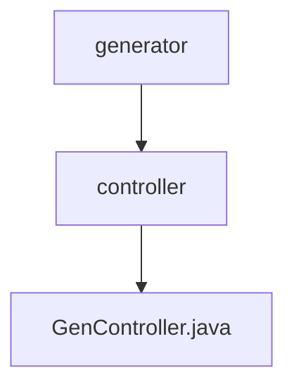

# 基础信息

|      |      |
|------|------|
| 编码语言 | .java |
| 代码路径 | ruoyi-system/ruoyi-generator/src/main/java/com/ruoyi/generator/controller |
| 包名 | ruoyi-system.ruoyi-generator.src.main.java.com.ruoyi.generator.controller |
| 概述说明 | 控制器代码生成，支持查询、导入、修改、删除、预览、下载及数据库同步功能。 |

# 说明

控制器处理代码生成，具备查询、导入、修改、删除、预览、下载及同步数据库等多种功能。这些功能涵盖了数据处理的核心操作，确保系统能够高效地管理和维护数据。通过控制器，用户可以方便地执行各种数据操作，提升系统的灵活性和可扩展性。

### 包内部结构视图

该流程图展示了`ruoyi-system`项目中`ruoyi-generator`模块的目录结构。`generator`目录下包含`controller`子目录，而`controller`目录中则包含`GenController.java`文件。通过这种层级关系，清晰地反映了代码的组织方式，便于开发人员理解和维护项目结构。

# 文件列表 File List

| 名称   | 类型  | 说明 |
|-------|------|-------------|
| [GenController.java](GenController.md) | file | 控制器代码生成，支持查询、导入、修改、删除、预览、下载及数据库同步功能。 |

