# 基础信息

|      |      |
|------|------|
| 编码语言 | .java |
| 代码路径 | ruoyi-system/ruoyi-generator/src/main/java/com/ruoyi/generator/domain/GenTable.java |
| 包名 | com.ruoyi.generator.domain |
| 依赖项 | ['java.util.List', 'javax.validation.Valid', 'javax.validation.constraints.NotBlank', 'org.apache.commons.lang3.ArrayUtils', 'com.ruoyi.common.constant.GenConstants', 'com.ruoyi.common.core.domain.BaseEntity', 'com.ruoyi.common.utils.StringUtils'] |
| 概述说明 | GenTable类管理表信息，包含表ID、名称、描述、关联表、实体类等属性。 |

# 说明

GenTable类用于管理表信息，包含表ID、名称、描述、关联表、实体类名称、模板、包路径、模块名、业务名、功能名、作者、表单布局、生成方式、路径、主键、子表、列信息、树编码、父编码、名称字段、上级菜单ID和名称等属性。该类通过多种属性详细描述表的结构和配置信息，支持复杂的数据管理和生成操作。

# 类列表 Class Summary

| 名称   | 类型  | 说明 |
|-------|------|-------------|
| GenTable | class | GenTable类用于管理表信息，包含表ID、名称、描述、关联表、实体类名称、模板、包路径、模块名、业务名、功能名、作者、表单布局、生成方式、路径、主键、子表、列信息、树编码、父编码、名称字段、上级菜单ID和名称等属性。 |

## 类 GenTable

|      |      |
|------|------|
| 访问范围 | public |
| 类型 | class |
| 名称 | GenTable |
| 说明 | GenTable类用于管理表信息，包含表ID、名称、描述、关联表、实体类名称、模板、包路径、模块名、业务名、功能名、作者、表单布局、生成方式、路径、主键、子表、列信息、树编码、父编码、名称字段、上级菜单ID和名称等属性。 |

### UML类图

```mermaid
classDiagram
    class BaseEntity {
        <<Interface>>
    }

    class GenTable {
        -Long tableId
        -String tableName
        -String tableComment
        -String subTableName
        -String subTableFkName
        -String className
        -String tplCategory
        -String packageName
        -String moduleName
        -String businessName
        -String functionName
        -String functionAuthor
        -int formColNum
        -String genType
        -String genPath
        -GenTableColumn pkColumn
        -GenTable subTable
        -List~GenTableColumn~ columns
        -String options
        -String treeCode
        -String treeParentCode
        -String treeName
        -String parentMenuId
        -String parentMenuName
        +Long getTableId()
        +void setTableId(Long tableId)
        +String getTableName()
        +void setTableName(String tableName)
        +String getTableComment()
        +void setTableComment(String tableComment)
        +String getSubTableName()
        +void setSubTableName(String subTableName)
        +String getSubTableFkName()
        +void setSubTableFkName(String subTableFkName)
        +String getClassName()
        +void setClassName(String className)
        +String getTplCategory()
        +void setTplCategory(String tplCategory)
        +String getPackageName()
        +void setPackageName(String packageName)
        +String getModuleName()
        +void setModuleName(String moduleName)
        +String getBusinessName()
        +void setBusinessName(String businessName)
        +String getFunctionName()
        +void setFunctionName(String functionName)
        +String getFunctionAuthor()
        +void setFunctionAuthor(String functionAuthor)
        +int getFormColNum()
        +void setFormColNum(int formColNum)
        +String getGenType()
        +void setGenType(String genType)
        +String getGenPath()
        +void setGenPath(String genPath)
        +GenTableColumn getPkColumn()
        +void setPkColumn(GenTableColumn pkColumn)
        +GenTable getSubTable()
        +void setSubTable(GenTable subTable)
        +List~GenTableColumn~ getColumns()
        +void setColumns(List~GenTableColumn~ columns)
        +String getOptions()
        +void setOptions(String options)
        +String getTreeCode()
        +void setTreeCode(String treeCode)
        +String getTreeParentCode()
        +void setTreeParentCode(String treeParentCode)
        +String getTreeName()
        +void setTreeName(String treeName)
        +String getParentMenuId()
        +void setParentMenuId(String parentMenuId)
        +String getParentMenuName()
        +void setParentMenuName(String parentMenuName)
        +boolean isSub()
        +static boolean isSub(String tplCategory)
        +boolean isTree()
        +static boolean isTree(String tplCategory)
        +boolean isCrud()
        +static boolean isCrud(String tplCategory)
        +boolean isSuperColumn(String javaField)
        +static boolean isSuperColumn(String tplCategory, String javaField)
    }

    class GenTableColumn {
        // GenTableColumn类未提供具体实现，假设其存在
    }

    BaseEntity <|-- GenTable
    GenTable --> GenTableColumn : 包含
    GenTable --> GenTable : 包含
```

这段代码定义了一个`GenTable`类，该类继承自`BaseEntity`接口，并包含多个与表格生成相关的属性和方法。`GenTable`类用于管理表格的元数据，包括表格名称、描述、列信息、生成路径等。它还包含了一些用于判断表格类型（如子表、树表、CRUD表）的静态方法。`GenTable`类与`GenTableColumn`类之间存在关联关系，表示表格的列信息。此外，`GenTable`类还包含对自身的引用，用于处理子表关系。

### 内部方法调用关系图

这段代码定义了一个名为`GenTable`的类，继承自`BaseEntity`。该类包含了多个属性，如表ID、表名称、表描述等，并提供了相应的getter和setter方法。此外，类中还定义了一些用于判断表类型（如子表、树表、CRUD表）的静态方法，以及判断是否为超级列的方法。这些方法主要用于处理表的不同类型和属性，以便在生成代码时进行相应的逻辑处理。

### 字段列表 Field List

| 名称  | 类型  | 说明 |
|-------|-------|------|
| tableName | String | 表名称字段不能为空。 |
| moduleName | String | 生成模块名不能为空。 |
| tableId | Long | 表ID为长整型变量。 |
| treeCode | String | 定义私有字符串变量treeCode。 |
| tableComment | String | 表描述字段不能为空。 |
| genType | String | genType是私有字符串变量。 |
| subTableName | String | 私有字符串变量存储子表名称。 |
| className | String | 实体类名称不能为空，使用注解校验。 |
| parentMenuName | String | 私有字符串变量存储父菜单名称。 |
| tplCategory | String | 定义了一个私有字符串变量tplCategory。 |
| packageName | String | 生成包路径不能为空，定义为字符串类型。 |
| genPath | String | 定义了一个私有字符串变量genPath。 |
| serialVersionUID = 1L | long | 声明一个私有静态不可变的序列化版本标识符。 |
| subTable | GenTable | 子表为私有GenTable类型。 |
| formColNum | int | 私有整型变量formColNum。 |
| parentMenuId | String | 私有字符串类型变量parentMenuId。 |
| functionName | String | 生成功能名不可为空，变量为functionName。 |
| pkColumn | GenTableColumn | 私有属性pkColumn，类型为GenTableColumn。 |
| treeName | String | 定义私有字符串变量treeName。 |
| treeParentCode | String | 私有字符串变量treeParentCode用于存储树结构父节点代码。 |
| columns | List<GenTableColumn> | 包含私有列表类型的表格列字段。 |
| options | String | 私有字符串变量options声明。 |
| subTableFkName | String | 私有字符串变量，用于存储子表外键名称。 |
| businessName | String | 业务名不能为空，使用@NotBlank注解验证。 |
| functionAuthor | String | 代码定义了一个非空的字符串变量functionAuthor，用于存储作者信息。 |

### 方法列表 Method List

| 名称  | 类型  | 说明 |
|-------|-------|------|
| isTree | boolean | 判断tplCategory是否为树形模板类型。 |
| setFunctionName | void | 设置函数名称的方法，将输入值赋给类成员变量。 |
| setPackageName | void | 设置包名为指定字符串。 |
| getPkColumn | GenTableColumn | 获取主键列的方法。 |
| getOptions | String | 该方法返回名为`options`的字符串变量。 |
| getGenPath | String | 获取生成路径的方法。 |
| setParentMenuId | void | 设置父菜单ID的方法。 |
| setTreeCode | void | 设置树编码的方法。 |
| isCrud | boolean | 检查模板类别是否为CRUD类型。 |
| getGenType | String | 该方法返回genType字符串。 |
| getTreeName | String | 获取树名称的方法，返回变量treeName的值。 |
| getSubTableName | String | 获取子表名称的方法。 |
| getSubTableFkName | String | 获取子表外键名称的方法。 |
| setSubTable | void | 设置子表对象。 |
| setModuleName | void | 设置模块名称的方法。 |
| setBusinessName | void | 设置业务名称的方法。 |
| getSubTable | GenTable | 获取子表对象的方法。 |
| getClassName | String | 该方法返回类名。 |
| setSubTableFkName | void | 设置子表外键名称的方法。 |
| getParentMenuId | String | 该方法返回父菜单ID。 |
| getTableId | Long | 该方法返回tableId的长整型值。 |
| setFormColNum | void | 设置表单列数为指定值。 |
| getFunctionName | String | 获取函数名称的方法，返回functionName。 |
| getTableName | String | 该方法返回表名。 |
| getTableComment | String | 获取表注释的Java方法。 |
| getBusinessName | String | 获取业务名称的方法。 |
| getModuleName | String | 获取模块名称的方法，返回模块名称字符串。 |
| setTableName | void | 该方法用于设置表名属性。 |
| getTreeParentCode | String | 获取树结构父节点代码的方法。 |
| isCrud | boolean | 该方法检查模板类别是否为CRUD操作。 |
| getFunctionAuthor | String | 获取函数作者信息的方法。 |
| getColumns | List<GenTableColumn> | 获取列表示例代码，返回列对象列表。 |
| setFunctionAuthor | void | 设置函数作者的方法。 |
| isTree | boolean | 方法isTree返回this.tplCategory是否为树结构。 |
| setClassName | void | 设置类名的方法，将传入的字符串赋值给当前对象的类名属性。 |
| getTplCategory | String | 获取模板分类的公共方法。 |
| setTableComment | void | 设置表注释的方法，接受字符串参数并赋值给成员变量。 |
| getTreeCode | String | 获取树结构代码的方法，返回treeCode值。 |
| isSub | boolean | 判断tplCategory是否为GenConstants.TPL_SUB。 |
| isSuperColumn | boolean | 方法isSuperColumn判断字段是否为超级列，基于模板类别和Java字段。 |
| setGenPath | void | 设置生成路径的方法，将传入路径赋值给类变量。 |
| setTableId | void | 设置表ID的方法，将传入的tableId赋值给当前对象的tableId属性。 |
| setGenType | void | 该方法用于设置genType属性的值。 |
| setParentMenuName | void | 设置父菜单名称的方法。 |
| getFormColNum | int | 获取表单列数的方法，返回整型变量formColNum。 |
| setTreeName | void | 设置树名称的方法，将传入的treeName赋值给当前对象的treeName属性。 |
| setPkColumn | void | 设置主键列方法，将传入的列对象赋值给当前对象的主键列属性。 |
| getPackageName | String | 获取当前包名的方法。 |
| setOptions | void | 设置选项的公共方法，将参数赋值给成员变量。 |
| setSubTableName | void | 设置子表名称的方法。 |
| getParentMenuName | String | 获取父菜单名称的方法。 |
| isSub | boolean | 该方法检查当前对象是否为子类别。 |
| setColumns | void | 设置表格列属性。 |
| isSuperColumn | boolean | 该方法检查给定Java字段是否为超级列，基于模板类别和字段名判断。 |
| setTreeParentCode | void | 设置树形结构父节点代码的方法。 |
| setTplCategory | void | 设置模板类别的公共方法。 |

