# 基础信息

|      |      |
|------|------|
| 编码语言 | .java |
| 代码路径 | ruoyi-system/ruoyi-generator/src/main/java/com/ruoyi/generator/domain/GenTableColumn.java |
| 包名 | com.ruoyi.generator.domain |
| 依赖项 | ['javax.validation.constraints.NotBlank', 'com.ruoyi.common.core.domain.BaseEntity', 'com.ruoyi.common.utils.StringUtils'] |
| 概述说明 | GenTableColumn类继承BaseEntity，包含列ID、表ID、列名等属性及相关方法。 |

# 说明

GenTableColumn类继承自BaseEntity，包含多个属性及相应方法。主要属性包括列ID、表ID、列名、列描述、列类型、Java类型、Java字段名、主键标识、自增标识、必填标识、插入标识、编辑标识、列表标识、查询标识、查询方式、显示类型、字典类型和排序。这些属性用于定义数据库表中列的各种特征和行为，并通过相应的方法进行管理和操作。

# 类列表 Class Summary

| 名称   | 类型  | 说明 |
|-------|------|-------------|
| GenTableColumn | class | GenTableColumn类继承BaseEntity，包含列ID、表ID、列名、列描述、列类型、Java类型、Java字段名、主键标识、自增标识、必填标识、插入标识、编辑标识、列表标识、查询标识、查询方式、显示类型、字典类型和排序等属性及相应方法。 |

## 类 GenTableColumn

|      |      |
|------|------|
| 访问范围 | public |
| 类型 | class |
| 名称 | GenTableColumn |
| 说明 | GenTableColumn类继承BaseEntity，包含列ID、表ID、列名、列描述、列类型、Java类型、Java字段名、主键标识、自增标识、必填标识、插入标识、编辑标识、列表标识、查询标识、查询方式、显示类型、字典类型和排序等属性及相应方法。 |

### UML类图

```mermaid
classDiagram
    class BaseEntity {
        <<Interface>>
    }

    class GenTableColumn {
        -Long serialVersionUID
        -Long columnId
        -Long tableId
        -String columnName
        -String columnComment
        -String columnType
        -String javaType
        -String javaField
        -String isPk
        -String isIncrement
        -String isRequired
        -String isInsert
        -String isEdit
        -String isList
        -String isQuery
        -String queryType
        -String htmlType
        -String dictType
        -Integer sort
        +void setColumnId(Long columnId)
        +Long getColumnId()
        +void setTableId(Long tableId)
        +Long getTableId()
        +void setColumnName(String columnName)
        +String getColumnName()
        +void setColumnComment(String columnComment)
        +String getColumnComment()
        +void setColumnType(String columnType)
        +String getColumnType()
        +void setJavaType(String javaType)
        +String getJavaType()
        +void setJavaField(String javaField)
        +String getJavaField()
        +String getCapJavaField()
        +void setIsPk(String isPk)
        +String getIsPk()
        +boolean isPk()
        +boolean isPk(String isPk)
        +void setIsIncrement(String isIncrement)
        +String getIsIncrement()
        +boolean isIncrement()
        +boolean isIncrement(String isIncrement)
        +void setIsRequired(String isRequired)
        +String getIsRequired()
        +boolean isRequired()
        +boolean isRequired(String isRequired)
        +void setIsInsert(String isInsert)
        +String getIsInsert()
        +boolean isInsert()
        +boolean isInsert(String isInsert)
        +void setIsEdit(String isEdit)
        +String getIsEdit()
        +boolean isEdit()
        +boolean isEdit(String isEdit)
        +void setIsList(String isList)
        +String getIsList()
        +boolean isList()
        +boolean isList(String isList)
        +void setIsQuery(String isQuery)
        +String getIsQuery()
        +boolean isQuery()
        +boolean isQuery(String isQuery)
        +void setQueryType(String queryType)
        +String getQueryType()
        +void setHtmlType(String htmlType)
        +String getHtmlType()
        +void setDictType(String dictType)
        +String getDictType()
        +void setSort(Integer sort)
        +Integer getSort()
        +boolean isSuperColumn()
        +static boolean isSuperColumn(String javaField)
        +boolean isUsableColumn()
        +static boolean isUsableColumn(String javaField)
        +String readConverterExp()
    }

    BaseEntity <|-- GenTableColumn : 继承
```

**描述：**
`GenTableColumn` 类继承自 `BaseEntity`，用于表示数据库表中的列信息。该类包含多个私有字段，如 `columnId`、`tableId`、`columnName` 等，分别表示列的唯一标识、所属表的标识、列名称等信息。此外，类中提供了大量的公有方法用于设置和获取这些字段的值，并包含一些辅助方法如 `isPk()`、`isIncrement()` 等，用于判断列是否为主键、是否自增等属性。`GenTableColumn` 类还包含一些静态方法，如 `isSuperColumn()` 和 `isUsableColumn()`，用于判断某些字段是否为超级列或可用列。

### 内部方法调用关系图

这段代码定义了一个名为`GenTableColumn`的类，继承自`BaseEntity`，用于表示数据库表中的列信息。类中包含多个属性，如`columnId`、`tableId`、`columnName`等，以及相应的getter和setter方法。此外，类中还包含一些辅助方法，如`isPk()`、`isIncrement()`等，用于判断列是否为主键、是否自增等。`readConverterExp()`方法用于解析列描述中的转换表达式。整体上，该类用于管理和操作数据库表的列信息，提供了丰富的功能来支持列的属性和行为。

### 字段列表 Field List

| 名称  | 类型  | 说明 |
|-------|-------|------|
| isPk | String | 定义私有字符串变量isPk。 |
| serialVersionUID = 1L | long | 声明序列化版本号为1L的静态常量。 |
| tableId | Long | 定义长整型变量tableId。 |
| columnId | Long | 定义长整型私有变量columnId。 |
| isInsert | String | 定义私有字符串变量isInsert。 |
| columnComment | String | 私有字符串变量存储列注释。 |
| isQuery | String | 定义了一个私有字符串变量isQuery。 |
| queryType | String | 定义私有字符串变量queryType。 |
| dictType = "" | String | 定义了一个私有字符串变量dictType，初始值为空。 |
| isIncrement | String | 该代码定义了一个私有字符串变量isIncrement。 |
| columnType | String | 定义私有字符串变量columnType。 |
| columnName | String | 定义了一个私有字符串变量columnName。 |
| javaField | String | Java属性验证，确保字段不为空。 |
| isList | String | 定义了一个私有字符串变量isList。 |
| sort | Integer | 定义了一个私有的整型变量sort。 |
| isRequired | String | 该代码定义了一个私有字符串变量isRequired。 |
| isEdit | String | 私有字符串变量isEdit用于标识编辑状态。 |
| htmlType | String | 定义私有字符串变量htmlType。 |
| javaType | String | Java类中定义的私有字符串类型变量。 |

### 方法列表 Method List

| 名称  | 类型  | 说明 |
|-------|-------|------|
| setIsEdit | void | 设置编辑状态的公共方法。 |
| setJavaType | void | 设置Java类型的公共方法。 |
| getJavaField | String | 获取Java字段值的公共方法。 |
| isPk | boolean | 检查是否为数据库主键的方法。 |
| setIsRequired | void | 设置isRequired属性的方法。 |
| getDictType | String | 该方法返回字典类型。 |
| setDictType | void | 设置字典类型的方法。 |
| getTableId | Long | 获取表的ID值。 |
| getIsQuery | String | 获取查询状态的字符串方法。 |
| getIsList | String | 该方法返回isList变量的值。 |
| isUsableColumn | boolean | 检查Java字段是否为可用列。 |
| getIsRequired | String | 获取是否必需的字符串方法。 |
| getSort | Integer | 获取排序整数值的方法。 |
| getQueryType | String | 获取查询类型的字符串方法。 |
| setIsList | void | 设置isList属性的方法。 |
| isInsert | boolean | 检查是否为插入操作的布尔方法。 |
| getJavaType | String | 该方法返回Java类型字符串。 |
| isList | boolean | 检查对象是否为列表类型。 |
| setColumnType | void | 设置列类型的方法，将传入参数赋值给类成员变量。 |
| getCapJavaField | String | 该方法将javaField字符串首字母大写后返回。 |
| isRequired | boolean | 检查是否为必需项的方法。 |
| getColumnId | Long | 获取columnId的公共方法，返回Long类型值。 |
| isList | boolean | 该方法检查字符串是否为"1"，是则返回true。 |
| getIsPk | String | 获取主键字段的字符串值。 |
| getIsIncrement | String | 方法`getIsIncrement`返回`isIncrement`字符串值。 |
| setIsPk | void | 设置主键属性的方法。 |
| setIsQuery | void | 该方法用于设置查询状态。 |
| getIsInsert | String | 获取插入状态的方法，返回isInsert值。 |
| getHtmlType | String | 获取HTML类型的方法，返回htmlType变量。 |
| setColumnId | void | 设置列ID的方法，将传入的columnId赋值给当前对象的columnId属性。 |
| isQuery | boolean | 该方法检查输入字符串是否为"1"，是则返回true，否则返回false。 |
| isSuperColumn | boolean | 方法isSuperColumn返回this.javaField是否为超级列。 |
| isIncrement | boolean | 方法判断字符串是否为"1"，非空且相等返回true。 |
| setSort | void | 设置排序值的方法。 |
| getColumnName | String | 获取列名的方法，返回列名字符串。 |
| isInsert | boolean | 判断输入字符串是否为"1"，返回布尔值。 |
| isEdit | boolean | 方法isEdit返回isInsert(this.isEdit)的布尔值。 |
| setTableId | void | 该方法用于设置表ID，将传入的tableId赋值给当前对象的tableId属性。 |
| getColumnType | String | 获取列类型的方法，返回columnType值。 |
| isSuperColumn | boolean | 判断字段是否为超级列，包含BaseEntity和TreeEntity的特定字段。 |
| getColumnComment | String | 获取列注释的方法，返回列注释字符串。 |
| setHtmlType | void | 设置HTML类型的方法，将传入的htmlType赋值给类的htmlType属性。 |
| setIsInsert | void | 设置插入状态的Java方法。 |
| setColumnName | void | 设置列名方法，将输入字符串赋给类的列名变量。 |
| isPk | boolean | 判断字符串isPk是否为"1"。 |
| isRequired | boolean | 该方法检查字符串是否为"1"，返回布尔值。 |
| isUsableColumn | boolean | 检查字段是否为可用列，白名单包含parentId、orderNum、remark。 |
| setIsIncrement | void | 设置增量状态的方法。 |
| isQuery | boolean | 该方法返回当前对象是否为查询的布尔值。 |
| isEdit | boolean | 该方法检查字符串isEdit是否为"1"，是则返回true，否则返回false。 |
| setQueryType | void | 设置查询类型的方法，参数为字符串类型。 |
| isIncrement | boolean | 方法isIncrement返回this.isIncrement的布尔值。 |
| setJavaField | void | 定义设置Java字段值的方法。 |
| getIsEdit | String | 方法getIsEdit返回isEdit变量的值。 |
| readConverterExp | String | 方法提取列注释中括号内容，格式化后返回，若无则返回原注释。 |
| setColumnComment | void | 设置列注释的方法。 |

