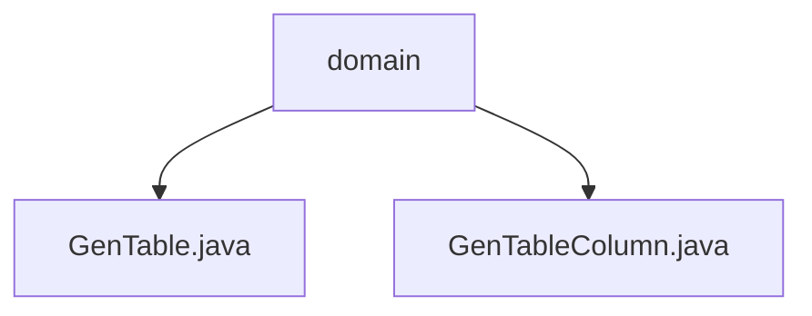

# 基础信息

|      |      |
|------|------|
| 编码语言 | .java |
| 代码路径 | ruoyi-system/ruoyi-generator/src/main/java/com/ruoyi/generator/domain |
| 包名 | ruoyi-system.ruoyi-generator.src.main.java.com.ruoyi.generator.domain |
| 概述说明 | GenTable类管理表信息，包含表ID、名称等属性；GenTableColumn类定义列特征，包含列ID、类型等属性。 |

# 说明

GenTable类用于管理表信息，包含表ID、名称、描述、关联表、实体类名称、模板、包路径、模块名、业务名、功能名、作者、表单布局、生成方式、路径、主键、子表、列信息、树编码、父编码、名称字段、上级菜单ID和名称等属性，详细描述表的结构和配置信息，支持复杂的数据管理和生成操作。GenTableColumn类继承自BaseEntity，包含列ID、表ID、列名、列描述、列类型、Java类型、Java字段名、主键标识、自增标识、必填标识、插入标识、编辑标识、列表标识、查询标识、查询方式、显示类型、字典类型和排序等属性，用于定义数据库表中列的各种特征和行为，并通过相应方法进行管理和操作。

### 包内部结构视图

该流程图展示了 `ruoyi-system/ruoyi-generator/src/main/java/com/ruoyi/generator/domain` 目录下的层级关系。`domain` 文件夹包含两个文件：`GenTable.java` 和 `GenTableColumn.java`。图中清晰地表示了 `domain` 作为父节点，而 `GenTable.java` 和 `GenTableColumn.java` 作为其子节点的结构关系。

# 文件列表 File List

| 名称   | 类型  | 说明 |
|-------|------|-------------|
| [GenTableColumn.java](GenTableColumn.md) | file | GenTableColumn类继承BaseEntity，包含列ID、表ID、列名等属性及相关方法。 |
| [GenTable.java](GenTable.md) | file | GenTable类管理表信息，包含表ID、名称、描述、关联表、实体类等属性。 |

