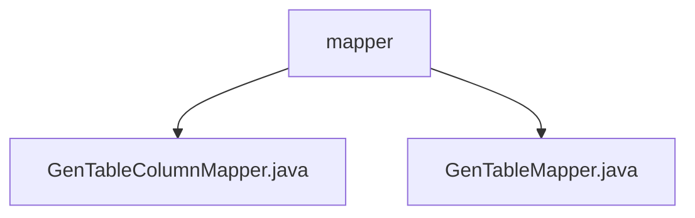

# 基础信息

|      |      |
|------|------|
| 编码语言 | .java |
| 代码路径 | ruoyi-system/ruoyi-generator/src/main/java/com/ruoyi/generator/mapper |
| 包名 | ruoyi-system.ruoyi-generator.src.main.java.com.ruoyi.generator.mapper |
| 概述说明 | 内容为空，无法生成总结。请提供具体信息。 |

# 说明

给定的内容为空，无法进行总结描述。请提供具体的信息或文本以便生成相应的总结。

### 包内部结构视图

该流程图展示了`ruoyi-generator`项目中`mapper`目录下的文件层级关系。`mapper`目录包含两个文件：`GenTableColumnMapper.java`和`GenTableMapper.java`。这两个文件直接位于`mapper`目录下，没有进一步的子目录结构。

# 文件列表 File List

| 名称   | 类型  | 说明 |
|-------|------|-------------|
| [GenTableMapper.java](GenTableMapper.md) | file | 输入内容为空，无法生成概要描述。 |
| [GenTableColumnMapper.java](GenTableColumnMapper.md) | file | 无内容提供，无法生成概要描述。 |

