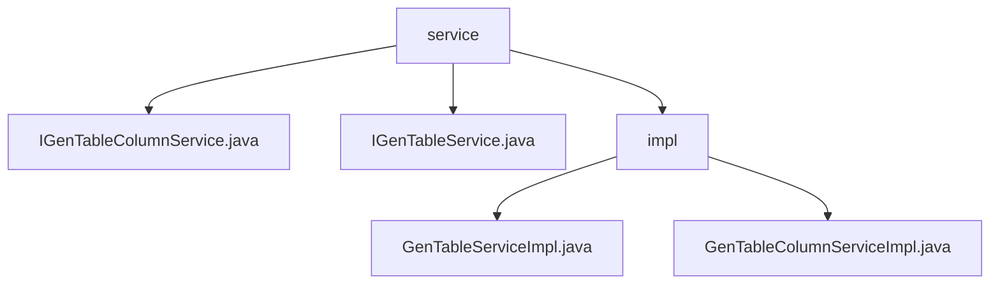

# 基础信息

|      |      |
|------|------|
| 编码语言 | .java |
| 代码路径 | ruoyi-system/ruoyi-generator/src/main/java/com/ruoyi/generator/service |
| 包名 | ruoyi-system.ruoyi-generator.src.main.java.com.ruoyi.generator.service |
| 概述说明 | GenTableServiceImpl实现数据操作与代码生成，提升开发效率；GenTableColumnServiceImpl管理业务字段，确保数据处理准确性。 |

# 说明

GenTableServiceImpl类实现了IGenTableService接口，提供业务数据的查询、修改、删除、导入及代码自动生成功能，显著提升开发效率和系统维护便捷性。GenTableColumnServiceImpl类负责业务字段的查询、新增、修改和删除操作，支持获取字段详细信息、添加新字段、更新字段属性及删除无用字段，确保业务字段管理的高效性和数据处理的准确性。

### 包内部结构视图

该流程图展示了`ruoyi-system/ruoyi-generator`项目中`service`模块的层级关系。`service`目录下包含两个接口文件`IGenTableColumnService.java`和`IGenTableService.java`，以及一个`impl`子目录。`impl`子目录中包含两个实现类文件`GenTableServiceImpl.java`和`GenTableColumnServiceImpl.java`。整个结构清晰地反映了服务接口与实现类之间的层级关系。

# 文件列表 File List

| 名称   | 类型  | 说明 |
|-------|------|-------------|
| [IGenTableService.java](IGenTableService.md) | file | 信息为空，无法生成概要描述。 |
| [IGenTableColumnService.java](IGenTableColumnService.md) | file | 信息为空，无法生成概要描述。 |
| [impl](impl/_module.md) | package | GenTableServiceImpl提供数据查询、修改、删除、导入及代码生成功能。GenTableColumnServiceImpl处理业务字段的查询、新增、修改和删除操作。 |

