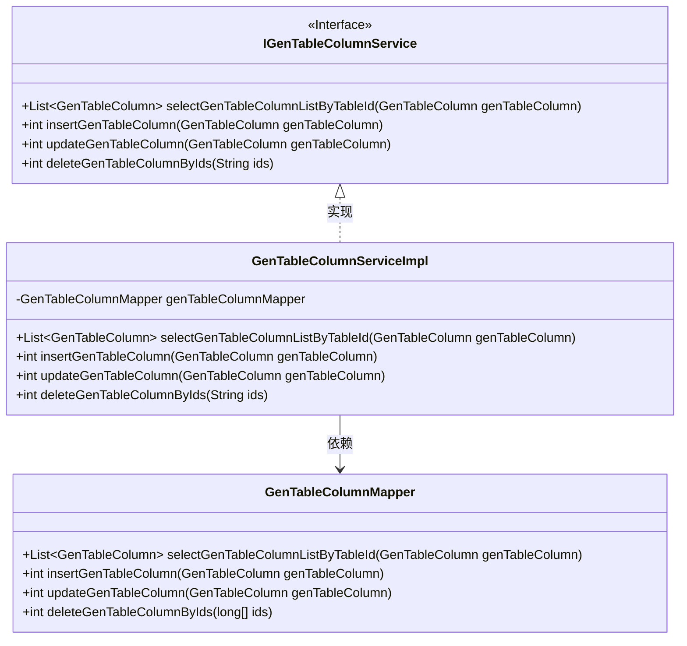
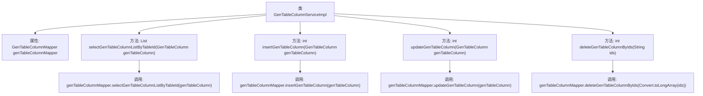

# 基础信息

|      |      |
|------|------|
| 编码语言 | .java |
| 代码路径 | ruoyi-system/ruoyi-generator/src/main/java/com/ruoyi/generator/service/impl/GenTableColumnServiceImpl.java |
| 包名 | com.ruoyi.generator.service.impl |
| 依赖项 | ['java.util.List', 'org.springframework.beans.factory.annotation.Autowired', 'org.springframework.stereotype.Service', 'com.ruoyi.common.core.text.Convert', 'com.ruoyi.generator.domain.GenTableColumn', 'com.ruoyi.generator.mapper.GenTableColumnMapper', 'com.ruoyi.generator.service.IGenTableColumnService'] |
| 概述说明 | GenTableColumnServiceImpl实现字段的增删改查功能。 |

# 说明

GenTableColumnServiceImpl类负责处理业务字段的相关操作，包括查询、新增、修改和删除功能。通过该实现类，用户可以获取特定业务字段的详细信息，添加新的业务字段，更新现有字段的属性，以及删除不再需要的字段。这些功能共同构成了业务字段管理的核心逻辑，确保系统能够高效地维护和处理业务数据。

# 类列表 Class Summary

| 名称   | 类型  | 说明 |
|-------|------|-------------|
| GenTableColumnServiceImpl | class | GenTableColumnServiceImpl实现业务字段的查询、新增、修改和删除功能。 |

## 类 GenTableColumnServiceImpl

|      |      |
|------|------|
| 访问范围 | @Service;public |
| 类型 | class |
| 名称 | GenTableColumnServiceImpl |
| 说明 | GenTableColumnServiceImpl实现业务字段的查询、新增、修改和删除功能。 |

### UML类图

这段代码描述了一个业务字段管理系统的部分实现。`IGenTableColumnService` 是一个接口，定义了查询、新增、修改和删除业务字段的方法。`GenTableColumnServiceImpl` 是该接口的实现类，依赖于 `GenTableColumnMapper` 来执行具体的数据库操作。`GenTableColumnMapper` 是一个数据访问对象，负责与数据库交互，执行增删改查操作。整个设计遵循了分层架构，服务层依赖于数据访问层来实现业务逻辑。

### 内部方法调用关系图

这段代码描述了一个名为`GenTableColumnServiceImpl`的服务类，它实现了`IGenTableColumnService`接口。该类通过`GenTableColumnMapper`与数据库进行交互，提供了查询、新增、修改和删除业务字段的功能。每个方法都调用了`GenTableColumnMapper`中的相应方法来完成具体的数据库操作。

### 字段列表 Field List

| 名称  | 类型  | 说明 |
|-------|-------|------|
| genTableColumnMapper | GenTableColumnMapper | 自动注入GenTableColumnMapper实例。 |

### 方法列表 Method List

| 名称  | 类型  | 说明 |
|-------|-------|------|
| selectGenTableColumnListByTableId | List<GenTableColumn> | 根据表ID查询生成表列信息列表。 |
| updateGenTableColumn | int | 重写方法更新GenTableColumn列数据。 |
| insertGenTableColumn | int | 重写插入生成表列方法，调用映射器插入操作。 |
| deleteGenTableColumnByIds | int | 方法删除指定ID的生成表列。 |

