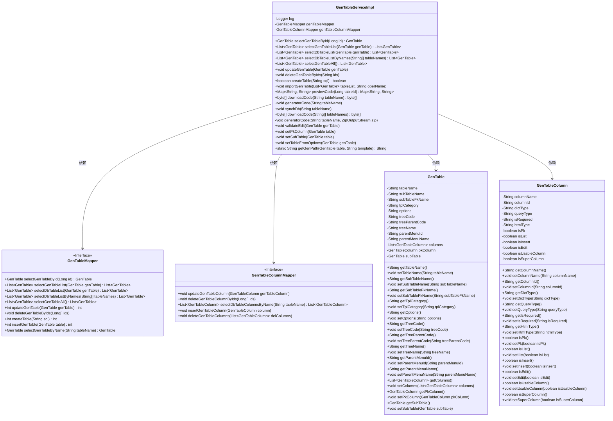

# 基础信息

|      |      |
|------|------|
| 编码语言 | .java |
| 代码路径 | ruoyi-system/ruoyi-generator/src/main/java/com/ruoyi/generator/service/impl/GenTableServiceImpl.java |
| 包名 | com.ruoyi.generator.service.impl |
| 依赖项 | ['java.io.ByteArrayOutputStream', 'java.io.File', 'java.io.IOException', 'java.io.StringWriter', 'java.util.LinkedHashMap', 'java.util.List', 'java.util.Map', 'java.util.function.Function', 'java.util.stream.Collectors', 'java.util.zip.ZipEntry', 'java.util.zip.ZipOutputStream', 'org.apache.commons.io.FileUtils', 'org.apache.commons.io.IOUtils', 'org.apache.velocity.Template', 'org.apache.velocity.VelocityContext', 'org.apache.velocity.app.Velocity', 'org.slf4j.Logger', 'org.slf4j.LoggerFactory', 'org.springframework.beans.factory.annotation.Autowired', 'org.springframework.stereotype.Service', 'org.springframework.transaction.annotation.Transactional', 'com.alibaba.fastjson.JSON', 'com.alibaba.fastjson.JSONObject', 'com.ruoyi.common.constant.Constants', 'com.ruoyi.common.constant.GenConstants', 'com.ruoyi.common.core.text.CharsetKit', 'com.ruoyi.common.core.text.Convert', 'com.ruoyi.common.exception.ServiceException', 'com.ruoyi.common.utils.StringUtils', 'com.ruoyi.generator.domain.GenTable', 'com.ruoyi.generator.domain.GenTableColumn', 'com.ruoyi.generator.mapper.GenTableColumnMapper', 'com.ruoyi.generator.mapper.GenTableMapper', 'com.ruoyi.generator.service.IGenTableService', 'com.ruoyi.generator.util.GenUtils', 'com.ruoyi.generator.util.VelocityInitializer', 'com.ruoyi.generator.util.VelocityUtils'] |
| 概述说明 | GenTableServiceImpl实现IGenTableService，支持业务查询、修改、删除、导入及代码生成。 |

# 说明

GenTableServiceImpl类实现了IGenTableService接口，提供了全面的业务功能支持。具体功能包括业务数据的查询、修改和删除操作，同时还支持数据的导入以及代码的自动生成。这些功能使得GenTableServiceImpl能够有效地管理和处理业务数据，提高开发效率和系统维护的便捷性。

# 类列表 Class Summary

| 名称   | 类型  | 说明 |
|-------|------|-------------|
| GenTableServiceImpl | class | GenTableServiceImpl实现IGenTableService，提供业务查询、修改、删除、导入、代码生成等功能。 |

## 类 GenTableServiceImpl

|      |      |
|------|------|
| 访问范围 | @Service;public |
| 类型 | class |
| 名称 | GenTableServiceImpl |
| 说明 | GenTableServiceImpl实现IGenTableService，提供业务查询、修改、删除、导入、代码生成等功能。 |

### UML类图

**描述**：该代码实现了一个生成表结构的服务类 `GenTableServiceImpl`，它依赖于 `GenTableMapper` 和 `GenTableColumnMapper` 两个接口来操作数据库表及其列信息。`GenTable` 类表示业务表信息，包含表名、子表名、模板类别等属性；`GenTableColumn` 类表示表的列信息，包含列名、列ID、字典类型等属性。服务类提供了查询、更新、删除、导入表结构等功能，并通过 `Velocity` 模板引擎生成代码。

### 内部方法调用关系图

该流程图展示了 `GenTableServiceImpl` 类的结构和主要方法。该类是一个服务实现类，负责处理与数据库表相关的业务逻辑。它包含了多个方法，用于查询、更新、删除、生成代码等操作。每个方法都与 `GenTableMapper` 或 `GenTableColumnMapper` 进行交互，执行具体的数据库操作。此外，类中还包含了一些辅助方法，如 `setPkColumn` 和 `setSubTable`，用于设置表的主键和子表信息。整体上，该类是一个复杂的服务类，涉及多种数据库操作和业务逻辑处理。

### 字段列表 Field List

| 名称  | 类型  | 说明 |
|-------|-------|------|
| log = LoggerFactory.getLogger(GenTableServiceImpl.class) | Logger | 定义日志记录器，用于GenTableServiceImpl类的日志输出。 |
| genTableColumnMapper | GenTableColumnMapper | 自动注入GenTableColumnMapper实例。 |
| genTableMapper | GenTableMapper | 自动注入GenTableMapper实例。 |

### 方法列表 Method List

| 名称  | 类型  | 说明 |
|-------|-------|------|
| selectGenTableAll | List<GenTable> | 重写方法，返回所有GenTable对象列表。 |
| selectGenTableById | GenTable | 根据ID查询生成表并设置选项后返回。 |
| selectDbTableList | List<GenTable> | 重写方法，调用mapper查询数据库表列表并返回。 |
| selectDbTableListByNames | List<GenTable> | 重写方法，通过表名数组查询数据库表列表。 |
| updateGenTable | void | 更新GenTable及其关联列数据，包含事务处理。 |
| deleteGenTableByIds | void | 删除指定ID的生成表及其列数据。 |
| previewCode | Map<String, String> | 方法预览代码，查询表信息，设置主键列，渲染模板并返回结果。 |
| downloadCode | byte[] | 重写方法，下载代码并打包为字节数组返回。 |
| downloadCode | byte[] | 重写方法下载代码，生成压缩文件并返回字节数组。 |
| setSubTable | void | 设置子表，若子表名非空则查询并赋值。 |
| validateEdit | void | 验证生成表编辑：检查树模板和子表模板的必要字段是否为空。 |
| getGenPath | String | 根据表路径和模板生成文件路径，若路径为根目录则使用当前工作目录。 |
| setPkColumn | void | 设置主键列，优先查找主键列，若无则默认首列，子表同理。 |
| generatorCode | void | 根据表名生成代码，包括查询表信息、设置主键、渲染模板并保存文件。 |
| synchDb | void | 同步数据库表结构，更新或插入列信息，删除不存在的列。 |
| importGenTable | void | 方法导入表数据，初始化并保存表及列信息，异常时抛出导入失败错误。 |
| generatorCode | void | 生成代码方法：查询表信息，设置主子表及主键列，初始化Velocity，渲染模板并压缩至zip文件。 |
| selectGenTableList | List<GenTable> | 该方法返回指定GenTable对象的列表。 |
| setTableFromOptions | void | 从JSON参数中提取树结构信息并设置到GenTable对象中。 |
| createTable | boolean | 重写方法createTable，调用genTableMapper创建表，返回结果是否为0。 |

