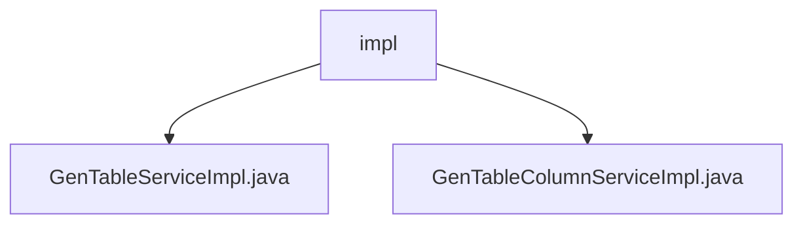

# 基础信息

|      |      |
|------|------|
| 编码语言 | .java |
| 代码路径 | ruoyi-system/ruoyi-generator/src/main/java/com/ruoyi/generator/service/impl |
| 包名 | ruoyi-system.ruoyi-generator.src.main.java.com.ruoyi.generator.service.impl |
| 概述说明 | GenTableServiceImpl提供数据查询、修改、删除、导入及代码生成功能。GenTableColumnServiceImpl处理业务字段的查询、新增、修改和删除操作。 |

# 说明

GenTableServiceImpl类实现了IGenTableService接口，提供业务数据的查询、修改、删除、导入及代码自动生成功能，有效提升开发效率和系统维护便捷性。GenTableColumnServiceImpl类负责业务字段的查询、新增、修改和删除操作，支持获取字段详细信息、添加新字段、更新字段属性及删除无用字段，确保业务字段管理的高效性和数据处理的准确性。

### 包内部结构视图

该流程图展示了`ruoyi-system`项目中`ruoyi-generator`模块的`service/impl`目录下的文件结构。`impl`文件夹包含两个实现类文件：`GenTableServiceImpl.java`和`GenTableColumnServiceImpl.java`。这两个文件分别处理与`GenTable`和`GenTableColumn`相关的业务逻辑，体现了模块化的设计思想。

# 文件列表 File List

| 名称   | 类型  | 说明 |
|-------|------|-------------|
| [GenTableColumnServiceImpl.java](GenTableColumnServiceImpl.md) | file | GenTableColumnServiceImpl实现字段的增删改查功能。 |
| [GenTableServiceImpl.java](GenTableServiceImpl.md) | file | GenTableServiceImpl实现IGenTableService，支持业务查询、修改、删除、导入及代码生成。 |

