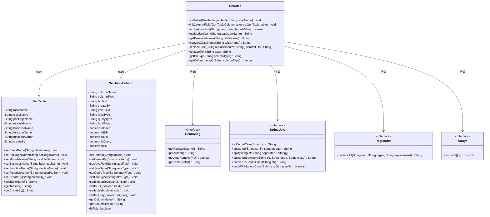
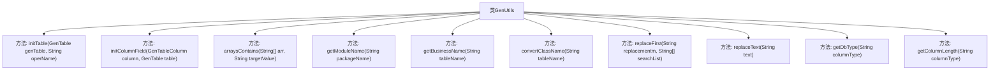

# 基础信息

|      |      |
|------|------|
| 编码语言 | .java |
| 代码路径 | ruoyi-system/ruoyi-generator/src/main/java/com/ruoyi/generator/util/GenUtils.java |
| 包名 | com.ruoyi.generator.util |
| 依赖项 | ['java.util.Arrays', 'org.apache.commons.lang3.RegExUtils', 'com.ruoyi.common.constant.GenConstants', 'com.ruoyi.common.utils.StringUtils', 'com.ruoyi.generator.config.GenConfig', 'com.ruoyi.generator.domain.GenTable', 'com.ruoyi.generator.domain.GenTableColumn'] |
| 概述说明 | GenUtils类用于初始化表信息并设置列属性，包括类名、包名等，处理列类型和HTML控件。 |

# 说明

GenUtils类主要用于表信息的初始化和列属性字段的设置。其功能包括处理类名、包名、模块名和业务名等关键信息，同时涉及列类型、查询类型以及HTML控件的配置。该类通过全面管理这些属性，确保表信息的准确性和一致性，为后续的业务处理提供基础支持。

# 类列表 Class Summary

| 名称   | 类型  | 说明 |
|-------|------|-------------|
| GenUtils | class | GenUtils类提供表信息初始化和列属性字段设置功能，包括类名、包名、模块名、业务名等，并处理列类型、查询类型、HTML控件等。 |

## 类 GenUtils

|      |      |
|------|------|
| 访问范围 | public |
| 类型 | class |
| 名称 | GenUtils |
| 说明 | GenUtils类提供表信息初始化和列属性字段设置功能，包括类名、包名、模块名、业务名等，并处理列类型、查询类型、HTML控件等。 |

### UML类图

### 描述
该代码主要涉及一个工具类 `GenUtils`，用于初始化表信息和列属性字段。`GenUtils` 类依赖于 `GenTable` 和 `GenTableColumn` 类来设置表名、类名、包名、模块名、业务名、功能名、作者信息等属性。此外，`GenUtils` 还依赖于 `GenConfig`、`StringUtils`、`RegExUtils` 和 `Arrays` 等工具类来执行字符串操作、正则表达式替换和数组处理等任务。该工具类的核心功能是通过解析数据库表结构，生成相应的Java类属性，并设置字段的插入、编辑、列表和查询等操作权限。

### 内部方法调用关系图

该流程图展示了`GenUtils`类中的主要方法及其调用关系。`initTable`方法用于初始化表信息，`initColumnField`方法用于初始化列属性字段，`arraysContains`方法用于校验数组是否包含指定值，`getModuleName`和`getBusinessName`方法分别用于获取模块名和业务名，`convertClassName`方法用于将表名转换为类名，`replaceFirst`和`replaceText`方法用于字符串替换，`getDbType`和`getColumnLength`方法用于获取数据库类型和字段长度。这些方法共同协作，完成代码生成工具的核心功能。

### 字段列表 Field List

| 名称  | 类型  | 说明 |
|-------|-------|------|

### 方法列表 Method List

| 名称  | 类型  | 说明 |
|-------|-------|------|
| arraysContains | boolean | 该方法检查字符串数组中是否包含目标值。 |
| getModuleName | String | 提取包名中的模块名并返回。 |
| getColumnLength | Integer | 提取列类型长度，无括号返回0。 |
| convertClassName | String | 该方法根据配置移除表名前缀并转换为驼峰命名。 |
| replaceText | String | 该方法用于移除字符串中的“表”或“若依”字符。 |
| getBusinessName | String | 从表名中提取业务名称，去除下划线及之前的部分。 |
| replaceFirst | String | 方法替换字符串中首次匹配的子串并返回结果。 |
| getDbType | String | 提取数据库类型，去除括号内内容。 |
| initTable | void | 初始化表信息，设置类名、包名、模块名、业务名、功能名、作者和创建者。 |
| initColumnField | void | 初始化表字段，设置Java字段名、类型、查询类型及HTML控件类型。 |

