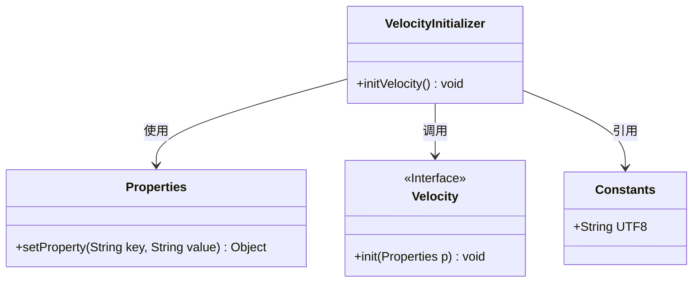
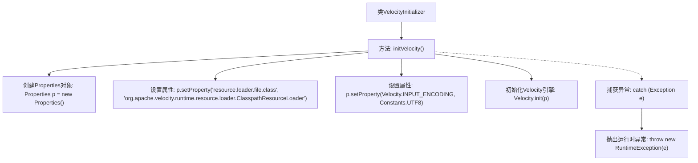

# 基础信息

|      |      |
|------|------|
| 编码语言 | .java |
| 代码路径 | ruoyi-system/ruoyi-generator/src/main/java/com/ruoyi/generator/util/VelocityInitializer.java |
| 包名 | com.ruoyi.generator.util |
| 依赖项 | ['java.util.Properties', 'org.apache.velocity.app.Velocity', 'com.ruoyi.common.constant.Constants'] |
| 概述说明 | VelocityInitializer类用于初始化Velocity引擎，配置资源加载器和字符集。 |

# 说明

VelocityInitializer类的主要功能是初始化Velocity引擎，负责配置资源加载器和字符集。通过该类，可以确保Velocity引擎在启动时具备所需的资源和字符编码设置，从而为后续的模板处理和渲染提供基础支持。

# 类列表 Class Summary

| 名称   | 类型  | 说明 |
|-------|------|-------------|
| VelocityInitializer | class | VelocityInitializer类用于初始化Velocity引擎，配置资源加载器和字符集。 |

## 类 VelocityInitializer

|      |      |
|------|------|
| 访问范围 | public |
| 类型 | class |
| 名称 | VelocityInitializer |
| 说明 | VelocityInitializer类用于初始化Velocity引擎，配置资源加载器和字符集。 |

### UML类图

这段代码定义了一个名为 `VelocityInitializer` 的类，其中包含一个静态方法 `initVelocity()`，用于初始化 Velocity 引擎。该方法通过 `Properties` 对象设置 Velocity 的配置属性，包括资源加载器和字符集，并调用 `Velocity.init()` 方法进行初始化。如果初始化过程中发生异常，将抛出 `RuntimeException`。类图中展示了 `VelocityInitializer` 类与其他相关类之间的依赖关系。

### 内部方法调用关系图

这段代码描述了一个名为 `VelocityInitializer` 的类，其中包含一个静态方法 `initVelocity()`。该方法用于初始化Velocity引擎，通过创建 `Properties` 对象并设置相关属性，如资源加载器和输入字符集，最后调用 `Velocity.init(p)` 完成初始化。如果在执行过程中发生异常，代码会捕获并抛出运行时异常。

### 字段列表 Field List

| 名称  | 类型  | 说明 |
|-------|-------|------|

### 方法列表 Method List

| 名称  | 类型  | 说明 |
|-------|-------|------|
| initVelocity | void | 初始化Velocity引擎，配置资源加载器和字符集。 |

