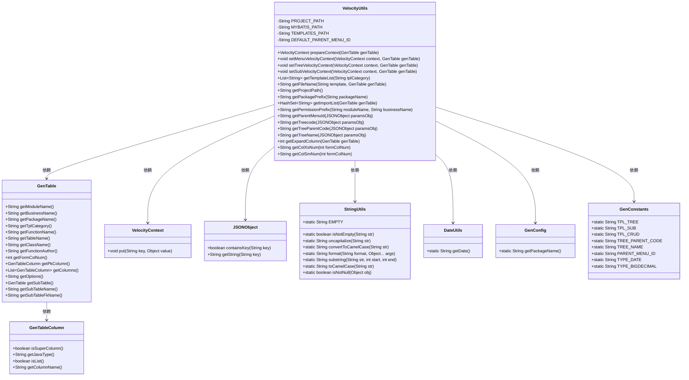

# 基础信息

|      |      |
|------|------|
| 编码语言 | .java |
| 代码路径 | ruoyi-system/ruoyi-generator/src/main/java/com/ruoyi/generator/util/VelocityUtils.java |
| 包名 | com.ruoyi.generator.util |
| 依赖项 | ['java.util.ArrayList', 'java.util.HashSet', 'java.util.List', 'org.apache.velocity.VelocityContext', 'com.alibaba.fastjson.JSONObject', 'com.ruoyi.common.constant.GenConstants', 'com.ruoyi.common.utils.DateUtils', 'com.ruoyi.common.utils.StringUtils', 'com.ruoyi.generator.config.GenConfig', 'com.ruoyi.generator.domain.GenTable', 'com.ruoyi.generator.domain.GenTableColumn'] |
| 概述说明 | VelocityUtils类生成模板上下文和文件路径，支持多模板类型和配置选项。 |

# 说明

VelocityUtils类是一个用于生成模板上下文和文件路径的工具类，支持多种模板类型和配置选项。它能够灵活处理不同的模板需求，帮助用户高效地生成所需的模板上下文和文件路径，从而简化模板管理和使用过程。

# 类列表 Class Summary

| 名称   | 类型  | 说明 |
|-------|------|-------------|
| VelocityUtils | class | VelocityUtils类用于生成模板上下文和文件路径，支持多种模板类型和配置选项。 |

## 类 VelocityUtils

|      |      |
|------|------|
| 访问范围 | public |
| 类型 | class |
| 名称 | VelocityUtils |
| 说明 | VelocityUtils类用于生成模板上下文和文件路径，支持多种模板类型和配置选项。 |

### UML类图

### 描述
`VelocityUtils` 类是一个工具类，主要用于生成代码模板的上下文信息。它依赖于 `GenTable` 类来获取表信息，并通过 `VelocityContext` 类设置模板变量。`VelocityUtils` 还使用了 `JSONObject` 和 `StringUtils` 等工具类来处理数据和字符串操作。该类的主要功能包括准备模板上下文、设置菜单、树形结构和子表上下文，以及获取模板列表和文件名等。

### 内部方法调用关系图

```mermaid
graph TD
    A["类VelocityUtils"]
    B["常量: PROJECT_PATH"]
    C["常量: MYBATIS_PATH"]
    D["常量: TEMPLATES_PATH"]
    E["常量: DEFAULT_PARENT_MENU_ID"]
    F["方法: prepareContext(GenTable genTable)"]
    G["方法: setMenuVelocityContext(VelocityContext context, GenTable genTable)"]
    H["方法: setTreeVelocityContext(VelocityContext context, GenTable genTable)"]
    I["方法: setSubVelocityContext(VelocityContext context, GenTable genTable)"]
    J["方法: getTemplateList(String tplCategory)"]
    K["方法: getFileName(String template, GenTable genTable)"]
    L["方法: getProjectPath()"]
    M["方法: getPackagePrefix(String packageName)"]
    N["方法: getImportList(GenTable genTable)"]
    O["方法: getPermissionPrefix(String moduleName, String businessName)"]
    P["方法: getParentMenuId(JSONObject paramsObj)"]
    Q["方法: getTreecode(JSONObject paramsObj)"]
    R["方法: getTreeParentCode(JSONObject paramsObj)"]
    S["方法: getTreeName(JSONObject paramsObj)"]
    T["方法: getExpandColumn(GenTable genTable)"]
    U["方法: getColXsNum(int formColNum)"]
    V["方法: getColSmNum(int formColNum)"]

    A --> B
    A --> C
    A --> D
    A --> E
    A --> F
    A --> G
    A --> H
    A --> I
    A --> J
    A --> K
    A --> L
    A --> M
    A --> N
    A --> O
    A --> P
    A --> Q
    A --> R
    A --> S
    A --> T
    A --> U
    A --> V
```

这段代码定义了一个名为 `VelocityUtils` 的工具类，主要用于生成模板上下文、获取模板列表、文件名、项目路径等操作。类中包含多个静态方法，用于处理不同的模板生成需求，如设置菜单上下文、树形结构上下文、子表上下文等。通过这些方法，代码能够根据不同的模板类别和业务表信息生成相应的模板文件和路径。

### 字段列表 Field List

| 名称  | 类型  | 说明 |
|-------|-------|------|
| PROJECT_PATH = "main/java" | String | 项目路径设置为"main/java"。 |
| MYBATIS_PATH = "main/resources/mapper" | String | 定义MyBatis映射文件路径常量。 |
| DEFAULT_PARENT_MENU_ID = "3" | String | 默认父菜单ID为"3"。 |
| TEMPLATES_PATH = "main/resources/templates" | String | 定义私有静态常量TEMPLATES_PATH指向模板路径。 |

### 方法列表 Method List

| 名称  | 类型  | 说明 |
|-------|-------|------|
| getFileName | String | 根据模板生成不同文件路径。 |
| getPackagePrefix | String | 获取包名前缀的静态方法，返回包名最后一个点之前的部分。 |
| getImportList | HashSet<String> | 方法获取GenTable的导入列表，包含日期、BigDecimal及子表相关类。 |
| setMenuVelocityContext | void | 该方法解析表选项并获取父菜单ID，然后将其存入Velocity上下文。 |
| getPermissionPrefix | String | 静态方法生成权限前缀，格式为模块名:业务名。 |
| getProjectPath | String | 获取项目路径，拼接包名并替换点号为斜杠。 |
| getColXsNum | String | 根据输入参数返回对应CSS类名，默认返回col-xs-12。 |
| prepareContext | VelocityContext | 方法准备Velocity上下文，包含模块、业务、包名等信息，并设置模板相关属性。 |
| setTreeVelocityContext | void | 方法设置树形结构上下文，提取并存储树码、父码、名称及扩展列。 |
| getTreeParentCode | String | 该方法从JSON对象中提取树父节点代码并转换为驼峰格式。 |
| getTreeName | String | 从JSON对象中获取树名并转换为驼峰格式，若无则返回空字符串。 |
| getColSmNum | String | 根据输入参数返回相应的col-sm类名。 |
| getTemplateList | List<String> | 获取模板列表，根据类别添加不同模板文件。 |
| getExpandColumn | int | 方法获取扩展列数，遍历列列表匹配树名，返回计数。 |
| getParentMenuId | String | 获取父菜单ID，若参数对象有效且包含父菜单ID则返回，否则返回默认值。 |
| getTreecode | String | 方法getTreecode从paramsObj中提取TREE_CODE并转换为驼峰格式，若无则返回空字符串。 |
| setSubVelocityContext | void | 方法设置子表Velocity上下文，包含子表名、外键名、类名等信息。 |

