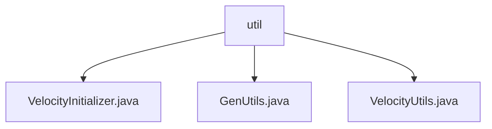

# 基础信息

|      |      |
|------|------|
| 编码语言 | .java |
| 代码路径 | ruoyi-system/ruoyi-generator/src/main/java/com/ruoyi/generator/util |
| 包名 | ruoyi-system.ruoyi-generator.src.main.java.com.ruoyi.generator.util |
| 概述说明 | VelocityInitializer初始化Velocity引擎，配置资源和字符集。GenUtils管理表信息和列属性，确保数据准确性。VelocityUtils生成模板上下文和文件路径，简化模板管理。 |

# 说明

VelocityInitializer类负责初始化Velocity引擎，配置资源加载器和字符集，确保引擎启动时具备所需资源和字符编码，为模板处理和渲染提供基础支持。GenUtils类主要用于表信息的初始化和列属性字段的设置，处理类名、包名、模块名和业务名等关键信息，并配置列类型、查询类型及HTML控件，确保表信息准确性和一致性，为业务处理提供基础支持。VelocityUtils类是一个工具类，用于生成模板上下文和文件路径，支持多种模板类型和配置选项，灵活处理不同模板需求，简化模板管理和使用过程。

### 包内部结构视图

该流程图展示了`util`文件夹下的三个文件：`VelocityInitializer.java`、`GenUtils.java`和`VelocityUtils.java`。`util`作为父节点，直接包含这三个文件，清晰地反映了它们在项目中的层级关系。

# 文件列表 File List

| 名称   | 类型  | 说明 |
|-------|------|-------------|
| [VelocityUtils.java](VelocityUtils.md) | file | VelocityUtils类生成模板上下文和文件路径，支持多模板类型和配置选项。 |
| [GenUtils.java](GenUtils.md) | file | GenUtils类用于初始化表信息并设置列属性，包括类名、包名等，处理列类型和HTML控件。 |
| [VelocityInitializer.java](VelocityInitializer.md) | file | VelocityInitializer类用于初始化Velocity引擎，配置资源加载器和字符集。 |

