# 基础信息

|      |      |
|------|------|
| 编码语言 | .java |
| 代码路径 | ruoyi-system/ruoyi-system/src/main/java/com/ruoyi |
| 包名 | ruoyi-system.ruoyi-system.src.main.java.com.ruoyi |
| 概述说明 | 各类服务实现系统功能，管理日志、用户、配置、岗位、角色等，确保数据完整性和高效性。 |

# 说明

SysOperLogServiceImpl类负责操作日志的增删查清，确保日志完整性和可维护性。SysUserServiceImpl提供用户查询、增删改及角色权限管理，维护用户信息和权限。SysConfigServiceImpl管理系统参数配置，包含缓存管理，提升性能和稳定性。SysPostServiceImpl处理岗位信息的查询、新增、修改和删除，确保岗位唯一性。SysRoleServiceImpl实现角色查询、删除、新增、修改及校验，全面管理角色信息。SysLogininforServiceImpl管理登录日志的增删查清，高效记录用户登录信息。SysDictDataServiceImpl提供字典数据的分页查询、标签查询、ID查询、批量删除、新增和修改。SysNoticeServiceImpl支持公告的查询、新增、修改和删除，维护公告信息。SysDeptServiceImpl处理部门信息的查询、树形结构处理、增删改查及权限校验。SysUserOnlineServiceImpl管理在线用户会话的查询、删除、保存和缓存清理。字典类型管理系统提供缓存管理、增删改查及数据校验，确保数据完整性和高效访问。菜单管理功能涵盖查询、删除、新增、修改，集成权限校验，确保系统安全性和操作合法性。

### 包内部结构视图

```mermaid
graph TD
    ruoyi --> system
    system --> service
    system --> domain
    system --> mapper
    service --> ISysPostService.java
    service --> ISysDictDataService.java
    service --> ISysConfigService.java
    service --> ISysRoleService.java
    service --> ISysOperLogService.java
    service --> ISysDeptService.java
    service --> ISysLogininforService.java
    service --> ISysNoticeService.java
    service --> ISysMenuService.java
    service --> ISysUserOnlineService.java
    service --> ISysDictTypeService.java
    service --> ISysUserService.java
    service --> impl
    impl --> SysOperLogServiceImpl.java
    impl --> SysUserServiceImpl.java
    impl --> SysConfigServiceImpl.java
    impl --> SysPostServiceImpl.java
    impl --> SysRoleServiceImpl.java
    impl --> SysLogininforServiceImpl.java
    impl --> SysDictDataServiceImpl.java
    impl --> SysNoticeServiceImpl.java
    impl --> SysDeptServiceImpl.java
    impl --> SysUserOnlineServiceImpl.java
    impl --> SysDictTypeServiceImpl.java
    impl --> SysMenuServiceImpl.java
    domain --> SysLogininfor.java
    domain --> SysConfig.java
    domain --> SysUserPost.java
    domain --> SysOperLog.java
    domain --> SysRoleMenu.java
    domain --> SysRoleDept.java
    domain --> SysPost.java
    domain --> SysNotice.java
    domain --> SysUserOnline.java
    domain --> SysUserRole.java
    mapper --> SysPostMapper.java
    mapper --> SysUserPostMapper.java
    mapper --> SysUserRoleMapper.java
    mapper --> SysDictTypeMapper.java
    mapper --> SysUserMapper.java
    mapper --> SysOperLogMapper.java
    mapper --> SysRoleDeptMapper.java
    mapper --> SysNoticeMapper.java
    mapper --> SysConfigMapper.java
    mapper --> SysRoleMapper.java
    mapper --> SysUserOnlineMapper.java
    mapper --> SysDeptMapper.java
    mapper --> SysDictDataMapper.java
    mapper --> SysLogininforMapper.java
    mapper --> SysRoleMenuMapper.java
    mapper --> SysMenuMapper.java
```

该流程图展示了Ruoyi系统中各个模块的层级关系，包括`service`、`domain`和`mapper`等主要模块及其子模块。`service`模块包含多个接口及其实现类，`domain`模块包含多个实体类，`mapper`模块包含多个映射接口。整个结构清晰，反映了系统的模块化设计。

# 文件列表 File List

| 名称   | 类型  | 说明 |
|-------|------|-------------|
| [system](system/_module.md) | package | 各类服务实现系统功能，管理日志、用户、配置、岗位、角色等，确保数据完整性和高效性。 |
| [system](system/_module.md) | package | 各类服务实现系统功能，管理日志、用户、配置、岗位、角色等，确保数据完整性和高效性。 |

