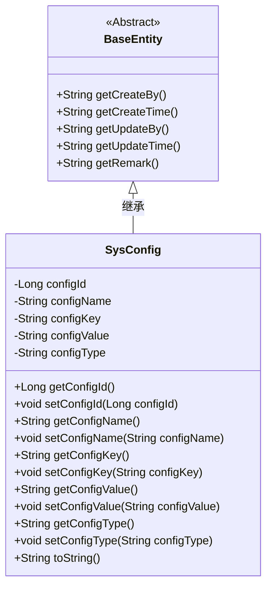

# 基础信息

|      |      |
|------|------|
| 编码语言 | .java |
| 代码路径 | ruoyi-system/ruoyi-system/src/main/java/com/ruoyi/system/domain/SysConfig.java |
| 包名 | com.ruoyi.system.domain |
| 依赖项 | ['javax.validation.constraints', 'org.apache.commons.lang3.builder.ToStringBuilder', 'org.apache.commons.lang3.builder.ToStringStyle', 'com.ruoyi.common.annotation.Excel', 'com.ruoyi.common.annotation.Excel.ColumnType', 'com.ruoyi.common.core.domain.BaseEntity'] |
| 概述说明 | SysConfig类含配置ID、名称、键名、键值及系统属性，提供getter和setter方法。 |

# 说明

SysConfig类用于管理系统配置，包含配置ID、名称、键名、键值和系统内置属性等关键信息。该类提供了getter和setter方法，用于获取和设置这些属性的值，确保配置数据的灵活访问和修改。

# 类列表 Class Summary

| 名称   | 类型  | 说明 |
|-------|------|-------------|
| SysConfig | class | SysConfig类包含配置ID、名称、键名、键值和系统内置属性，提供getter和setter方法。 |

## 类 SysConfig

|      |      |
|------|------|
| 访问范围 | public |
| 类型 | class |
| 名称 | SysConfig |
| 说明 | SysConfig类包含配置ID、名称、键名、键值和系统内置属性，提供getter和setter方法。 |

### UML类图

**描述**：`SysConfig` 类继承自 `BaseEntity`，用于管理系统配置信息。它包含配置 ID、配置名称、配置键名、配置键值和配置类型等属性，并提供了相应的 getter 和 setter 方法。`SysConfig` 类还重写了 `toString` 方法，以便以多行格式返回对象的字符串表示。`BaseEntity` 是一个抽象类，提供了创建时间、更新时间和备注等通用属性。

### 内部方法调用关系图

```mermaid
graph TD
    A["类SysConfig"]
    B["属性: Long configId"]
    C["属性: String configName"]
    D["属性: String configKey"]
    E["属性: String configValue"]
    F["属性: String configType"]
    G["方法: Long getConfigId()"]
    H["方法: void setConfigId(Long configId)"]
    I["方法: String getConfigName()"]
    J["方法: void setConfigName(String configName)"]
    K["方法: String getConfigKey()"]
    L["方法: void setConfigKey(String configKey)"]
    M["方法: String getConfigValue()"]
    N["方法: void setConfigValue(String configValue)"]
    O["方法: String getConfigType()"]
    P["方法: void setConfigType(String configType)"]
    Q["重写方法: String toString()"]

    A --> B
    A --> C
    A --> D
    A --> E
    A --> F
    A --> G
    A --> H
    A --> I
    A --> J
    A --> K
    A --> L
    A --> M
    A --> N
    A --> O
    A --> P
    A --> Q
```

这段代码定义了一个名为`SysConfig`的类，该类继承自`BaseEntity`。`SysConfig`类包含多个属性，如`configId`、`configName`、`configKey`、`configValue`和`configType`，并为每个属性提供了相应的getter和setter方法。此外，`SysConfig`类还重写了`toString()`方法，用于返回对象的字符串表示。该类主要用于管理系统配置参数，并通过注解对输入参数进行验证和约束。

### 字段列表 Field List

| 名称  | 类型  | 说明 |
|-------|-------|------|
| configName | String | Excel参数配置名称为configName。 |
| configValue | String | Excel参数键值配置字段为configValue。 |
| configKey | String | Excel参数键名由configKey变量存储。 |
| serialVersionUID = 1L | long | 定义序列化版本号，确保类的版本一致性。 |
| configId | Long | Excel列“参数主键”对应数字类型的configId字段。 |
| configType | String | 系统内置配置类型，使用Y表示是，N表示否。 |

### 方法列表 Method List

| 名称  | 类型  | 说明 |
|-------|-------|------|
| setConfigValue | void | 设置配置值的方法。 |
| getConfigType | String | 该方法返回配置类型。 |
| getConfigId | Long | 获取配置ID的方法，返回configId。 |
| setConfigName | void | 设置配置名称的方法。 |
| getConfigName | String | 参数名称不能为空且不超过100字符。 |
| setConfigKey | void | 设置配置键的方法，将传入值赋给类的configKey属性。 |
| getConfigKey | String | 参数键名长度限制为100字符，不能为空。 |
| toString | String | 重写toString方法，输出多行格式的配置信息。 |
| getConfigValue | String | 检查参数键值非空且长度不超过500字符。 |
| setConfigId | void | 设置配置ID的方法。 |
| setConfigType | void | 设置配置类型的方法，将传入的configType赋值给类的成员变量。 |

