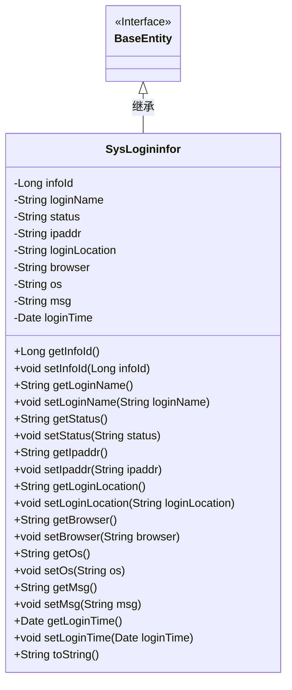

# 基础信息

|      |      |
|------|------|
| 编码语言 | .java |
| 代码路径 | ruoyi-system/ruoyi-system/src/main/java/com/ruoyi/system/domain/SysLogininfor.java |
| 包名 | com.ruoyi.system.domain |
| 依赖项 | ['org.apache.commons.lang3.builder.ToStringBuilder', 'org.apache.commons.lang3.builder.ToStringStyle', 'java.util.Date', 'com.ruoyi.common.annotation.Excel', 'com.ruoyi.common.annotation.Excel.ColumnType', 'com.ruoyi.common.core.domain.BaseEntity'] |
| 概述说明 | SysLogininfor类记录用户登录信息，包含账号、状态、IP、地点、浏览器、系统、消息和时间。 |

# 说明

SysLogininfor类用于记录用户登录信息，包含多个关键字段：账号、登录状态、IP地址、登录地点、使用的浏览器类型、操作系统、相关消息以及登录时间。这些字段共同构成了用户登录行为的完整记录，便于后续的查询和分析。

# 类列表 Class Summary

| 名称   | 类型  | 说明 |
|-------|------|-------------|
| SysLogininfor | class | SysLogininfor类用于记录用户登录信息，包含账号、状态、IP、地点、浏览器、系统、消息和时间等字段。 |

## 类 SysLogininfor

|      |      |
|------|------|
| 访问范围 | public |
| 类型 | class |
| 名称 | SysLogininfor |
| 说明 | SysLogininfor类用于记录用户登录信息，包含账号、状态、IP、地点、浏览器、系统、消息和时间等字段。 |

### UML类图

**描述：**  
`SysLogininfor` 类继承自 `BaseEntity` 接口，用于存储和管理系统登录信息。该类包含多个私有属性，如 `infoId`、`loginName`、`status`、`ipaddr` 等，分别表示登录信息的唯一标识、用户账号、登录状态、登录IP地址等。每个属性都有对应的 `getter` 和 `setter` 方法，用于访问和修改这些属性。`toString` 方法重写了对象的字符串表示形式，以便于调试和日志记录。该类通过继承 `BaseEntity` 接口，可能实现了一些基础实体类的通用功能。

### 内部方法调用关系图

```mermaid
graph TD
    A["类SysLogininfor"]
    B["属性: Long infoId"]
    C["属性: String loginName"]
    D["属性: String status"]
    E["属性: String ipaddr"]
    F["属性: String loginLocation"]
    G["属性: String browser"]
    H["属性: String os"]
    I["属性: String msg"]
    J["属性: Date loginTime"]
    K["方法: Long getInfoId()"]
    L["方法: void setInfoId(Long infoId)"]
    M["方法: String getLoginName()"]
    N["方法: void setLoginName(String loginName)"]
    O["方法: String getStatus()"]
    P["方法: void setStatus(String status)"]
    Q["方法: String getIpaddr()"]
    R["方法: void setIpaddr(String ipaddr)"]
    S["方法: String getLoginLocation()"]
    T["方法: void setLoginLocation(String loginLocation)"]
    U["方法: String getBrowser()"]
    V["方法: void setBrowser(String browser)"]
    W["方法: String getOs()"]
    X["方法: void setOs(String os)"]
    Y["方法: String getMsg()"]
    Z["方法: void setMsg(String msg)"]
    AA["方法: Date getLoginTime()"]
    AB["方法: void setLoginTime(Date loginTime)"]
    AC["重写方法: String toString()"]

    A --> B
    A --> C
    A --> D
    A --> E
    A --> F
    A --> G
    A --> H
    A --> I
    A --> J
    A --> K
    A --> L
    A --> M
    A --> N
    A --> O
    A --> P
    A --> Q
    A --> R
    A --> S
    A --> T
    A --> U
    A --> V
    A --> W
    A --> X
    A --> Y
    A --> Z
    A --> AA
    A --> AB
    A --> AC
```

这段代码定义了一个名为`SysLogininfor`的类，该类继承自`BaseEntity`，并包含多个属性及其对应的`getter`和`setter`方法。类中的属性包括用户登录信息，如用户账号、登录状态、登录IP地址、登录地点、浏览器类型、操作系统、提示消息和访问时间。`toString`方法被重写，用于返回包含所有属性的字符串表示。流程图展示了类与其属性和方法之间的关系。

### 字段列表 Field List

| 名称  | 类型  | 说明 |
|-------|-------|------|
| loginLocation | String | 登录地点字段为字符串类型。 |
| serialVersionUID = 1L | long | 定义了一个静态常量serialVersionUID，值为1L。 |
| msg | String | Excel类中包含名为msg的提示消息属性。 |
| infoId | Long | Excel列“序号”为数值类型，对应变量infoId。 |
| loginName | String | Excel表格中定义用户账号的登录名字段。 |
| loginTime | Date | Excel列“访问时间”使用日期格式“yyyy-MM-dd HH:mm:ss”。 |
| ipaddr | String | Excel表格中定义了一个名为“登录地址”的字段，类型为字符串。 |
| browser | String | Excel类中包含一个名为浏览器的字符串类型私有变量。 |
| os | String | 定义了一个名为"操作系统"的Excel字段，类型为字符串。 |
| status | String | Excel字段“登录状态”映射：0为成功，1为失败。 |

### 方法列表 Method List

| 名称  | 类型  | 说明 |
|-------|-------|------|
| getInfoId | Long | 获取信息ID的公共方法。 |
| getIpaddr | String | 获取IP地址的方法，返回变量ipaddr的值。 |
| setBrowser | void | 定义设置浏览器属性的方法。 |
| getLoginTime | Date | 获取登录时间的方法。 |
| getOs | String | 获取操作系统信息的Java方法。 |
| setOs | void | 设置操作系统属性的方法。 |
| getLoginName | String | 该方法返回用户登录名。 |
| setLoginLocation | void | 设置登录位置的方法。 |
| setStatus | void | 该方法用于设置状态变量的值。 |
| getStatus | String | 获取状态信息的方法。 |
| setLoginTime | void | 设置登录时间的Java方法。 |
| setMsg | void | 设置消息内容的方法。 |
| setInfoId | void | 设置infoId属性的方法，参数为Long类型。 |
| getMsg | String | 获取消息内容的方法。 |
| toString | String | 重写toString方法，返回多行格式的对象信息。 |
| getLoginLocation | String | 获取登录位置的方法，返回登录位置信息。 |
| setIpaddr | void | 设置IP地址的方法，将传入的ipaddr赋值给类的成员变量。 |
| setLoginName | void | 设置登录名的方法，将传入参数赋值给类成员变量。 |
| getBrowser | String | 获取浏览器名称的Java方法。 |

