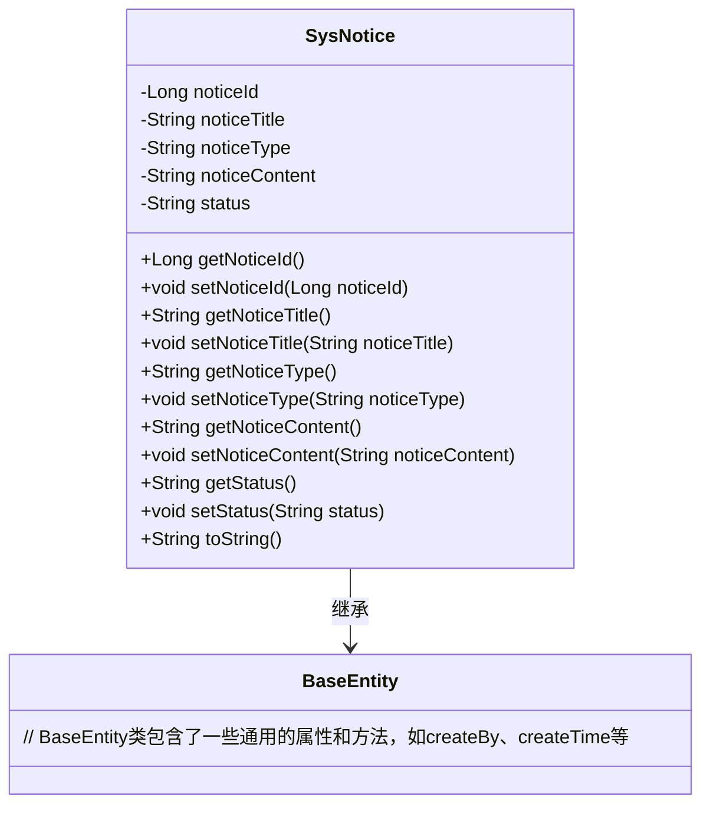

# 基础信息

|      |      |
|------|------|
| 编码语言 | .java |
| 代码路径 | ruoyi-system/ruoyi-system/src/main/java/com/ruoyi/system/domain/SysNotice.java |
| 包名 | com.ruoyi.system.domain |
| 依赖项 | ['javax.validation.constraints.NotBlank', 'javax.validation.constraints.Size', 'org.apache.commons.lang3.builder.ToStringBuilder', 'org.apache.commons.lang3.builder.ToStringStyle', 'com.ruoyi.common.core.domain.BaseEntity', 'com.ruoyi.common.xss.Xss'] |
| 概述说明 | SysNotice类管理公告，含ID、标题、类型、内容和状态属性。 |

# 说明

SysNotice类是一个用于管理系统公告的类，包含了多个关键属性。这些属性包括ID，用于唯一标识每条公告；标题，用于简要描述公告的主题；类型，用于分类公告的内容；内容，用于详细描述公告的具体信息；以及状态，用于标识公告的当前状态，如发布、草稿或已删除等。通过这些属性，SysNotice类能够有效地管理和维护系统中的公告信息。

# 类列表 Class Summary

| 名称   | 类型  | 说明 |
|-------|------|-------------|
| SysNotice | class | SysNotice类用于管理系统公告，包含ID、标题、类型、内容和状态等属性。 |

## 类 SysNotice

|      |      |
|------|------|
| 访问范围 | public |
| 类型 | class |
| 名称 | SysNotice |
| 说明 | SysNotice类用于管理系统公告，包含ID、标题、类型、内容和状态等属性。 |

### UML类图

这段代码定义了一个`SysNotice`类，该类继承自`BaseEntity`。`SysNotice`类包含了公告的基本属性，如`noticeId`、`noticeTitle`、`noticeType`、`noticeContent`和`status`，并为这些属性提供了相应的getter和setter方法。`toString`方法用于将对象转换为字符串表示形式，包含了所有属性的值。`SysNotice`类通过继承`BaseEntity`，获得了`BaseEntity`中的通用属性和方法。

### 内部方法调用关系图

```mermaid
graph TD
    A["类SysNotice"]
    B["属性: Long noticeId"]
    C["属性: String noticeTitle"]
    D["属性: String noticeType"]
    E["属性: String noticeContent"]
    F["属性: String status"]
    G["方法: Long getNoticeId()"]
    H["方法: void setNoticeId(Long noticeId)"]
    I["方法: String getNoticeTitle()"]
    J["方法: void setNoticeTitle(String noticeTitle)"]
    K["方法: String getNoticeType()"]
    L["方法: void setNoticeType(String noticeType)"]
    M["方法: String getNoticeContent()"]
    N["方法: void setNoticeContent(String noticeContent)"]
    O["方法: String getStatus()"]
    P["方法: void setStatus(String status)"]
    Q["重写方法: String toString()"]

    A --> B
    A --> C
    A --> D
    A --> E
    A --> F
    A --> G
    A --> H
    A --> I
    A --> J
    A --> K
    A --> L
    A --> M
    A --> N
    A --> O
    A --> P
    A --> Q
```

这段代码定义了一个名为`SysNotice`的类，该类继承自`BaseEntity`，并包含多个属性和方法。类的主要功能是管理公告信息，包括公告ID、标题、类型、内容和状态等。每个属性都有对应的getter和setter方法，用于获取和设置属性值。此外，类还重写了`toString`方法，用于返回对象的字符串表示，包含所有属性的值。代码中还对`noticeTitle`属性进行了校验，确保其不包含脚本字符、不为空且长度不超过50个字符。

### 字段列表 Field List

| 名称  | 类型  | 说明 |
|-------|-------|------|
| status | String | 定义了一个私有字符串变量status。 |
| noticeId | Long | 包含长整型变量noticeId的私有声明。 |
| noticeTitle | String | 私有字符串变量noticeTitle。 |
| noticeType | String | 定义了一个私有字符串变量noticeType。 |
| noticeContent | String | noticeContent为私有字符串变量。 |
| serialVersionUID = 1L | long | 定义序列化版本UID为1L的私有静态常量。 |

### 方法列表 Method List

| 名称  | 类型  | 说明 |
|-------|-------|------|
| getNoticeContent | String | 获取公告内容的方法。 |
| getStatus | String | 获取状态值的方法。 |
| getNoticeId | Long | 获取通知ID的方法。 |
| setNoticeType | void | 设置通知类型的方法。 |
| getNoticeType | String | 获取通知类型的方法，返回noticeType变量值。 |
| setNoticeId | void | 设置通知ID的方法，将传入的noticeId赋值给当前对象。 |
| setNoticeTitle | void | 设置公告标题的方法，接受字符串参数。 |
| setStatus | void | 设置对象状态的方法。 |
| toString | String | 重写toString方法，返回包含通知ID、标题、类型、内容、状态、创建更新信息的多行字符串。 |
| getNoticeTitle | String | 公告标题需非空、无脚本字符且不超过50字符。 |
| setNoticeContent | void | 设置通知内容的方法，将传入值赋给类变量。 |

