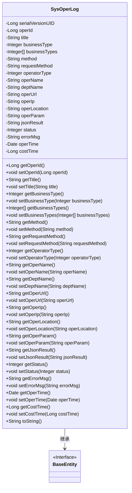

# 基础信息

|      |      |
|------|------|
| 编码语言 | .java |
| 代码路径 | ruoyi-system/ruoyi-system/src/main/java/com/ruoyi/system/domain/SysOperLog.java |
| 包名 | com.ruoyi.system.domain |
| 依赖项 | ['org.apache.commons.lang3.builder.ToStringBuilder', 'org.apache.commons.lang3.builder.ToStringStyle', 'java.util.Date', 'com.ruoyi.common.annotation.Excel', 'com.ruoyi.common.annotation.Excel.ColumnType', 'com.ruoyi.common.core.domain.BaseEntity'] |
| 概述说明 | SysOperLog类记录系统操作日志，包含操作ID、模块、类型、人员、时间等信息。 |

# 说明

SysOperLog类用于记录系统操作日志，包含操作ID、模块、类型、人员、时间等关键信息，确保系统操作的全面追踪和记录。

# 类列表 Class Summary

| 名称   | 类型  | 说明 |
|-------|------|-------------|
| SysOperLog | class | SysOperLog类用于记录系统操作日志，包含操作ID、模块、类型、人员、时间等关键信息。 |

## 类 SysOperLog

|      |      |
|------|------|
| 访问范围 | public |
| 类型 | class |
| 名称 | SysOperLog |
| 说明 | SysOperLog类用于记录系统操作日志，包含操作ID、模块、类型、人员、时间等关键信息。 |

### UML类图

**描述：**
`SysOperLog` 类继承自 `BaseEntity` 接口，主要用于记录系统操作日志。它包含多个私有属性，如操作序号、操作模块、业务类型、请求方法等，并提供了相应的 getter 和 setter 方法。`toString` 方法用于返回对象的字符串表示，方便日志输出和调试。该类通过继承 `BaseEntity` 接口，实现了实体类的基本功能。

### 内部方法调用关系图

这段代码定义了一个名为`SysOperLog`的类，继承自`BaseEntity`，用于记录系统操作日志。类中包含多个属性，如`operId`、`title`、`businessType`等，以及对应的getter和setter方法。`toString`方法被重写，用于返回对象的字符串表示。流程图展示了类的继承关系、属性定义以及方法的调用关系。

### 字段列表 Field List

| 名称  | 类型  | 说明 |
|-------|-------|------|
| title | String | Excel操作模块的标题字段定义。 |
| operUrl | String | 请求地址字段定义为私有字符串operUrl。 |
| requestMethod | String | 请求方式字段定义为私有字符串类型。 |
| operId | Long | Excel操作序号字段为长整型。 |
| businessTypes | Integer[] | 私有整型数组businessTypes存储业务类型。 |
| operLocation | String | Excel操作地点字段定义为私有字符串类型。 |
| jsonResult | String | 返回参数存储在jsonResult字符串中。 |
| operIp | String | 操作地址字段存储操作IP地址。 |
| operatorType | Integer | 操作类别：0=其它，1=后台用户，2=手机端用户。 |
| costTime | Long | 消耗时间以毫秒为单位，类型为长整型。 |
| serialVersionUID = 1L | long | 定义序列化版本号，确保类版本兼容性。 |
| errorMsg | String | Excel注解错误消息字段定义为私有字符串。 |
| operName | String | 操作人员字段使用Excel注解，类型为字符串。 |
| deptName | String | Excel注解标记部门名称字段为deptName。 |
| status | Integer | Excel状态字段：0正常，1异常。 |
| method | String | Excel请求方法字段为私有字符串类型。 |
| operTime | Date | 操作时间字段，格式为"yyyy-MM-dd HH:mm:ss"，宽度30。 |
| businessType | Integer | 业务类型：0=其它，1=新增，2=修改，3=删除，4=授权，5=导出，6=导入，7=强退，8=生成代码，9=清空数据。 |
| operParam | String | Excel请求参数定义为operParam字符串。 |

### 方法列表 Method List

| 名称  | 类型  | 说明 |
|-------|-------|------|
| getStatus | Integer | 该方法返回整数类型的状态值。 |
| getOperLocation | String | 获取操作位置的方法。 |
| getErrorMsg | String | 该方法返回错误信息字符串。 |
| setOperatorType | void | 设置操作类型的公共方法。 |
| setOperUrl | void | 设置操作URL的方法。 |
| getOperUrl | String | 获取操作URL的公共方法。 |
| getCostTime | Long | 该方法返回成本时间的长整型值。 |
| setStatus | void | 设置状态值的Java方法。 |
| getJsonResult | String | 方法getJsonResult返回jsonResult字符串。 |
| setRequestMethod | void | 设置请求方法的公共函数。 |
| setOperLocation | void | 设置操作位置的方法。 |
| setOperName | void | 设置操作名称的方法。 |
| getOperParam | String | 该方法返回操作参数。 |
| setOperTime | void | 设置操作时间的Java方法。 |
| setDeptName | void | 设置部门名称的方法。 |
| getDeptName | String | 获取部门名称的方法。 |
| getOperIp | String | 获取操作IP地址的方法。 |
| getOperName | String | 获取操作名称的方法。 |
| setOperParam | void | 设置操作参数的方法。 |
| setBusinessTypes | void | 设置业务类型数组。 |
| getOperatorType | Integer | 该方法返回操作员类型。 |
| getBusinessType | Integer | 获取业务类型的方法，返回整数类型。 |
| setCostTime | void | 设置耗时方法，用于更新耗时值。 |
| getBusinessTypes | Integer[] | 获取业务类型数组的方法。 |
| setErrorMsg | void | 设置错误信息方法，将传入字符串赋值给类成员变量errorMsg。 |
| setMethod | void | 设置方法属性的公共方法。 |
| getRequestMethod | String | 获取请求方法的函数，返回requestMethod值。 |
| toString | String | 重写toString方法，返回多行格式的字符串，包含操作信息。 |
| setOperId | void | 设置操作ID的方法，将传入的operId赋值给当前对象的operId。 |
| getOperTime | Date | 方法getOperTime返回operTime的日期对象。 |
| setJsonResult | void | 设置JSON结果的方法，将传入的jsonResult赋值给类的成员变量。 |
| setOperIp | void | 设置操作IP地址的方法。 |
| getTitle | String | 该方法返回字符串类型的标题值。 |
| getOperId | Long | 获取操作ID的方法。 |
| setBusinessType | void | 设置业务类型的方法，接受整型参数并赋值给类成员变量。 |
| setTitle | void | 设置对象标题的方法，将传入的title赋值给对象的title属性。 |
| getMethod | String | 该方法返回字符串类型的method变量值。 |

