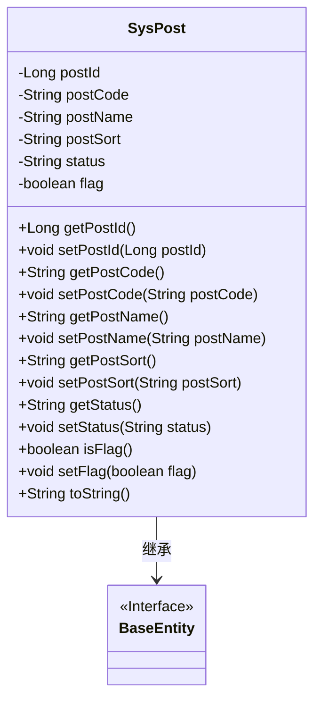

# 基础信息

|      |      |
|------|------|
| 编码语言 | .java |
| 代码路径 | ruoyi-system/ruoyi-system/src/main/java/com/ruoyi/system/domain/SysPost.java |
| 包名 | com.ruoyi.system.domain |
| 依赖项 | ['javax.validation.constraints', 'org.apache.commons.lang3.builder.ToStringBuilder', 'org.apache.commons.lang3.builder.ToStringStyle', 'com.ruoyi.common.annotation.Excel', 'com.ruoyi.common.annotation.Excel.ColumnType', 'com.ruoyi.common.core.domain.BaseEntity'] |
| 概述说明 | SysPost类含岗位ID、编码、名称、排序、状态及标识字段，提供getter和setter方法。 |

# 说明

SysPost类是一个用于管理岗位信息的实体类，包含岗位ID、编码、名称、排序、状态及标识字段。该类提供了标准的getter和setter方法，用于访问和修改这些字段的值。通过这个类，可以方便地管理岗位的基本信息，包括唯一标识、编码、名称、排序顺序、当前状态以及其他相关标识。

# 类列表 Class Summary

| 名称   | 类型  | 说明 |
|-------|------|-------------|
| SysPost | class | SysPost类包含岗位ID、编码、名称、排序、状态及标识字段，提供getter和setter方法。 |

## 类 SysPost

|      |      |
|------|------|
| 访问范围 | public |
| 类型 | class |
| 名称 | SysPost |
| 说明 | SysPost类包含岗位ID、编码、名称、排序、状态及标识字段，提供getter和setter方法。 |

### UML类图

这段代码定义了一个`SysPost`类，它继承自`BaseEntity`接口。`SysPost`类包含多个私有属性，如`postId`、`postCode`、`postName`等，并为这些属性提供了相应的getter和setter方法。此外，`SysPost`类还重写了`toString`方法，用于返回对象的字符串表示。`SysPost`类通过继承`BaseEntity`接口，可能继承了某些基础实体的行为或属性。该类的设计主要用于管理系统中的岗位信息，包含岗位的基本属性及其状态。

### 内部方法调用关系图

```mermaid
graph TD
    A["类SysPost"]
    B["属性: Long postId"]
    C["属性: String postCode"]
    D["属性: String postName"]
    E["属性: String postSort"]
    F["属性: String status"]
    G["属性: boolean flag"]
    H["方法: Long getPostId()"]
    I["方法: void setPostId(Long postId)"]
    J["方法: String getPostCode()"]
    K["方法: void setPostCode(String postCode)"]
    L["方法: String getPostName()"]
    M["方法: void setPostName(String postName)"]
    N["方法: String getPostSort()"]
    O["方法: void setPostSort(String postSort)"]
    P["方法: String getStatus()"]
    Q["方法: void setStatus(String status)"]
    R["方法: boolean isFlag()"]
    S["方法: void setFlag(boolean flag)"]
    T["重写方法: String toString()"]

    A --> B
    A --> C
    A --> D
    A --> E
    A --> F
    A --> G
    A --> H
    A --> I
    A --> J
    A --> K
    A --> L
    A --> M
    A --> N
    A --> O
    A --> P
    A --> Q
    A --> R
    A --> S
    A --> T
```

这段代码定义了一个名为`SysPost`的类，继承自`BaseEntity`。类中包含多个属性，如`postId`、`postCode`、`postName`等，并为每个属性提供了相应的getter和setter方法。此外，类中还重写了`toString`方法，用于返回对象的字符串表示。每个属性都有相应的注解用于数据验证和Excel导出时的列配置。代码结构清晰，功能明确，主要用于管理岗位信息。

### 字段列表 Field List

| 名称  | 类型  | 说明 |
|-------|-------|------|
| serialVersionUID = 1L | long | 定义序列化版本号，确保类版本一致性。 |
| postCode | String | 岗位编码字段为字符串类型。 |
| flag = false | boolean | 私有布尔变量flag初始值为false。 |
| status | String | Excel字段“状态”对应值：0表示正常，1表示停用。 |
| postId | Long | 岗位序号为长整型数字字段。 |
| postName | String | Excel岗位名称字段定义为postName。 |
| postSort | String | Excel列“岗位排序”为数字类型，存储排序信息。 |

### 方法列表 Method List

| 名称  | 类型  | 说明 |
|-------|-------|------|
| getPostId | Long | 该方法返回postId的长整型值。 |
| isFlag | boolean | 该方法返回布尔变量`flag`的值。 |
| setPostCode | void | 设置邮政编码的方法，参数为字符串类型。 |
| getPostSort | String | 显示顺序字段的非空校验方法。 |
| getStatus | String | 获取状态值的方法。 |
| setPostName | void | 设置岗位名称的方法，将传入参数赋值给实例变量。 |
| getPostName | String | 岗位名称长度限制50字符，不能为空。 |
| setStatus | void | 设置状态方法，将传入的状态值赋给当前对象的状态变量。 |
| toString | String | 重写toString方法，返回包含多个属性的多行字符串。 |
| setPostSort | void | 定义方法setPostSort，用于设置postSort属性。 |
| setPostId | void | 设置帖子ID的方法，将传入的postId赋值给当前对象。 |
| getPostCode | String | 岗位编码长度限制为64字符，不能为空。 |
| setFlag | void | 设置布尔类型标志变量的方法。 |

