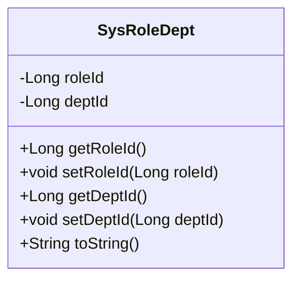
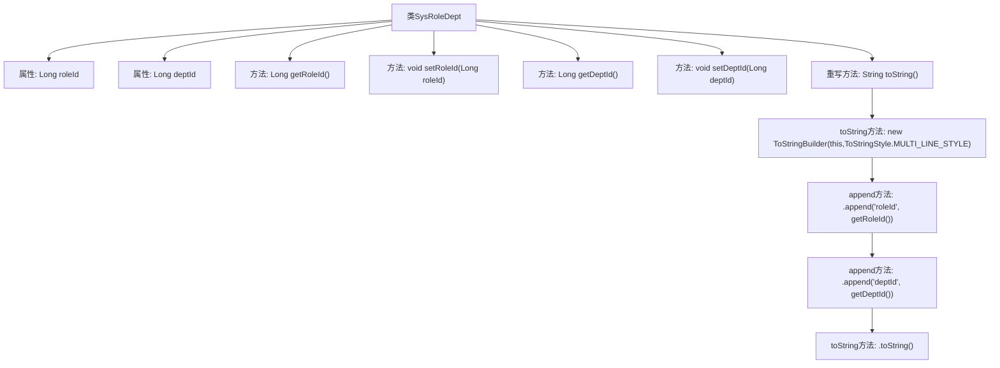

# 基础信息

|      |      |
|------|------|
| 编码语言 | .java |
| 代码路径 | ruoyi-system/ruoyi-system/src/main/java/com/ruoyi/system/domain/SysRoleDept.java |
| 包名 | com.ruoyi.system.domain |
| 依赖项 | ['org.apache.commons.lang3.builder.ToStringBuilder', 'org.apache.commons.lang3.builder.ToStringStyle'] |
| 概述说明 | SysRoleDept类包含角色ID和部门ID，提供getter、setter和toString方法。 |

# 说明

SysRoleDept类是一个包含角色ID和部门ID的实体类。该类提供了获取和设置角色ID与部门ID的getter和setter方法，以便外部代码能够访问和修改这些属性。此外，该类还重写了toString方法，用于返回该对象的字符串表示形式，通常包括角色ID和部门ID的信息，以便于调试和日志记录。

# 类列表 Class Summary

| 名称   | 类型  | 说明 |
|-------|------|-------------|
| SysRoleDept | class | SysRoleDept类包含角色ID和部门ID，提供getter和setter方法，并重写toString方法。 |

## 类 SysRoleDept

|      |      |
|------|------|
| 访问范围 | public |
| 类型 | class |
| 名称 | SysRoleDept |
| 说明 | SysRoleDept类包含角色ID和部门ID，提供getter和setter方法，并重写toString方法。 |

### UML类图

**描述：**
`SysRoleDept` 类用于表示角色与部门之间的关联关系。它包含两个私有属性 `roleId` 和 `deptId`，分别表示角色ID和部门ID。类提供了获取和设置这两个属性的公有方法，并重写了 `toString` 方法以返回对象的字符串表示形式。该类主要用于管理和操作角色与部门之间的关联数据。

### 内部方法调用关系图

这段代码定义了一个名为`SysRoleDept`的类，包含两个属性`roleId`和`deptId`，并提供了相应的getter和setter方法。类中重写了`toString`方法，使用`ToStringBuilder`来构建多行风格的字符串表示，依次追加`roleId`和`deptId`的值，最终返回生成的字符串。

### 字段列表 Field List

| 名称  | 类型  | 说明 |
|-------|-------|------|
| roleId | Long | 定义长整型角色ID变量。 |
| deptId | Long | 定义长整型部门ID变量。 |

### 方法列表 Method List

| 名称  | 类型  | 说明 |
|-------|-------|------|
| getRoleId | Long | 获取角色ID的方法。 |
| toString | String | 重写toString方法，返回角色ID和部门ID的多行字符串。 |
| getDeptId | Long | 获取部门ID的方法，返回长整型数值。 |
| setDeptId | void | 设置部门ID的方法，将传入的deptId赋值给当前对象。 |
| setRoleId | void | 设置角色ID的方法，将传入的roleId赋值给当前对象的roleId属性。 |

