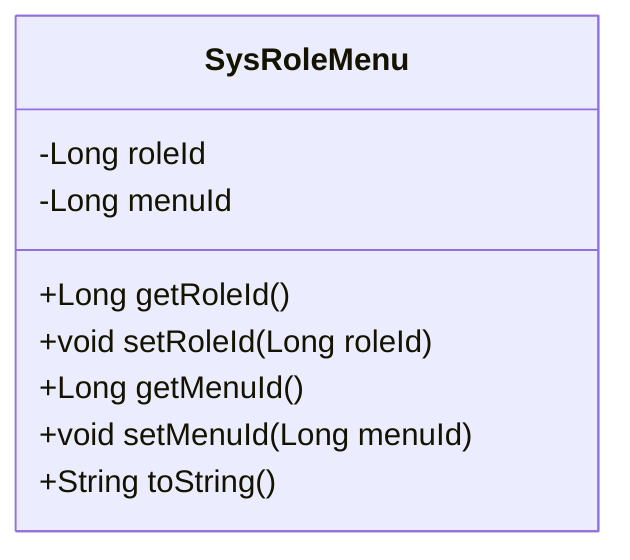
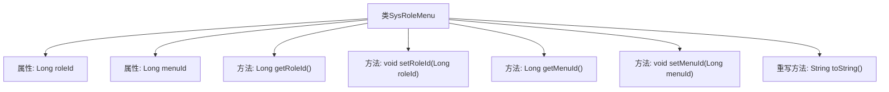

# 基础信息

|      |      |
|------|------|
| 编码语言 | .java |
| 代码路径 | ruoyi-system/ruoyi-system/src/main/java/com/ruoyi/system/domain/SysRoleMenu.java |
| 包名 | com.ruoyi.system.domain |
| 依赖项 | ['org.apache.commons.lang3.builder.ToStringBuilder', 'org.apache.commons.lang3.builder.ToStringStyle'] |
| 概述说明 | SysRoleMenu类包含角色ID和菜单ID，提供getter和setter方法，重写toString方法。 |

# 说明

SysRoleMenu类是一个用于管理角色与菜单关联的实体类。该类包含两个主要属性：角色ID和菜单ID，分别用于标识角色和菜单的唯一性。类中提供了getter和setter方法，用于获取和设置这两个属性的值。此外，该类还重写了toString方法，以便在需要时将对象转换为字符串形式，便于调试和日志记录。这个类主要用于在系统中维护角色与菜单之间的映射关系，确保权限管理的准确性和可追溯性。

# 类列表 Class Summary

| 名称   | 类型  | 说明 |
|-------|------|-------------|
| SysRoleMenu | class | SysRoleMenu类包含角色ID和菜单ID，提供getter和setter方法，并重写toString方法。 |

## 类 SysRoleMenu

|      |      |
|------|------|
| 访问范围 | public |
| 类型 | class |
| 名称 | SysRoleMenu |
| 说明 | SysRoleMenu类包含角色ID和菜单ID，提供getter和setter方法，并重写toString方法。 |

### UML类图

这段代码定义了一个名为 `SysRoleMenu` 的类，用于表示角色与菜单之间的关系。该类包含两个私有属性 `roleId` 和 `menuId`，分别表示角色ID和菜单ID。类中提供了这两个属性的 getter 和 setter 方法，用于获取和设置它们的值。此外，类中还重写了 `toString` 方法，使用 `ToStringBuilder` 来生成一个格式化的字符串表示对象的状态。这个类主要用于管理角色与菜单之间的关联关系，便于在系统中进行角色权限的管理。

### 内部方法调用关系图

这段代码定义了一个名为 `SysRoleMenu` 的类，该类包含两个属性 `roleId` 和 `menuId`，分别表示角色ID和菜单ID。类中提供了获取和设置这两个属性的方法，并重写了 `toString` 方法，使用 `ToStringBuilder` 以多行样式返回对象的字符串表示。流程图展示了类的结构及其方法之间的调用关系。

### 字段列表 Field List

| 名称  | 类型  | 说明 |
|-------|-------|------|
| menuId | Long | 菜单ID为长整型。 |
| roleId | Long | 定义了一个名为roleId的长整型私有变量。 |

### 方法列表 Method List

| 名称  | 类型  | 说明 |
|-------|-------|------|
| setMenuId | void | 设置菜单ID的方法。 |
| getMenuId | Long | 获取菜单ID的方法，返回长整型menuId。 |
| getRoleId | Long | 获取角色ID的方法，返回类型为Long。 |
| setRoleId | void | 设置角色ID的方法，将参数roleId赋值给当前对象的roleId属性。 |
| toString | String | 重写toString方法，输出roleId和menuId的多行格式。 |

