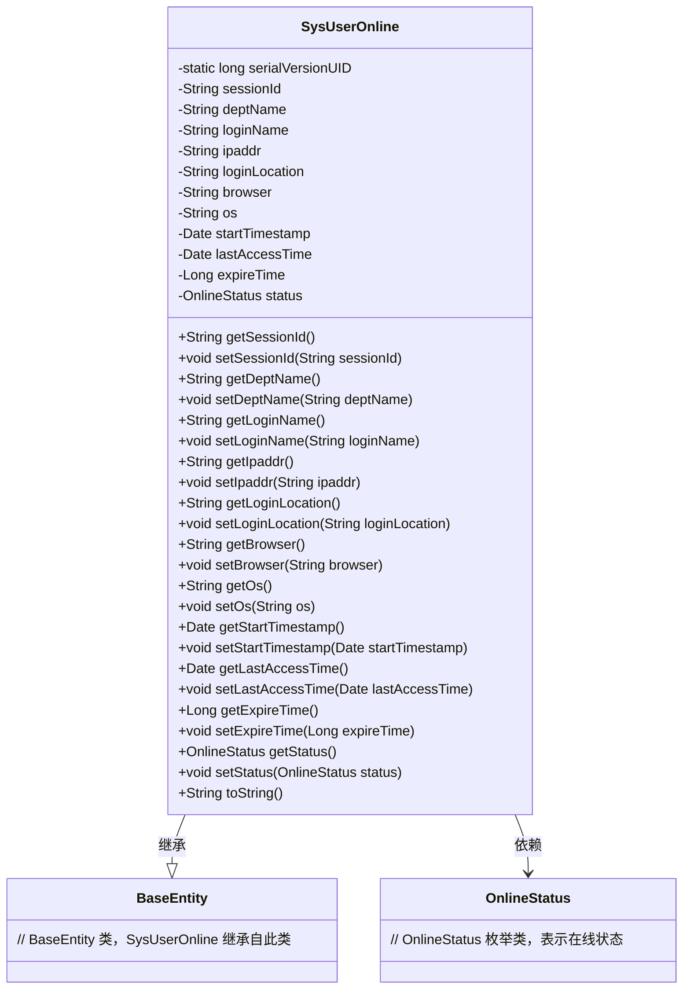

# 基础信息

|      |      |
|------|------|
| 编码语言 | .java |
| 代码路径 | ruoyi-system/ruoyi-system/src/main/java/com/ruoyi/system/domain/SysUserOnline.java |
| 包名 | com.ruoyi.system.domain |
| 依赖项 | ['java.util.Date', 'org.apache.commons.lang3.builder.ToStringBuilder', 'org.apache.commons.lang3.builder.ToStringStyle', 'com.ruoyi.common.core.domain.BaseEntity', 'com.ruoyi.common.enums.OnlineStatus'] |
| 概述说明 | SysUserOnline继承BaseEntity，包含会话、登录、在线状态等属性。 |

# 说明

SysUserOnline类继承自BaseEntity，主要用于管理用户在线状态和相关会话信息。该类包含多个属性，用于记录用户的会话数据、登录详情以及当前的在线状态。通过这些属性，可以全面追踪和管理用户的在线行为，确保系统能够实时掌握用户的登录和活动情况。

# 类列表 Class Summary

| 名称   | 类型  | 说明 |
|-------|------|-------------|
| SysUserOnline | class | SysUserOnline类扩展BaseEntity，包含用户会话、登录信息、在线状态等属性。 |

## 类 SysUserOnline

|      |      |
|------|------|
| 访问范围 | public |
| 类型 | class |
| 名称 | SysUserOnline |
| 说明 | SysUserOnline类扩展BaseEntity，包含用户会话、登录信息、在线状态等属性。 |

### UML类图

**描述：**  
`SysUserOnline` 类继承自 `BaseEntity`，用于表示系统用户的在线状态信息。它包含多个私有属性，如会话ID、登录名、IP地址、浏览器类型、操作系统等，并提供了相应的 getter 和 setter 方法。`SysUserOnline` 类依赖于 `OnlineStatus` 枚举类来表示用户的在线状态。通过 `toString` 方法，可以格式化输出对象的所有属性信息。

### 内部方法调用关系图

这段代码定义了一个名为 `SysUserOnline` 的类，该类继承自 `BaseEntity`。类中包含了多个属性，如 `sessionId`、`deptName`、`loginName` 等，分别用于存储用户会话ID、部门名称、登录名称等信息。每个属性都有对应的 `getter` 和 `setter` 方法，用于获取和设置属性的值。此外，类中还重写了 `toString` 方法，用于返回对象的字符串表示，格式为多行样式，包含了所有属性的值。

### 字段列表 Field List

| 名称  | 类型  | 说明 |
|-------|-------|------|
| loginLocation | String | 定义私有字符串变量loginLocation。 |
| serialVersionUID = 1L | long | 定义序列化版本UID为1L。 |
| lastAccessTime | Date | 最后访问时间的私有日期变量。 |
| deptName | String | 定义私有字符串变量deptName。 |
| sessionId | String | 定义了一个私有字符串类型的sessionId变量。 |
| startTimestamp | Date | 私有日期类型变量startTimestamp。 |
| status = OnlineStatus.on_line | OnlineStatus | 私有变量status设置为在线状态。 |
| os | String | 定义了一个私有的字符串变量os。 |
| loginName | String | 定义了一个私有字符串变量loginName。 |
| expireTime | Long | 存储过期时间的长整型变量。 |
| ipaddr | String | 定义私有字符串变量ipaddr。 |
| browser | String | 定义了一个私有字符串变量browser。 |

### 方法列表 Method List

| 名称  | 类型  | 说明 |
|-------|-------|------|
| setOs | void | 定义方法设置操作系统字符串变量。 |
| setLoginLocation | void | 设置用户登录位置的方法。 |
| getStartTimestamp | Date | 获取开始时间戳的方法。 |
| setIpaddr | void | 设置IP地址的方法。 |
| getExpireTime | Long | 获取过期时间的Java方法。 |
| setLoginName | void | 设置用户登录名的方法。 |
| getSessionId | String | 获取当前会话ID的方法。 |
| getOs | String | 获取操作系统信息的方法。 |
| getBrowser | String | 该方法返回浏览器名称。 |
| setStatus | void | 设置用户在线状态的方法。 |
| getLoginName | String | 获取登录名称的方法。 |
| getLastAccessTime | Date | 获取最后访问时间的公共方法。 |
| setStartTimestamp | void | 设置起始时间戳的方法。 |
| setExpireTime | void | 设置过期时间的方法，参数为长整型。 |
| getIpaddr | String | 该方法返回ipaddr变量的值。 |
| setLastAccessTime | void | 设置最后访问时间为指定日期。 |
| getLoginLocation | String | 获取登录位置的方法，返回loginLocation变量。 |
| getDeptName | String | 获取部门名称的方法，返回deptName变量。 |
| toString | String | 重写toString方法，返回包含会话信息的多行字符串。 |
| setSessionId | void | 设置会话ID的方法，将传入的sessionId赋值给当前对象的sessionId属性。 |
| setDeptName | void | 设置部门名称的方法，将输入值赋给类变量deptName。 |
| setBrowser | void | 设置浏览器属性的方法。 |
| getStatus | OnlineStatus | 该方法返回当前在线状态。 |

