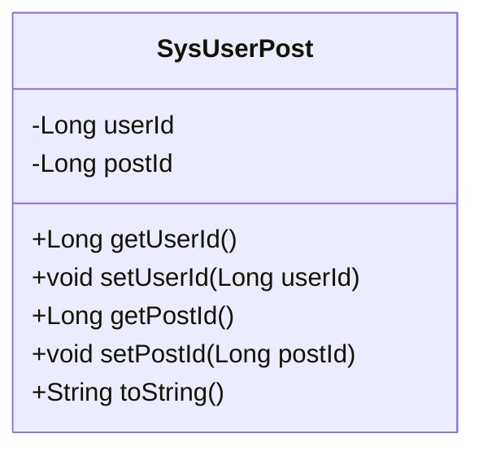
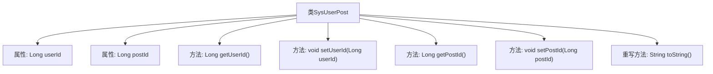

# 基础信息

|      |      |
|------|------|
| 编码语言 | .java |
| 代码路径 | ruoyi-system/ruoyi-system/src/main/java/com/ruoyi/system/domain/SysUserPost.java |
| 包名 | com.ruoyi.system.domain |
| 依赖项 | ['org.apache.commons.lang3.builder.ToStringBuilder', 'org.apache.commons.lang3.builder.ToStringStyle'] |
| 概述说明 | SysUserPost类包含用户ID和岗位ID，提供getter和setter方法，并重写toString方法。 |

# 说明

SysUserPost类用于管理用户与岗位的关联关系，包含两个关键属性：用户ID和岗位ID。该类提供了标准的getter和setter方法，用于获取和设置这两个属性的值。此外，SysUserPost类还重写了toString方法，以便在需要时以字符串形式展示对象的内容。这个类的设计简洁明了，专注于用户与岗位的关联数据管理，适用于需要处理用户岗位信息的应用场景。

# 类列表 Class Summary

| 名称   | 类型  | 说明 |
|-------|------|-------------|
| SysUserPost | class | SysUserPost类包含用户ID和岗位ID，提供getter和setter方法，并重写toString方法。 |

## 类 SysUserPost

|      |      |
|------|------|
| 访问范围 | public |
| 类型 | class |
| 名称 | SysUserPost |
| 说明 | SysUserPost类包含用户ID和岗位ID，提供getter和setter方法，并重写toString方法。 |

### UML类图

这段代码定义了一个名为 `SysUserPost` 的类，用于表示用户与岗位之间的关系。类中包含两个私有属性 `userId` 和 `postId`，分别表示用户ID和岗位ID。类提供了这两个属性的公有getter和setter方法，用于访问和修改这些属性。此外，类还重写了 `toString` 方法，使用 `ToStringBuilder` 来生成格式化的字符串表示，以便在调试或日志记录时使用。

### 内部方法调用关系图

这段代码定义了一个名为 `SysUserPost` 的类，包含两个私有属性 `userId` 和 `postId`，以及对应的 `getter` 和 `setter` 方法。类中还重写了 `toString` 方法，使用 `ToStringBuilder` 来生成格式化的字符串表示。流程图展示了类的结构及其内部方法之间的关系，清晰地描述了类成员和方法的调用路径。

### 字段列表 Field List

| 名称  | 类型  | 说明 |
|-------|-------|------|
| userId | Long | 用户ID为长整型。 |
| postId | Long | 定义长整型变量postId。 |

### 方法列表 Method List

| 名称  | 类型  | 说明 |
|-------|-------|------|
| getUserId | Long | 该方法返回用户ID。 |
| getPostId | Long | 获取文章ID的方法，返回长整型数值。 |
| setUserId | void | 设置用户ID的方法，将传入的userId赋值给当前对象的userId属性。 |
| toString | String | 重写toString方法，返回用户ID和帖子ID的多行字符串。 |
| setPostId | void | 设置帖子ID的方法，将传入的postId赋值给当前对象。 |

