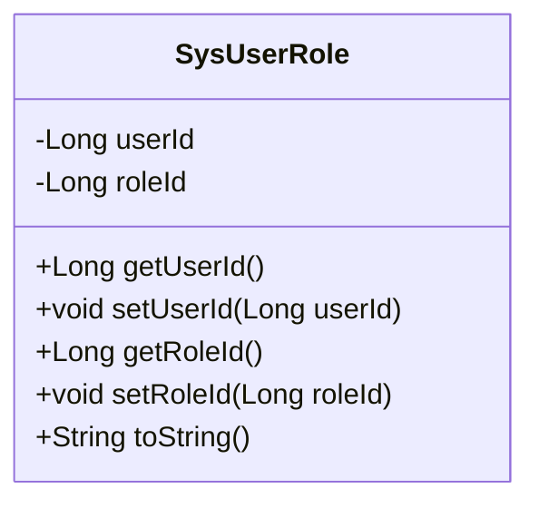
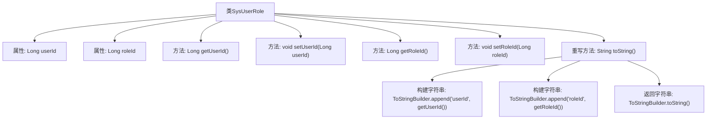

# 基础信息

|      |      |
|------|------|
| 编码语言 | .java |
| 代码路径 | ruoyi-system/ruoyi-system/src/main/java/com/ruoyi/system/domain/SysUserRole.java |
| 包名 | com.ruoyi.system.domain |
| 依赖项 | ['org.apache.commons.lang3.builder.ToStringBuilder', 'org.apache.commons.lang3.builder.ToStringStyle'] |
| 概述说明 | SysUserRole类包含用户ID和角色ID，提供getter、setter和toString方法。 |

# 说明

SysUserRole类包含两个主要属性：用户ID和角色ID。该类提供了获取和设置这两个属性的getter和setter方法。此外，该类还重写了toString方法，以便在需要时将对象转换为字符串表示形式。

# 类列表 Class Summary

| 名称   | 类型  | 说明 |
|-------|------|-------------|
| SysUserRole | class | SysUserRole类包含用户ID和角色ID，提供getter和setter方法，并重写toString方法。 |

## 类 SysUserRole

|      |      |
|------|------|
| 访问范围 | public |
| 类型 | class |
| 名称 | SysUserRole |
| 说明 | SysUserRole类包含用户ID和角色ID，提供getter和setter方法，并重写toString方法。 |

### UML类图

这段代码定义了一个名为 `SysUserRole` 的类，用于表示用户与角色之间的关系。该类包含两个私有属性 `userId` 和 `roleId`，分别表示用户ID和角色ID。类中提供了这两个属性的getter和setter方法，用于获取和设置属性的值。此外，`toString` 方法被重写，返回一个格式化的字符串，包含 `userId` 和 `roleId` 的值。这个类主要用于在系统中管理用户与角色的关联关系。

### 内部方法调用关系图

这段代码定义了一个名为`SysUserRole`的类，包含两个私有属性`userId`和`roleId`，并提供了相应的getter和setter方法。类中重写了`toString`方法，使用`ToStringBuilder`类构建并返回一个格式化的字符串，展示`userId`和`roleId`的值。流程图展示了类的结构及其内部方法的调用关系，清晰地描述了属性、方法和`toString`方法的构建过程。

### 字段列表 Field List

| 名称  | 类型  | 说明 |
|-------|-------|------|
| roleId | Long | 角色ID为长整型数据。 |
| userId | Long | 用户ID为长整型数据。 |

### 方法列表 Method List

| 名称  | 类型  | 说明 |
|-------|-------|------|
| getRoleId | Long | 获取角色ID的方法。 |
| setUserId | void | 设置用户ID的方法，将传入的userId赋值给当前对象的userId属性。 |
| getUserId | Long | 该方法返回用户的唯一标识符userId。 |
| setRoleId | void | 设置角色ID的方法，将传入的roleId赋值给当前对象的roleId属性。 |
| toString | String | 重写toString方法，输出userId和roleId的多行格式。 |

