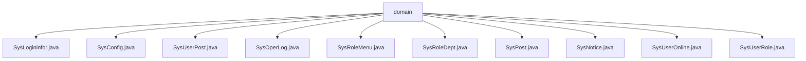

# 基础信息

|      |      |
|------|------|
| 编码语言 | .java |
| 代码路径 | ruoyi-system/ruoyi-system/src/main/java/com/ruoyi/system/domain |
| 包名 | ruoyi-system.ruoyi-system.src.main.java.com.ruoyi.system.domain |
| 概述说明 | SysLogininfor记录登录信息，SysConfig管理系统配置，SysUserPost管理用户岗位关联，SysOperLog记录操作日志，SysRoleMenu管理角色菜单关联，SysRoleDept管理角色部门关联，SysPost管理岗位信息，SysNotice管理公告，SysUserOnline管理用户在线状态，SysUserRole管理用户角色关联。 |

# 说明

SysLogininfor类记录用户登录信息，包括账号、状态、IP地址、地点、浏览器、操作系统、消息和时间。SysConfig类管理系统配置，包含配置ID、名称、键名、键值和内置属性，提供getter和setter方法。SysUserPost类管理用户与岗位关联，包含用户ID和岗位ID，提供getter和setter方法，重写toString方法。SysOperLog类记录系统操作日志，包括操作ID、模块、类型、人员和时间。SysRoleMenu类管理角色与菜单关联，包含角色ID和菜单ID，提供getter和setter方法，重写toString方法。SysRoleDept类包含角色ID和部门ID，提供getter和setter方法，重写toString方法。SysPost类管理岗位信息，包含岗位ID、编码、名称、排序、状态和标识字段，提供getter和setter方法。SysNotice类管理系统公告，包含ID、标题、类型、内容和状态。SysUserOnline类管理用户在线状态和会话信息，继承自BaseEntity。SysUserRole类包含用户ID和角色ID，提供getter和setter方法，重写toString方法。

### 包内部结构视图

该流程图展示了`ruoyi-system`项目中`domain`目录下的所有文件结构。`domain`作为根节点，连接了多个具体的Java类文件，如`SysLogininfor.java`、`SysConfig.java`等。这些文件代表了系统中不同模块的领域模型，用于处理用户登录信息、系统配置、用户职位等业务逻辑。通过该图可以清晰地看到`domain`目录下的文件层级关系。

# 文件列表 File List

| 名称   | 类型  | 说明 |
|-------|------|-------------|
| [SysUserRole.java](SysUserRole.md) | file | SysUserRole类包含用户ID和角色ID，提供getter、setter和toString方法。 |
| [SysUserOnline.java](SysUserOnline.md) | file | SysUserOnline继承BaseEntity，包含会话、登录、在线状态等属性。 |
| [SysNotice.java](SysNotice.md) | file | SysNotice类管理公告，含ID、标题、类型、内容和状态属性。 |
| [SysPost.java](SysPost.md) | file | SysPost类含岗位ID、编码、名称、排序、状态及标识字段，提供getter和setter方法。 |
| [SysRoleDept.java](SysRoleDept.md) | file | SysRoleDept类包含角色ID和部门ID，提供getter、setter和toString方法。 |
| [SysRoleMenu.java](SysRoleMenu.md) | file | SysRoleMenu类包含角色ID和菜单ID，提供getter和setter方法，重写toString方法。 |
| [SysOperLog.java](SysOperLog.md) | file | SysOperLog类记录系统操作日志，包含操作ID、模块、类型、人员、时间等信息。 |
| [SysUserPost.java](SysUserPost.md) | file | SysUserPost类包含用户ID和岗位ID，提供getter和setter方法，并重写toString方法。 |
| [SysConfig.java](SysConfig.md) | file | SysConfig类含配置ID、名称、键名、键值及系统属性，提供getter和setter方法。 |
| [SysLogininfor.java](SysLogininfor.md) | file | SysLogininfor类记录用户登录信息，包含账号、状态、IP、地点、浏览器、系统、消息和时间。 |
| [SysUserRole.java](SysUserRole.md) | file | SysUserRole类包含用户ID和角色ID，提供getter、setter和toString方法。 |
| [SysUserOnline.java](SysUserOnline.md) | file | SysUserOnline继承BaseEntity，包含会话、登录、在线状态等属性。 |
| [SysNotice.java](SysNotice.md) | file | SysNotice类管理公告，含ID、标题、类型、内容和状态属性。 |
| [SysPost.java](SysPost.md) | file | SysPost类含岗位ID、编码、名称、排序、状态及标识字段，提供getter和setter方法。 |
| [SysRoleDept.java](SysRoleDept.md) | file | SysRoleDept类包含角色ID和部门ID，提供getter、setter和toString方法。 |
| [SysRoleMenu.java](SysRoleMenu.md) | file | SysRoleMenu类包含角色ID和菜单ID，提供getter和setter方法，重写toString方法。 |
| [SysOperLog.java](SysOperLog.md) | file | SysOperLog类记录系统操作日志，包含操作ID、模块、类型、人员、时间等信息。 |
| [SysUserPost.java](SysUserPost.md) | file | SysUserPost类包含用户ID和岗位ID，提供getter和setter方法，并重写toString方法。 |
| [SysConfig.java](SysConfig.md) | file | SysConfig类含配置ID、名称、键名、键值及系统属性，提供getter和setter方法。 |
| [SysLogininfor.java](SysLogininfor.md) | file | SysLogininfor类记录用户登录信息，包含账号、状态、IP、地点、浏览器、系统、消息和时间。 |

