# 基础信息

|      |      |
|------|------|
| 编码语言 | .java |
| 代码路径 | ruoyi-system/ruoyi-system/src/main/java/com/ruoyi/system/mapper |
| 包名 | ruoyi-system.ruoyi-system.src.main.java.com.ruoyi.system.mapper |
| 概述说明 | 内容为空，无法总结。请提供具体信息。 |

# 说明

提供的文本内容为空，无法进行总结描述。请提供具体内容以便生成准确、全面详尽的描述。

### 包内部结构视图

```mermaid
graph TD
    mapper --> SysPostMapper.java
    mapper --> SysUserPostMapper.java
    mapper --> SysUserRoleMapper.java
    mapper --> SysDictTypeMapper.java
    mapper --> SysUserMapper.java
    mapper --> SysOperLogMapper.java
    mapper --> SysRoleDeptMapper.java
    mapper --> SysNoticeMapper.java
    mapper --> SysConfigMapper.java
    mapper --> SysRoleMapper.java
    mapper --> SysUserOnlineMapper.java
    mapper --> SysDeptMapper.java
    mapper --> SysDictDataMapper.java
    mapper --> SysLogininforMapper.java
    mapper --> SysRoleMenuMapper.java
    mapper --> SysMenuMapper.java
```

该流程图展示了 `ruoyi-system` 项目中 `mapper` 目录下的所有文件及其层级关系。`mapper` 作为根节点，包含了多个与系统功能相关的映射文件，如用户、角色、部门、菜单等的映射文件。这些文件共同构成了系统数据访问层的基础，用于处理数据库操作和业务逻辑的映射。

# 文件列表 File List

| 名称   | 类型  | 说明 |
|-------|------|-------------|
| [SysMenuMapper.java](SysMenuMapper.md) | file | 无内容，无法生成描述。 |
| [SysRoleMenuMapper.java](SysRoleMenuMapper.md) | file | 信息为空，无法生成概要描述。 |
| [SysLogininforMapper.java](SysLogininforMapper.md) | file | 信息为空，无法生成概要描述。 |
| [SysDictDataMapper.java](SysDictDataMapper.md) | file | 内容为空，无法生成概要描述。 |
| [SysDeptMapper.java](SysDeptMapper.md) | file | 信息为空，无法生成概要描述。 |
| [SysUserOnlineMapper.java](SysUserOnlineMapper.md) | file | 信息为空，无法生成概要描述。 |
| [SysRoleMapper.java](SysRoleMapper.md) | file | 输入为空，无法生成概要描述。 |
| [SysConfigMapper.java](SysConfigMapper.md) | file | 信息为空，无法生成概要描述。 |
| [SysNoticeMapper.java](SysNoticeMapper.md) | file | 内容为空，无法生成概要描述。 |
| [SysRoleDeptMapper.java](SysRoleDeptMapper.md) | file | 无内容提供，无法生成概要描述。 |
| [SysOperLogMapper.java](SysOperLogMapper.md) | file | 信息为空，无法生成概要描述。 |
| [SysUserMapper.java](SysUserMapper.md) | file | 信息为空，无法生成概要描述。 |
| [SysDictTypeMapper.java](SysDictTypeMapper.md) | file | 信息为空，无法生成概要描述。 |
| [SysUserRoleMapper.java](SysUserRoleMapper.md) | file | 请提供具体信息以便生成概要描述。 |
| [SysUserPostMapper.java](SysUserPostMapper.md) | file | 无内容，无法生成概要描述。 |
| [SysPostMapper.java](SysPostMapper.md) | file | 无内容可总结。 |
| [SysMenuMapper.java](SysMenuMapper.md) | file | 无内容，无法生成描述。 |
| [SysRoleMenuMapper.java](SysRoleMenuMapper.md) | file | 信息为空，无法生成概要描述。 |
| [SysLogininforMapper.java](SysLogininforMapper.md) | file | 信息为空，无法生成概要描述。 |
| [SysDictDataMapper.java](SysDictDataMapper.md) | file | 内容为空，无法生成概要描述。 |
| [SysDeptMapper.java](SysDeptMapper.md) | file | 信息为空，无法生成概要描述。 |
| [SysUserOnlineMapper.java](SysUserOnlineMapper.md) | file | 信息为空，无法生成概要描述。 |
| [SysRoleMapper.java](SysRoleMapper.md) | file | 输入为空，无法生成概要描述。 |
| [SysConfigMapper.java](SysConfigMapper.md) | file | 信息为空，无法生成概要描述。 |
| [SysNoticeMapper.java](SysNoticeMapper.md) | file | 内容为空，无法生成概要描述。 |
| [SysRoleDeptMapper.java](SysRoleDeptMapper.md) | file | 无内容提供，无法生成概要描述。 |
| [SysOperLogMapper.java](SysOperLogMapper.md) | file | 信息为空，无法生成概要描述。 |
| [SysUserMapper.java](SysUserMapper.md) | file | 信息为空，无法生成概要描述。 |
| [SysDictTypeMapper.java](SysDictTypeMapper.md) | file | 信息为空，无法生成概要描述。 |
| [SysUserRoleMapper.java](SysUserRoleMapper.md) | file | 请提供具体信息以便生成概要描述。 |
| [SysUserPostMapper.java](SysUserPostMapper.md) | file | 无内容，无法生成概要描述。 |
| [SysPostMapper.java](SysPostMapper.md) | file | 无内容可总结。 |

