# 基础信息

|      |      |
|------|------|
| 编码语言 | .java |
| 代码路径 | ruoyi-system/ruoyi-system/src/main/java/com/ruoyi/system/service |
| 包名 | ruoyi-system.ruoyi-system.src.main.java.com.ruoyi.system.service |
| 概述说明 | 多个服务类实现系统日志、用户、角色、配置等管理功能。 |

# 说明

SysOperLogServiceImpl类负责操作日志的增删查清，确保日志完整性和可维护性。SysUserServiceImpl提供用户查询、增删改及角色权限管理，维护用户信息和权限。SysConfigServiceImpl管理系统参数配置，包含缓存管理，提升性能和稳定性。SysPostServiceImpl处理岗位信息的查询、新增、修改和删除，确保岗位唯一性。SysRoleServiceImpl实现角色查询、删除、新增、修改及校验，全面管理角色信息。SysLogininforServiceImpl管理登录日志的增删查清，高效记录用户登录信息。SysDictDataServiceImpl提供字典数据的分页查询、标签查询、ID查询、批量删除、新增和修改。SysNoticeServiceImpl支持公告的查询、新增、修改和删除，维护公告信息。SysDeptServiceImpl处理部门信息的查询、树形结构处理、增删改查及权限校验。SysUserOnlineServiceImpl管理在线用户会话的查询、删除、保存和缓存清理。字典类型管理系统提供缓存管理、增删改查及数据校验，确保数据完整性和高效访问。菜单管理功能涵盖查询、删除、新增、修改，集成权限校验，确保系统安全性和操作合法性。

### 包内部结构视图

```mermaid
graph TD
    service --> ISysPostService.java
    service --> ISysDictDataService.java
    service --> ISysConfigService.java
    service --> ISysRoleService.java
    service --> ISysOperLogService.java
    service --> ISysDeptService.java
    service --> ISysLogininforService.java
    service --> ISysNoticeService.java
    service --> ISysMenuService.java
    service --> ISysUserOnlineService.java
    service --> ISysDictTypeService.java
    service --> ISysUserService.java
    service --> impl
    impl --> SysOperLogServiceImpl.java
    impl --> SysUserServiceImpl.java
    impl --> SysConfigServiceImpl.java
    impl --> SysPostServiceImpl.java
    impl --> SysRoleServiceImpl.java
    impl --> SysLogininforServiceImpl.java
    impl --> SysDictDataServiceImpl.java
    impl --> SysNoticeServiceImpl.java
    impl --> SysDeptServiceImpl.java
    impl --> SysUserOnlineServiceImpl.java
    impl --> SysDictTypeServiceImpl.java
    impl --> SysMenuServiceImpl.java
```

该流程图展示了`ruoyi-system`项目中`service`模块的层级结构。`service`目录下包含多个接口文件（如`ISysPostService.java`等）和一个`impl`子目录，`impl`子目录中包含了这些接口的具体实现类（如`SysOperLogServiceImpl.java`等）。整体结构清晰，反映了服务接口与实现类之间的依赖关系。

# 文件列表 File List

| 名称   | 类型  | 说明 |
|-------|------|-------------|
| [ISysUserService.java](ISysUserService.md) | file | 无内容，无法生成概要描述。 |
| [ISysDictTypeService.java](ISysDictTypeService.md) | file | 无内容可总结。 |
| [ISysUserOnlineService.java](ISysUserOnlineService.md) | file | 内容为空，无法生成概要描述。 |
| [ISysMenuService.java](ISysMenuService.md) | file | 暂无内容，请提供具体信息以便生成概要描述。 |
| [ISysNoticeService.java](ISysNoticeService.md) | file | 内容为空，无法生成概要描述。 |
| [ISysLogininforService.java](ISysLogininforService.md) | file | 内容为空，无法生成概要描述。 |
| [ISysDeptService.java](ISysDeptService.md) | file | 输入内容为空，无法生成概要描述。 |
| [ISysOperLogService.java](ISysOperLogService.md) | file | 信息为空，无法生成概要描述。 |
| [ISysRoleService.java](ISysRoleService.md) | file | 无内容，无法生成概要描述。 |
| [ISysConfigService.java](ISysConfigService.md) | file | 信息为空，无法生成概要描述。 |
| [ISysDictDataService.java](ISysDictDataService.md) | file | 信息为空，无法生成概要描述。 |
| [ISysPostService.java](ISysPostService.md) | file | 信息为空，无法生成概要描述。 |
| [impl](impl/_module.md) | package | 多个服务类实现系统管理功能，涵盖日志、用户、配置、岗位、角色、登录、字典、公告、部门、在线用户及菜单管理，确保系统安全、高效运行。 |
| [ISysUserService.java](ISysUserService.md) | file | 无内容，无法生成概要描述。 |
| [ISysDictTypeService.java](ISysDictTypeService.md) | file | 无内容可总结。 |
| [ISysUserOnlineService.java](ISysUserOnlineService.md) | file | 内容为空，无法生成概要描述。 |
| [ISysMenuService.java](ISysMenuService.md) | file | 暂无内容，请提供具体信息以便生成概要描述。 |
| [ISysNoticeService.java](ISysNoticeService.md) | file | 内容为空，无法生成概要描述。 |
| [ISysLogininforService.java](ISysLogininforService.md) | file | 内容为空，无法生成概要描述。 |
| [ISysDeptService.java](ISysDeptService.md) | file | 输入内容为空，无法生成概要描述。 |
| [ISysOperLogService.java](ISysOperLogService.md) | file | 信息为空，无法生成概要描述。 |
| [ISysRoleService.java](ISysRoleService.md) | file | 无内容，无法生成概要描述。 |
| [ISysConfigService.java](ISysConfigService.md) | file | 信息为空，无法生成概要描述。 |
| [ISysDictDataService.java](ISysDictDataService.md) | file | 信息为空，无法生成概要描述。 |
| [ISysPostService.java](ISysPostService.md) | file | 信息为空，无法生成概要描述。 |
| [impl](impl/_module.md) | package | 多个服务类实现系统管理功能，涵盖日志、用户、配置、岗位、角色、登录、字典、公告、部门、在线用户及菜单管理，确保系统安全、高效运行。 |

