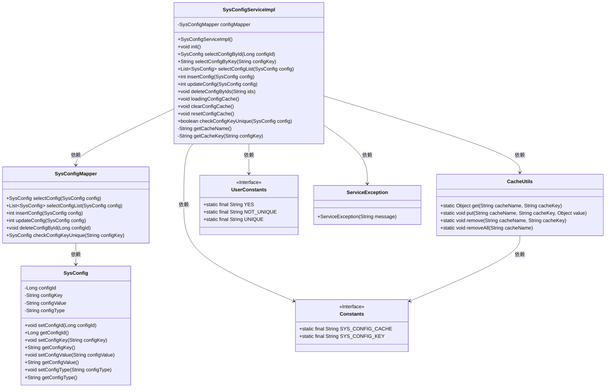

# 基础信息

|      |      |
|------|------|
| 编码语言 | .java |
| 代码路径 | ruoyi-system/ruoyi-system/src/main/java/com/ruoyi/system/service/impl/SysConfigServiceImpl.java |
| 包名 | com.ruoyi.system.service.impl |
| 依赖项 | ['java.util.List', 'javax.annotation.PostConstruct', 'org.springframework.beans.factory.annotation.Autowired', 'org.springframework.stereotype.Service', 'com.ruoyi.common.constant.Constants', 'com.ruoyi.common.constant.UserConstants', 'com.ruoyi.common.core.text.Convert', 'com.ruoyi.common.exception.ServiceException', 'com.ruoyi.common.utils.CacheUtils', 'com.ruoyi.common.utils.StringUtils', 'com.ruoyi.system.domain.SysConfig', 'com.ruoyi.system.mapper.SysConfigMapper', 'com.ruoyi.system.service.ISysConfigService'] |
| 概述说明 | SysConfigServiceImpl实现ISysConfigService，管理参数配置及缓存。 |

# 说明

SysConfigServiceImpl类实现了ISysConfigService接口，主要负责系统参数配置的管理工作。该服务类提供了对参数配置的增删改查操作，同时还包含了缓存管理功能，确保系统参数的高效访问和更新。通过这一实现，系统能够灵活地管理和维护配置数据，提升整体性能和稳定性。

# 类列表 Class Summary

| 名称   | 类型  | 说明 |
|-------|------|-------------|
| SysConfigServiceImpl | class | SysConfigServiceImpl实现ISysConfigService，提供参数配置的增删改查及缓存管理功能。 |

## 类 SysConfigServiceImpl

|      |      |
|------|------|
| 访问范围 | @Service;public |
| 类型 | class |
| 名称 | SysConfigServiceImpl |
| 说明 | SysConfigServiceImpl实现ISysConfigService，提供参数配置的增删改查及缓存管理功能。 |

### UML类图

### 描述
`SysConfigServiceImpl` 是一个服务类，负责管理系统配置的增删改查操作，并与缓存进行交互。它依赖于 `SysConfigMapper` 进行数据库操作，使用 `CacheUtils` 管理缓存数据。`SysConfig` 类表示配置信息，`Constants` 和 `UserConstants` 提供常量和枚举值。`ServiceException` 用于处理异常情况。该类的核心功能包括初始化缓存、查询配置、更新配置、删除配置以及校验配置键的唯一性。

### 内部方法调用关系图

```mermaid
graph TD
    A["类SysConfigServiceImpl"]
    B["属性: SysConfigMapper configMapper"]
    C["方法: init()"]
    D["方法: selectConfigById(Long configId)"]
    E["方法: selectConfigByKey(String configKey)"]
    F["方法: selectConfigList(SysConfig config)"]
    G["方法: insertConfig(SysConfig config)"]
    H["方法: updateConfig(SysConfig config)"]
    I["方法: deleteConfigByIds(String ids)"]
    J["方法: loadingConfigCache()"]
    K["方法: clearConfigCache()"]
    L["方法: resetConfigCache()"]
    M["方法: checkConfigKeyUnique(SysConfig config)"]
    N["方法: getCacheName()"]
    O["方法: getCacheKey(String configKey)"]

    A --> B
    A --> C
    A --> D
    A --> E
    A --> F
    A --> G
    A --> H
    A --> I
    A --> J
    A --> K
    A --> L
    A --> M
    A --> N
    A --> O
```

**描述：**  
该流程图展示了`SysConfigServiceImpl`类的结构及其内部方法。`SysConfigServiceImpl`类通过`SysConfigMapper`与数据库交互，提供了多种操作配置参数的方法，包括初始化缓存、查询、插入、更新、删除配置参数等。此外，还包含了一些辅助方法如获取缓存名称和缓存键。每个方法都通过箭头与类主体连接，清晰地展示了类的方法调用关系。

### 字段列表 Field List

| 名称  | 类型  | 说明 |
|-------|-------|------|
| configMapper | SysConfigMapper | 自动注入SysConfigMapper配置映射器实例。 |

### 方法列表 Method List

| 名称  | 类型  | 说明 |
|-------|-------|------|
| init | void | 初始化方法加载配置缓存。 |
| clearConfigCache | void | 清除指定名称的缓存配置。 |
| getCacheName | String | 获取系统配置缓存名称的方法。 |
| insertConfig | int | 重写insertConfig方法，插入配置并更新缓存。 |
| resetConfigCache | void | 重置配置缓存，先清除再加载。 |
| selectConfigById | SysConfig | 根据配置ID查询系统配置信息并返回结果。 |
| getCacheKey | String | 生成缓存键方法，拼接系统配置键与传入键。 |
| selectConfigList | List<SysConfig> | 重写方法，调用Mapper查询配置列表并返回结果。 |
| selectConfigByKey | String | 通过缓存或数据库获取配置值并返回。 |
| deleteConfigByIds | void | 方法删除指定ID的配置，内置参数不可删除，并清除缓存。 |
| updateConfig | int | 更新系统配置，先检查并清理缓存，再更新数据库并刷新缓存。 |
| checkConfigKeyUnique | boolean | 检查配置键是否唯一，若存在且ID不同则返回不唯一，否则返回唯一。 |
| loadingConfigCache | void | 加载配置缓存，遍历配置列表并存入缓存。 |

