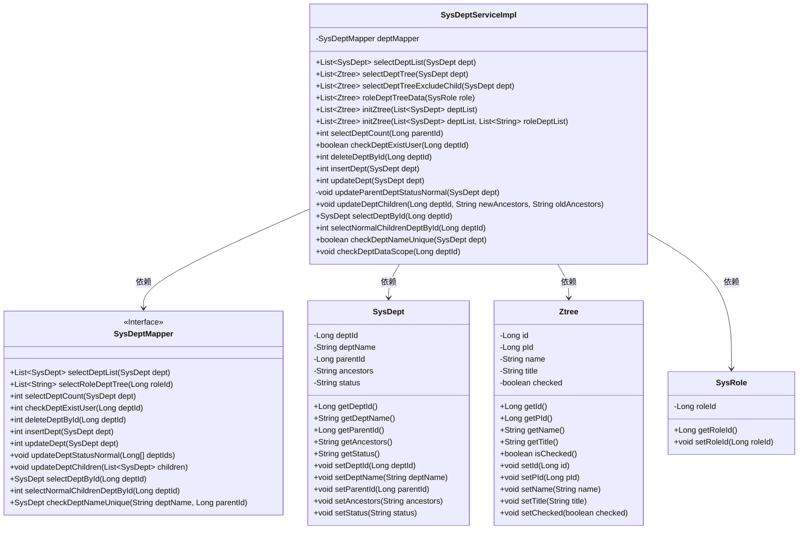

# 基础信息

|      |      |
|------|------|
| 编码语言 | .java |
| 代码路径 | ruoyi-system/ruoyi-system/src/main/java/com/ruoyi/system/service/impl/SysDeptServiceImpl.java |
| 包名 | com.ruoyi.system.service.impl |
| 依赖项 | ['java.util.ArrayList', 'java.util.List', 'org.apache.commons.lang3.ArrayUtils', 'org.springframework.beans.factory.annotation.Autowired', 'org.springframework.stereotype.Service', 'org.springframework.transaction.annotation.Transactional', 'com.ruoyi.common.annotation.DataScope', 'com.ruoyi.common.constant.UserConstants', 'com.ruoyi.common.core.domain.Ztree', 'com.ruoyi.common.core.domain.entity.SysDept', 'com.ruoyi.common.core.domain.entity.SysRole', 'com.ruoyi.common.core.domain.entity.SysUser', 'com.ruoyi.common.core.text.Convert', 'com.ruoyi.common.exception.ServiceException', 'com.ruoyi.common.utils.ShiroUtils', 'com.ruoyi.common.utils.StringUtils', 'com.ruoyi.common.utils.spring.SpringUtils', 'com.ruoyi.system.mapper.SysDeptMapper', 'com.ruoyi.system.service.ISysDeptService'] |
| 概述说明 | SysDeptServiceImpl实现ISysDeptService，提供部门管理和权限校验功能。 |

# 说明

SysDeptServiceImpl实现了ISysDeptService接口，主要负责部门管理功能。其核心功能包括部门信息的查询、树形结构的处理、部门的增加、删除、修改和查询操作，以及权限校验。该服务类全面覆盖了部门管理的基本需求，确保数据的完整性和安全性。

# 类列表 Class Summary

| 名称   | 类型  | 说明 |
|-------|------|-------------|
| SysDeptServiceImpl | class | SysDeptServiceImpl实现ISysDeptService，提供部门管理功能，包括查询、树结构处理、增删改查及权限校验。 |

## 类 SysDeptServiceImpl

|      |      |
|------|------|
| 访问范围 | @Service;public |
| 类型 | class |
| 名称 | SysDeptServiceImpl |
| 说明 | SysDeptServiceImpl实现ISysDeptService，提供部门管理功能，包括查询、树结构处理、增删改查及权限校验。 |

### UML类图

### 描述
该代码实现了一个部门管理服务类 `SysDeptServiceImpl`，它通过 `SysDeptMapper` 接口与数据库交互，提供了查询、新增、修改、删除部门信息的功能。`SysDept` 类表示部门实体，`Ztree` 类用于构建部门树结构，`SysRole` 类表示角色实体。`SysDeptServiceImpl` 通过 `SysDeptMapper` 获取数据，并将部门信息转换为树结构，支持根据角色权限过滤部门数据。

### 内部方法调用关系图

```mermaid
graph TD
    A["类SysDeptServiceImpl"]
    B["属性: SysDeptMapper deptMapper"]
    C["方法: List<SysDept> selectDeptList(SysDept dept)"]
    D["方法: List<Ztree> selectDeptTree(SysDept dept)"]
    E["方法: List<Ztree> selectDeptTreeExcludeChild(SysDept dept)"]
    F["方法: List<Ztree> roleDeptTreeData(SysRole role)"]
    G["方法: List<Ztree> initZtree(List<SysDept> deptList)"]
    H["方法: List<Ztree> initZtree(List<SysDept> deptList, List<String> roleDeptList)"]
    I["方法: int selectDeptCount(Long parentId)"]
    J["方法: boolean checkDeptExistUser(Long deptId)"]
    K["方法: int deleteDeptById(Long deptId)"]
    L["方法: int insertDept(SysDept dept)"]
    M["方法: int updateDept(SysDept dept)"]
    N["方法: void updateParentDeptStatusNormal(SysDept dept)"]
    O["方法: void updateDeptChildren(Long deptId, String newAncestors, String oldAncestors)"]
    P["方法: SysDept selectDeptById(Long deptId)"]
    Q["方法: int selectNormalChildrenDeptById(Long deptId)"]
    R["方法: boolean checkDeptNameUnique(SysDept dept)"]
    S["方法: void checkDeptDataScope(Long deptId)"]

    A --> B
    A --> C
    A --> D
    A --> E
    A --> F
    A --> G
    A --> H
    A --> I
    A --> J
    A --> K
    A --> L
    A --> M
    A --> N
    A --> O
    A --> P
    A --> Q
    A --> R
    A --> S
```

该流程图展示了`SysDeptServiceImpl`类的结构及其内部方法调用关系。`SysDeptServiceImpl`类是一个服务实现类，主要负责部门管理相关的业务逻辑。它依赖于`SysDeptMapper`进行数据库操作，并提供了多种方法来处理部门的查询、树结构生成、数据校验、新增、修改、删除等操作。每个方法都有明确的职责，并通过`deptMapper`与数据库进行交互，确保数据的准确性和一致性。

### 字段列表 Field List

| 名称  | 类型  | 说明 |
|-------|-------|------|
| deptMapper | SysDeptMapper | 自动注入SysDeptMapper实例。 |

### 方法列表 Method List

| 名称  | 类型  | 说明 |
|-------|-------|------|
| checkDeptExistUser | boolean | 检查部门是否存在用户，返回布尔值。 |
| updateParentDeptStatusNormal | void | 更新父部门状态为正常的方法。 |
| roleDeptTreeData | List<Ztree> | 根据角色ID生成部门树数据，返回Ztree列表。 |
| selectDeptCount | int | 根据父部门ID查询子部门数量。 |
| updateDept | int | 更新部门信息，处理上级部门状态和层级关系。 |
| deleteDeptById | int | 该方法通过部门ID删除部门，调用deptMapper执行删除操作。 |
| initZtree | List<Ztree> | 初始化Ztree列表，支持传入部门列表和空参数。 |
| selectDeptTree | List<Ztree> | 方法selectDeptTree根据部门列表生成Ztree结构。 |
| updateDeptChildren | void | 更新部门子节点的祖先路径，替换旧路径为新路径并保存。 |
| selectNormalChildrenDeptById | int | 根据部门ID查询正常子部门并返回结果。 |
| selectDeptById | SysDept | 根据部门ID查询部门信息并返回结果。 |
| insertDept | int | 插入部门时检查父部门状态，若异常则报错，否则更新部门祖先信息并插入。 |
| checkDeptNameUnique | boolean | 检查部门名称是否唯一，若存在同名且ID不同则返回不唯一。 |
| initZtree | List<Ztree> | 初始化Ztree列表，基于部门列表和角色部门列表，设置节点属性并返回。 |
| selectDeptList | List<SysDept> | 重写方法，带部门数据权限，查询部门列表。 |
| checkDeptDataScope | void | 检查部门数据权限，非管理员需验证部门ID权限。 |
| selectDeptTreeExcludeChild | List<Ztree> | 方法selectDeptTreeExcludeChild根据部门ID排除子部门，生成部门树。 |

