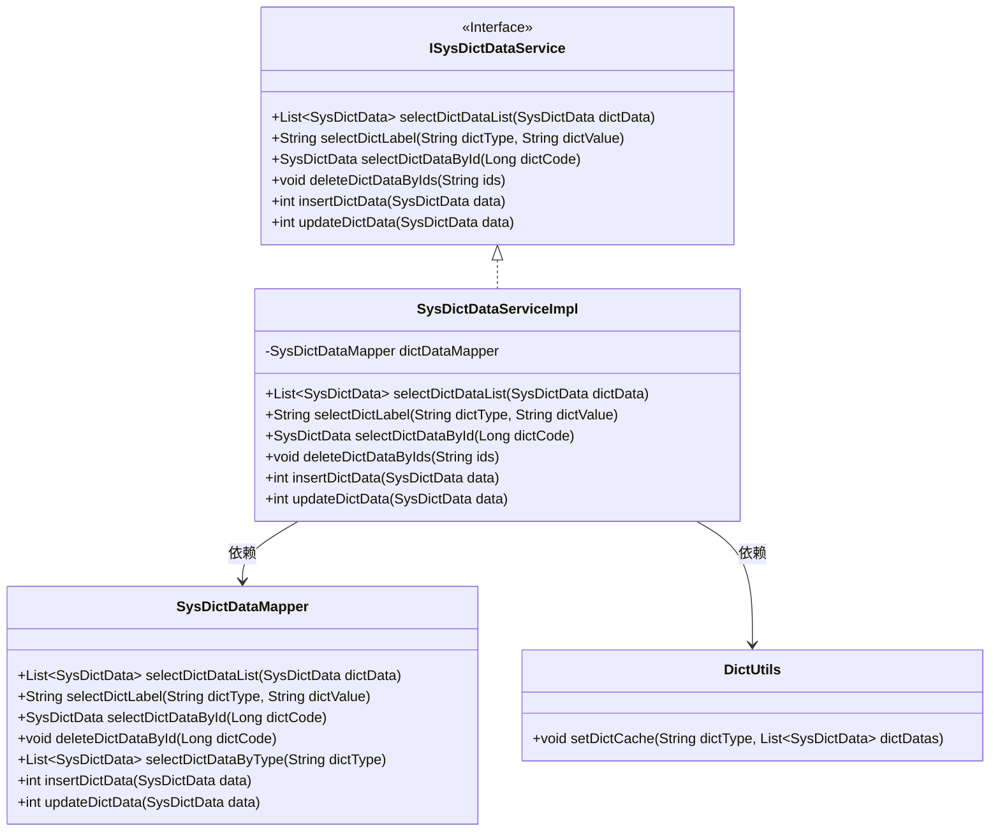
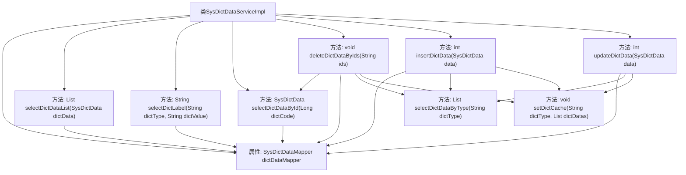

# 基础信息

|      |      |
|------|------|
| 编码语言 | .java |
| 代码路径 | ruoyi-system/ruoyi-system/src/main/java/com/ruoyi/system/service/impl/SysDictDataServiceImpl.java |
| 包名 | com.ruoyi.system.service.impl |
| 依赖项 | ['java.util.List', 'org.springframework.beans.factory.annotation.Autowired', 'org.springframework.stereotype.Service', 'com.ruoyi.common.core.domain.entity.SysDictData', 'com.ruoyi.common.core.text.Convert', 'com.ruoyi.common.utils.DictUtils', 'com.ruoyi.system.mapper.SysDictDataMapper', 'com.ruoyi.system.service.ISysDictDataService'] |
| 概述说明 | SysDictDataServiceImpl实现ISysDictDataService，提供字典数据的增删改查功能。 |

# 说明

SysDictDataServiceImpl实现了ISysDictDataService接口，提供了全面的字典数据管理功能。具体功能包括分页查询、根据标签查询、根据ID查询、批量删除、新增字典数据以及修改字典数据。这些功能涵盖了字典数据的常见操作，确保了对字典数据的高效管理和操作。

# 类列表 Class Summary

| 名称   | 类型  | 说明 |
|-------|------|-------------|
| SysDictDataServiceImpl | class | SysDictDataServiceImpl实现ISysDictDataService，提供字典数据的分页查询、标签查询、ID查询、批量删除、新增和修改功能。 |

## 类 SysDictDataServiceImpl

|      |      |
|------|------|
| 访问范围 | @Service;public |
| 类型 | class |
| 名称 | SysDictDataServiceImpl |
| 说明 | SysDictDataServiceImpl实现ISysDictDataService，提供字典数据的分页查询、标签查询、ID查询、批量删除、新增和修改功能。 |

### UML类图

该代码展示了一个字典数据服务实现类 `SysDictDataServiceImpl`，它实现了 `ISysDictDataService` 接口，并依赖于 `SysDictDataMapper` 和 `DictUtils` 类。`SysDictDataServiceImpl` 提供了字典数据的查询、删除、插入和更新功能，并通过 `SysDictDataMapper` 与数据库交互，同时使用 `DictUtils` 来管理字典数据的缓存。类图清晰地展示了这些类之间的关系和依赖。

### 内部方法调用关系图

这段代码实现了一个字典数据服务类 `SysDictDataServiceImpl`，提供了对字典数据的增删改查操作。通过 `SysDictDataMapper` 与数据库交互，并在数据修改后更新缓存。每个方法都调用了 `dictDataMapper` 的相应方法，并在必要时更新缓存。

### 字段列表 Field List

| 名称  | 类型  | 说明 |
|-------|-------|------|
| dictDataMapper | SysDictDataMapper | 自动注入SysDictDataMapper实例。 |

### 方法列表 Method List

| 名称  | 类型  | 说明 |
|-------|-------|------|
| selectDictDataList | List<SysDictData> | 重写方法，调用mapper查询字典数据列表。 |
| selectDictLabel | String | 重写方法，通过字典类型和值查询对应标签。 |
| selectDictDataById | SysDictData | 重写方法，通过字典代码查询字典数据并返回结果。 |
| deleteDictDataByIds | void | 根据ID删除字典数据并更新缓存。 |
| insertDictData | int | 插入字典数据并更新缓存，返回影响行数。 |
| updateDictData | int | 更新字典数据并缓存，返回影响行数。 |

