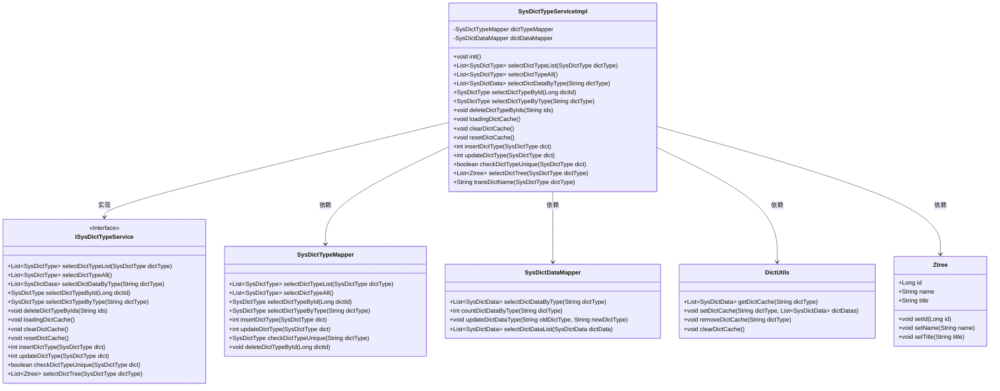

# 基础信息

|      |      |
|------|------|
| 编码语言 | .java |
| 代码路径 | ruoyi-system/ruoyi-system/src/main/java/com/ruoyi/system/service/impl/SysDictTypeServiceImpl.java |
| 包名 | com.ruoyi.system.service.impl |
| 依赖项 | ['java.util.ArrayList', 'java.util.Comparator', 'java.util.List', 'java.util.Map', 'java.util.stream.Collectors', 'javax.annotation.PostConstruct', 'org.springframework.beans.factory.annotation.Autowired', 'org.springframework.stereotype.Service', 'org.springframework.transaction.annotation.Transactional', 'com.ruoyi.common.constant.UserConstants', 'com.ruoyi.common.core.domain.Ztree', 'com.ruoyi.common.core.domain.entity.SysDictData', 'com.ruoyi.common.core.domain.entity.SysDictType', 'com.ruoyi.common.core.text.Convert', 'com.ruoyi.common.exception.ServiceException', 'com.ruoyi.common.utils.DictUtils', 'com.ruoyi.common.utils.StringUtils', 'com.ruoyi.system.mapper.SysDictDataMapper', 'com.ruoyi.system.mapper.SysDictTypeMapper', 'com.ruoyi.system.service.ISysDictTypeService'] |
| 概述说明 | 实现字典服务，涵盖缓存管理、增删改查及校验功能。 |

# 说明

该服务旨在实现一个字典类型的管理系统，提供全面的功能支持。系统包括缓存管理，用于优化数据访问速度，减少重复查询的开销。增删改查功能允许用户对字典数据进行灵活操作，支持数据的添加、删除、更新和查询。此外，系统还集成了校验功能，确保数据的完整性和准确性，防止无效或错误数据的引入。整体设计旨在提供高效、可靠的数据管理解决方案。

# 类列表 Class Summary

| 名称   | 类型  | 说明 |
|-------|------|-------------|
| SysDictTypeServiceImpl | class | 实现字典类型服务，包括缓存管理、增删改查及校验功能。 |

## 类 SysDictTypeServiceImpl

|      |      |
|------|------|
| 访问范围 | @Service;public |
| 类型 | class |
| 名称 | SysDictTypeServiceImpl |
| 说明 | 实现字典类型服务，包括缓存管理、增删改查及校验功能。 |

### UML类图

### 描述
`SysDictTypeServiceImpl`类实现了`ISysDictTypeService`接口，负责字典类型的管理。它依赖于`SysDictTypeMapper`和`SysDictDataMapper`进行数据库操作，并使用`DictUtils`管理字典缓存。类中提供了初始化缓存、查询、删除、更新字典类型等方法，并通过`Ztree`类构建字典类型树。该类通过`@Service`注解标记为Spring服务，确保其在应用启动时自动加载。

### 内部方法调用关系图

```mermaid
graph TD
    A["类SysDictTypeServiceImpl"]
    B["属性: SysDictTypeMapper dictTypeMapper"]
    C["属性: SysDictDataMapper dictDataMapper"]
    D["方法: init()"]
    E["方法: selectDictTypeList(SysDictType dictType)"]
    F["方法: selectDictTypeAll()"]
    G["方法: selectDictDataByType(String dictType)"]
    H["方法: selectDictTypeById(Long dictId)"]
    I["方法: selectDictTypeByType(String dictType)"]
    J["方法: deleteDictTypeByIds(String ids)"]
    K["方法: loadingDictCache()"]
    L["方法: clearDictCache()"]
    M["方法: resetDictCache()"]
    N["方法: insertDictType(SysDictType dict)"]
    O["方法: updateDictType(SysDictType dict)"]
    P["方法: checkDictTypeUnique(SysDictType dict)"]
    Q["方法: selectDictTree(SysDictType dictType)"]
    R["方法: transDictName(SysDictType dictType)"]

    A --> B
    A --> C
    A --> D
    A --> E
    A --> F
    A --> G
    A --> H
    A --> I
    A --> J
    A --> K
    A --> L
    A --> M
    A --> N
    A --> O
    A --> P
    A --> Q
    A --> R
```

该流程图展示了`SysDictTypeServiceImpl`类的结构和各个方法之间的关系。类中包含了两个属性`dictTypeMapper`和`dictDataMapper`，以及多个方法用于处理字典类型和字典数据的操作。`init()`方法在项目启动时初始化字典缓存，`selectDictTypeList()`和`selectDictTypeAll()`用于查询字典类型，`selectDictDataByType()`用于查询字典数据，`deleteDictTypeByIds()`用于批量删除字典类型，`loadingDictCache()`、`clearDictCache()`和`resetDictCache()`用于管理字典缓存，`insertDictType()`和`updateDictType()`用于新增和修改字典类型，`checkDictTypeUnique()`用于校验字典类型是否唯一，`selectDictTree()`用于查询字典类型树，`transDictName()`用于转换字典名称。

### 字段列表 Field List

| 名称  | 类型  | 说明 |
|-------|-------|------|
| dictTypeMapper | SysDictTypeMapper | 自动注入系统字典类型映射器实例。 |
| dictDataMapper | SysDictDataMapper | 使用Autowired注解自动注入SysDictDataMapper实例。 |

### 方法列表 Method List

| 名称  | 类型  | 说明 |
|-------|-------|------|
| selectDictTypeAll | List<SysDictType> | 重写方法，返回所有字典类型列表。 |
| init | void | 使用@PostConstruct注解初始化时加载字典缓存。 |
| selectDictDataByType | List<SysDictData> | 方法通过缓存获取字典数据，若无则从数据库查询并缓存。 |
| updateDictType | int | 更新字典类型并同步缓存数据。 |
| resetDictCache | void | 重置字典缓存，先清除再加载。 |
| clearDictCache | void | 重写clearDictCache方法，调用DictUtils.clearDictCache清除缓存。 |
| selectDictTypeList | List<SysDictType> | 重写方法，调用Mapper接口查询字典类型列表。 |
| selectDictTypeById | SysDictType | 根据字典ID查询字典类型信息的方法。 |
| transDictName | String | 该方法将字典类型名称和类型拼接为字符串返回。 |
| loadingDictCache | void | 加载字典缓存，按状态筛选并分组，排序后存入缓存。 |
| insertDictType | int | 重写插入字典类型方法，成功时更新缓存并返回行数。 |
| selectDictTypeByType | SysDictType | 重写方法，通过字典类型查询系统字典类型。 |
| checkDictTypeUnique | boolean | 检查字典类型唯一性，若存在且ID不同则返回不唯一，否则返回唯一。 |
| selectDictTree | List<Ztree> | 方法selectDictTree根据字典类型筛选正常状态的字典，生成Ztree列表并返回。 |
| deleteDictTypeByIds | void | 根据ID删除字典类型，若已分配则抛出异常，否则删除并清除缓存。 |

