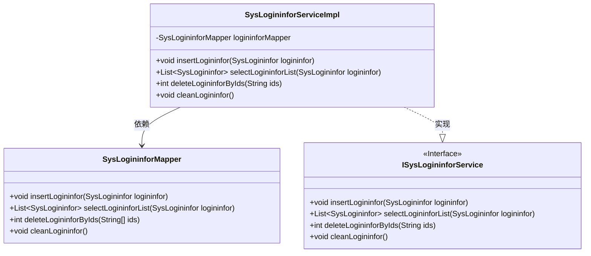
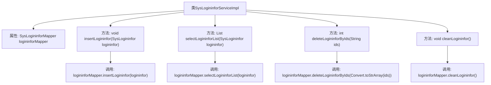

# 基础信息

|      |      |
|------|------|
| 编码语言 | .java |
| 代码路径 | ruoyi-system/ruoyi-system/src/main/java/com/ruoyi/system/service/impl/SysLogininforServiceImpl.java |
| 包名 | com.ruoyi.system.service.impl |
| 依赖项 | ['java.util.List', 'org.springframework.beans.factory.annotation.Autowired', 'org.springframework.stereotype.Service', 'com.ruoyi.common.core.text.Convert', 'com.ruoyi.system.domain.SysLogininfor', 'com.ruoyi.system.mapper.SysLogininforMapper', 'com.ruoyi.system.service.ISysLogininforService'] |
| 概述说明 | SysLogininforServiceImpl类负责登录日志的增删查清操作。 |

# 说明

SysLogininforServiceImpl类负责实现登录日志的管理功能，包括增加、删除、查询和清空操作。该类通过增删查清四个核心方法，全面处理登录日志的存储、检索和维护，确保系统能够高效记录和管理用户登录信息。

# 类列表 Class Summary

| 名称   | 类型  | 说明 |
|-------|------|-------------|
| SysLogininforServiceImpl | class | SysLogininforServiceImpl类实现登录日志的增删查清功能。 |

## 类 SysLogininforServiceImpl

|      |      |
|------|------|
| 访问范围 | @Service;public |
| 类型 | class |
| 名称 | SysLogininforServiceImpl |
| 说明 | SysLogininforServiceImpl类实现登录日志的增删查清功能。 |

### UML类图

这段代码定义了一个名为 `SysLogininforServiceImpl` 的服务类，该类实现了 `ISysLogininforService` 接口，并依赖于 `SysLogininforMapper` 类来进行数据库操作。`SysLogininforServiceImpl` 提供了插入、查询、批量删除和清空系统登录日志的功能。`ISysLogininforService` 接口定义了这些操作的契约，而 `SysLogininforMapper` 类则负责具体的数据库交互。

### 内部方法调用关系图

这段代码展示了`SysLogininforServiceImpl`类的实现，该类通过`SysLogininforMapper`与数据库进行交互，提供了新增、查询、批量删除和清空系统登录日志的功能。每个方法都调用了`logininforMapper`的相应方法来完成具体的数据库操作。

### 字段列表 Field List

| 名称  | 类型  | 说明 |
|-------|-------|------|
| logininforMapper | SysLogininforMapper | 自动注入登录信息映射器。 |

### 方法列表 Method List

| 名称  | 类型  | 说明 |
|-------|-------|------|
| selectLogininforList | List<SysLogininfor> | 方法selectLogininforList调用mapper查询登录信息列表。 |
| deleteLogininforByIds | int | 该方法通过调用logininforMapper删除指定ID的登录信息。 |
| insertLogininfor | void | 重写insertLogininfor方法，调用logininforMapper插入登录信息。 |
| cleanLogininfor | void | 清理登录信息方法调用登录信息映射器的清理功能。 |

