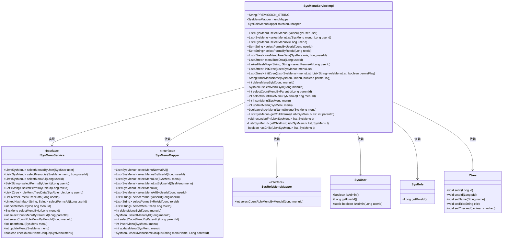

# 基础信息

|      |      |
|------|------|
| 编码语言 | .java |
| 代码路径 | ruoyi-system/ruoyi-system/src/main/java/com/ruoyi/system/service/impl/SysMenuServiceImpl.java |
| 包名 | com.ruoyi.system.service.impl |
| 依赖项 | ['java.text.MessageFormat', 'java.util.ArrayList', 'java.util.Arrays', 'java.util.HashSet', 'java.util.Iterator', 'java.util.LinkedHashMap', 'java.util.LinkedList', 'java.util.List', 'java.util.Set', 'org.springframework.beans.factory.annotation.Autowired', 'org.springframework.stereotype.Service', 'com.ruoyi.common.constant.UserConstants', 'com.ruoyi.common.core.domain.Ztree', 'com.ruoyi.common.core.domain.entity.SysMenu', 'com.ruoyi.common.core.domain.entity.SysRole', 'com.ruoyi.common.core.domain.entity.SysUser', 'com.ruoyi.common.utils.StringUtils', 'com.ruoyi.system.mapper.SysMenuMapper', 'com.ruoyi.system.mapper.SysRoleMenuMapper', 'com.ruoyi.system.service.ISysMenuService'] |
| 概述说明 | 实现菜单管理功能，支持查询、删除、新增、修改及权限校验。 |

# 说明

实现菜单管理功能，涵盖查询、删除、新增、修改菜单操作，并集成权限校验机制，确保系统安全性和操作合法性。

# 类列表 Class Summary

| 名称   | 类型  | 说明 |
|-------|------|-------------|
| SysMenuServiceImpl | class | 实现菜单管理功能，包括查询、删除、新增、修改菜单及权限校验。 |

## 类 SysMenuServiceImpl

|      |      |
|------|------|
| 访问范围 | @Service;public |
| 类型 | class |
| 名称 | SysMenuServiceImpl |
| 说明 | 实现菜单管理功能，包括查询、删除、新增、修改菜单及权限校验。 |

### UML类图

这段代码定义了一个 `SysMenuServiceImpl` 类，实现了 `ISysMenuService` 接口，用于管理系统菜单的查询、添加、修改、删除等操作。类中通过 `SysMenuMapper` 和 `SysRoleMenuMapper` 与数据库进行交互，处理菜单和角色菜单的相关逻辑。代码还涉及权限管理、菜单树结构的生成与展示等功能，展示了复杂的业务逻辑与数据操作。

### 内部方法调用关系图

```mermaid
graph TD
    A["类SysMenuServiceImpl"]
    B["属性: String PREMISSION_STRING"]
    C["属性: SysMenuMapper menuMapper"]
    D["属性: SysRoleMenuMapper roleMenuMapper"]
    E["方法: List<SysMenu> selectMenusByUser(SysUser user)"]
    F["方法: List<SysMenu> selectMenuList(SysMenu menu, Long userId)"]
    G["方法: List<SysMenu> selectMenuAll(Long userId)"]
    H["方法: Set<String> selectPermsByUserId(Long userId)"]
    I["方法: Set<String> selectPermsByRoleId(Long roleId)"]
    J["方法: List<Ztree> roleMenuTreeData(SysRole role, Long userId)"]
    K["方法: List<Ztree> menuTreeData(Long userId)"]
    L["方法: LinkedHashMap<String, String> selectPermsAll(Long userId)"]
    M["方法: List<Ztree> initZtree(List<SysMenu> menuList)"]
    N["方法: List<Ztree> initZtree(List<SysMenu> menuList, List<String> roleMenuList, boolean permsFlag)"]
    O["方法: String transMenuName(SysMenu menu, boolean permsFlag)"]
    P["方法: int deleteMenuById(Long menuId)"]
    Q["方法: SysMenu selectMenuById(Long menuId)"]
    R["方法: int selectCountMenuByParentId(Long parentId)"]
    S["方法: int selectCountRoleMenuByMenuId(Long menuId)"]
    T["方法: int insertMenu(SysMenu menu)"]
    U["方法: int updateMenu(SysMenu menu)"]
    V["方法: boolean checkMenuNameUnique(SysMenu menu)"]
    W["方法: List<SysMenu> getChildPerms(List<SysMenu> list, int parentId)"]
    X["方法: void recursionFn(List<SysMenu> list, SysMenu t)"]
    Y["方法: List<SysMenu> getChildList(List<SysMenu> list, SysMenu t)"]
    Z["方法: boolean hasChild(List<SysMenu> list, SysMenu t)"]

    A --> B
    A --> C
    A --> D
    A --> E
    A --> F
    A --> G
    A --> H
    A --> I
    A --> J
    A --> K
    A --> L
    A --> M
    A --> N
    A --> O
    A --> P
    A --> Q
    A --> R
    A --> S
    A --> T
    A --> U
    A --> V
    A --> W
    W --> X
    X --> Y
    X --> Z
```

这段代码是一个实现菜单管理功能的类，包含了多个方法用于查询、新增、修改、删除菜单，以及根据用户、角色等条件获取菜单和权限信息。类中使用了递归和迭代来处理菜单的层级关系，并通过`initZtree`方法将菜单列表转换为树形结构。代码中还涉及权限字符串的格式化、菜单名称的唯一性校验等功能。

### 字段列表 Field List

| 名称  | 类型  | 说明 |
|-------|-------|------|
| menuMapper | SysMenuMapper | 自动注入SysMenuMapper实例。 |
| PREMISSION_STRING = "perms[\"{0}\"]" | String | 定义静态常量字符串，用于表示权限格式。 |
| roleMenuMapper | SysRoleMenuMapper | 自动注入SysRoleMenuMapper实例。 |

### 方法列表 Method List

| 名称  | 类型  | 说明 |
|-------|-------|------|
| hasChild | boolean | 检查列表中是否存在指定菜单的子项。 |
| menuTreeData | List<Ztree> | 根据用户ID获取菜单树数据并转换为Ztree格式。 |
| selectPermsAll | LinkedHashMap<String, String> | 根据用户ID获取所有权限并格式化为LinkedHashMap。 |
| roleMenuTreeData | List<Ztree> | 根据角色和用户ID生成角色菜单树数据。 |
| getChildList | List<SysMenu> | 获取菜单列表中指定菜单的所有子菜单。 |
| checkMenuNameUnique | boolean | 检查菜单名称是否唯一，返回唯一性结果。 |
| selectPermsByUserId | Set<String> | 根据用户ID筛选权限并返回去重集合。 |
| getChildPerms | List<SysMenu> | 获取指定父节点ID的所有子节点列表。 |
| insertMenu | int | 重写insertMenu方法，调用menuMapper插入菜单并返回结果。 |
| selectPermsByRoleId | Set<String> | 通过角色ID查询权限并返回去重后的权限集合。 |
| recursionFn | void | 递归函数构建菜单树结构，设置子节点并递归处理。 |
| selectMenuAll | List<SysMenu> | 根据用户ID查询菜单，管理员返回所有菜单，否则返回用户专属菜单。 |
| deleteMenuById | int | 重写删除菜单方法，调用菜单映射器删除指定ID菜单。 |
| transMenuName | String | 该方法将菜单名与权限信息拼接，根据标志决定是否添加权限信息。 |
| selectMenuById | SysMenu | 通过menuId查询SysMenu的方法。 |
| selectCountRoleMenuByMenuId | int | 方法selectCountRoleMenuByMenuId通过menuId查询角色菜单数量。 |
| selectMenuList | List<SysMenu> | 根据用户权限选择菜单列表，管理员直接获取，普通用户按ID筛选。 |
| initZtree | List<Ztree> | 初始化Ztree，接收菜单列表，调用内部方法并返回结果。 |
| selectMenusByUser | List<SysMenu> | 管理员显示所有菜单，普通用户按ID获取菜单并返回子权限。 |
| selectCountMenuByParentId | int | 重写方法selectCountMenuByParentId，调用menuMapper查询父ID对应的菜单数量。 |
| updateMenu | int | 重写updateMenu方法，调用menuMapper更新菜单并返回结果。 |
| initZtree | List<Ztree> | 初始化Ztree列表，根据菜单和角色权限设置节点属性并返回。 |

