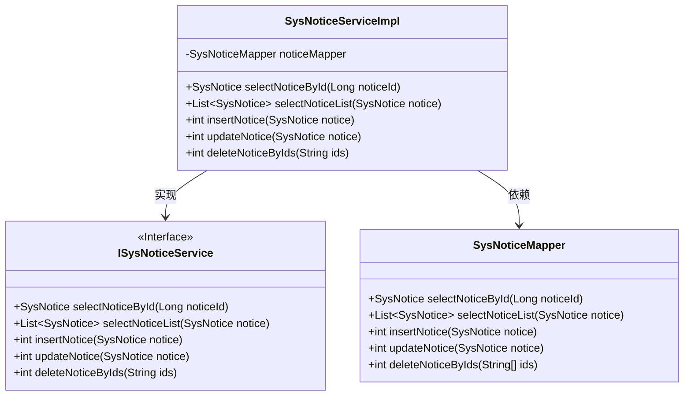
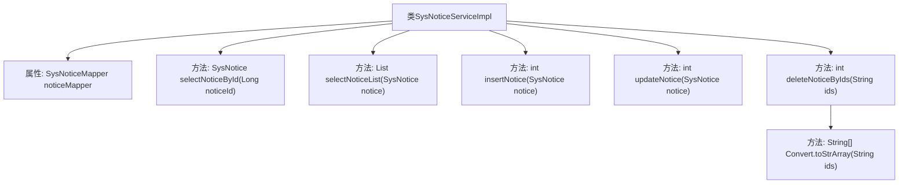

# 基础信息

|      |      |
|------|------|
| 编码语言 | .java |
| 代码路径 | ruoyi-system/ruoyi-system/src/main/java/com/ruoyi/system/service/impl/SysNoticeServiceImpl.java |
| 包名 | com.ruoyi.system.service.impl |
| 依赖项 | ['java.util.List', 'org.springframework.beans.factory.annotation.Autowired', 'org.springframework.stereotype.Service', 'com.ruoyi.common.core.text.Convert', 'com.ruoyi.system.domain.SysNotice', 'com.ruoyi.system.mapper.SysNoticeMapper', 'com.ruoyi.system.service.ISysNoticeService'] |
| 概述说明 | SysNoticeServiceImpl类提供公告的查询、新增、修改和删除功能。 |

# 说明

SysNoticeServiceImpl类是一个公告管理服务实现类，提供了公告的查询、新增、修改和删除功能。通过这些功能，用户可以检索现有公告、创建新公告、更新公告内容以及删除不再需要的公告。该类全面支持公告管理的基本操作，确保公告信息的有效维护和更新。

# 类列表 Class Summary

| 名称   | 类型  | 说明 |
|-------|------|-------------|
| SysNoticeServiceImpl | class | SysNoticeServiceImpl类实现公告查询、新增、修改和删除功能。 |

## 类 SysNoticeServiceImpl

|      |      |
|------|------|
| 访问范围 | @Service;public |
| 类型 | class |
| 名称 | SysNoticeServiceImpl |
| 说明 | SysNoticeServiceImpl类实现公告查询、新增、修改和删除功能。 |

### UML类图

该代码展示了一个公告服务实现类 `SysNoticeServiceImpl`，它实现了 `ISysNoticeService` 接口，并依赖于 `SysNoticeMapper` 来执行数据库操作。`SysNoticeServiceImpl` 提供了公告的查询、新增、修改和删除功能。`ISysNoticeService` 接口定义了这些方法的契约，而 `SysNoticeMapper` 则负责与数据库交互，执行具体的 SQL 操作。

### 内部方法调用关系图

这段代码定义了一个名为 `SysNoticeServiceImpl` 的服务类，实现了 `ISysNoticeService` 接口。该类通过 `SysNoticeMapper` 与数据库交互，提供了公告信息的查询、新增、修改和删除功能。每个方法都调用了 `noticeMapper` 的相应方法来完成具体操作。其中，`deleteNoticeByIds` 方法还调用了 `Convert.toStrArray` 方法将字符串转换为字符串数组。

### 字段列表 Field List

| 名称  | 类型  | 说明 |
|-------|-------|------|
| noticeMapper | SysNoticeMapper | 自动注入SysNoticeMapper实例。 |

### 方法列表 Method List

| 名称  | 类型  | 说明 |
|-------|-------|------|
| updateNotice | int | 重写updateNotice方法，调用noticeMapper更新通知。 |
| insertNotice | int | 重写insertNotice方法，调用noticeMapper插入通知。 |
| selectNoticeById | SysNotice | 该方法通过ID查询系统公告并返回结果。 |
| selectNoticeList | List<SysNotice> | 重写方法，调用Mapper接口查询通知列表。 |
| deleteNoticeByIds | int | 该方法通过ID字符串删除多个通知，并返回删除结果。 |

