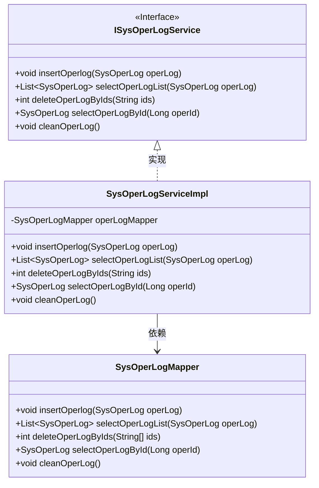
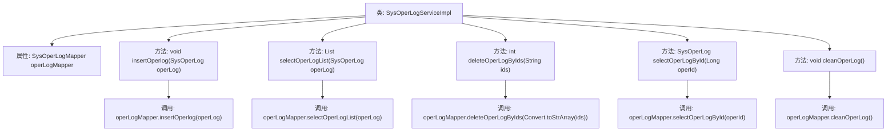

# 基础信息

|      |      |
|------|------|
| 编码语言 | .java |
| 代码路径 | ruoyi-system/ruoyi-system/src/main/java/com/ruoyi/system/service/impl/SysOperLogServiceImpl.java |
| 包名 | com.ruoyi.system.service.impl |
| 依赖项 | ['java.util.List', 'org.springframework.beans.factory.annotation.Autowired', 'org.springframework.stereotype.Service', 'com.ruoyi.common.core.text.Convert', 'com.ruoyi.system.domain.SysOperLog', 'com.ruoyi.system.mapper.SysOperLogMapper', 'com.ruoyi.system.service.ISysOperLogService'] |
| 概述说明 | SysOperLogServiceImpl类实现操作日志的增删查清功能。 |

# 说明

SysOperLogServiceImpl类主要负责操作日志的管理，实现了日志的增删查清功能。该类通过增加日志记录操作事件，删除不需要的日志条目，查询特定日志信息，以及清空日志数据，确保系统操作日志的完整性和可维护性。这些功能帮助系统管理员有效监控和管理用户操作行为，提升系统安全性和可追溯性。

# 类列表 Class Summary

| 名称   | 类型  | 说明 |
|-------|------|-------------|
| SysOperLogServiceImpl | class | SysOperLogServiceImpl类实现操作日志的增删查清功能。 |

## 类 SysOperLogServiceImpl

|      |      |
|------|------|
| 访问范围 | @Service;public |
| 类型 | class |
| 名称 | SysOperLogServiceImpl |
| 说明 | SysOperLogServiceImpl类实现操作日志的增删查清功能。 |

### UML类图

这段代码展示了一个操作日志服务接口 `ISysOperLogService` 及其实现类 `SysOperLogServiceImpl`，以及一个操作日志映射器 `SysOperLogMapper`。`SysOperLogServiceImpl` 类实现了 `ISysOperLogService` 接口，并通过 `SysOperLogMapper` 类与数据库进行交互。类图中的依赖关系清晰地展示了 `SysOperLogServiceImpl` 依赖于 `SysOperLogMapper` 来执行具体的数据库操作。

### 内部方法调用关系图

这段代码展示了 `SysOperLogServiceImpl` 类的实现，该类提供了对系统操作日志的增删改查功能。每个方法都调用了 `SysOperLogMapper` 接口中的相应方法，完成对数据库的操作。流程图中清晰地展示了类与方法的调用关系，帮助理解代码的执行流程。

### 字段列表 Field List

| 名称  | 类型  | 说明 |
|-------|-------|------|
| operLogMapper | SysOperLogMapper | 自动注入SysOperLogMapper操作日志映射器。 |

### 方法列表 Method List

| 名称  | 类型  | 说明 |
|-------|-------|------|
| insertOperlog | void | 重写insertOperlog方法，调用operLogMapper插入操作日志。 |
| selectOperLogById | SysOperLog | 根据操作ID查询系统操作日志。 |
| deleteOperLogByIds | int | 重写删除操作日志方法，通过ID数组删除日志。 |
| selectOperLogList | List<SysOperLog> | 该方法通过调用operLogMapper.selectOperLogList查询并返回操作日志列表。 |
| cleanOperLog | void | 该方法调用operLogMapper清理操作日志。 |

