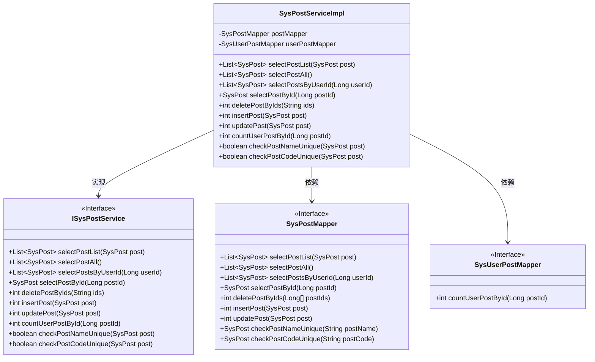
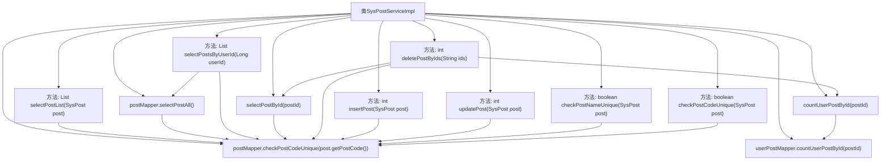

# 基础信息

|      |      |
|------|------|
| 编码语言 | .java |
| 代码路径 | ruoyi-system/ruoyi-system/src/main/java/com/ruoyi/system/service/impl/SysPostServiceImpl.java |
| 包名 | com.ruoyi.system.service.impl |
| 依赖项 | ['java.util.List', 'org.springframework.beans.factory.annotation.Autowired', 'org.springframework.stereotype.Service', 'com.ruoyi.common.constant.UserConstants', 'com.ruoyi.common.core.text.Convert', 'com.ruoyi.common.exception.ServiceException', 'com.ruoyi.common.utils.StringUtils', 'com.ruoyi.system.domain.SysPost', 'com.ruoyi.system.mapper.SysPostMapper', 'com.ruoyi.system.mapper.SysUserPostMapper', 'com.ruoyi.system.service.ISysPostService'] |
| 概述说明 | SysPostServiceImpl实现岗位的查询、新增、修改、删除及唯一性校验功能。 |

# 说明

SysPostServiceImpl类实现了岗位管理的核心功能，包括岗位信息的查询、新增、修改和删除操作。此外，该类还提供了岗位唯一性校验功能，确保岗位信息的唯一性和准确性。这些功能共同构成了一个完整的岗位管理系统，满足了岗位信息管理的基本需求。

# 类列表 Class Summary

| 名称   | 类型  | 说明 |
|-------|------|-------------|
| SysPostServiceImpl | class | SysPostServiceImpl实现岗位查询、新增、修改、删除及唯一性校验功能。 |

## 类 SysPostServiceImpl

|      |      |
|------|------|
| 访问范围 | @Service;public |
| 类型 | class |
| 名称 | SysPostServiceImpl |
| 说明 | SysPostServiceImpl实现岗位查询、新增、修改、删除及唯一性校验功能。 |

### UML类图

**描述：**  
`SysPostServiceImpl` 类实现了 `ISysPostService` 接口，提供了岗位信息的增删改查功能。它依赖于 `SysPostMapper` 和 `SysUserPostMapper` 两个接口来访问数据库。`SysPostMapper` 负责岗位信息的数据库操作，而 `SysUserPostMapper` 负责用户与岗位关联的数据库操作。通过这种方式，`SysPostServiceImpl` 实现了岗位信息的完整管理功能，包括查询、删除、新增、修改等操作。

### 内部方法调用关系图

这段代码定义了一个名为 `SysPostServiceImpl` 的服务类，实现了 `ISysPostService` 接口。该类通过 `SysPostMapper` 和 `SysUserPostMapper` 与数据库进行交互，提供了多种岗位信息的查询、新增、修改、删除等功能。每个方法都调用了相应的 `Mapper` 方法来完成数据库操作，并且在删除岗位时还进行了使用数量的检查，确保岗位未被分配时才能删除。

### 字段列表 Field List

| 名称  | 类型  | 说明 |
|-------|-------|------|
| userPostMapper | SysUserPostMapper | 自动注入SysUserPostMapper实例。 |
| postMapper | SysPostMapper | 自动注入SysPostMapper实例到postMapper变量。 |

### 方法列表 Method List

| 名称  | 类型  | 说明 |
|-------|-------|------|
| deletePostByIds | int | 根据ID删除帖子，若帖子已分配则抛出异常。 |
| insertPost | int | 重写insertPost方法，调用postMapper的insertPost插入数据。 |
| updatePost | int | 重写updatePost方法，调用postMapper更新帖子数据。 |
| checkPostCodeUnique | boolean | 检查岗位编码唯一性，返回是否唯一。 |
| selectPostById | SysPost | 该方法通过ID查询岗位信息，调用postMapper的selectPostById方法。 |
| selectPostList | List<SysPost> | 重写方法，调用postMapper查询岗位列表并返回结果。 |
| selectPostAll | List<SysPost> | 重写方法selectPostAll，调用postMapper.selectPostAll()返回所有岗位列表。 |
| checkPostNameUnique | boolean | 检查岗位名称唯一性，存在同名且ID不同则返回不唯一。 |
| selectPostsByUserId | List<SysPost> | 该方法通过用户ID获取相关岗位并标记所有岗位中用户关联的岗位。 |
| countUserPostById | int | 重写方法countUserPostById，调用userPostMapper统计指定postId的用户帖子数量。 |

