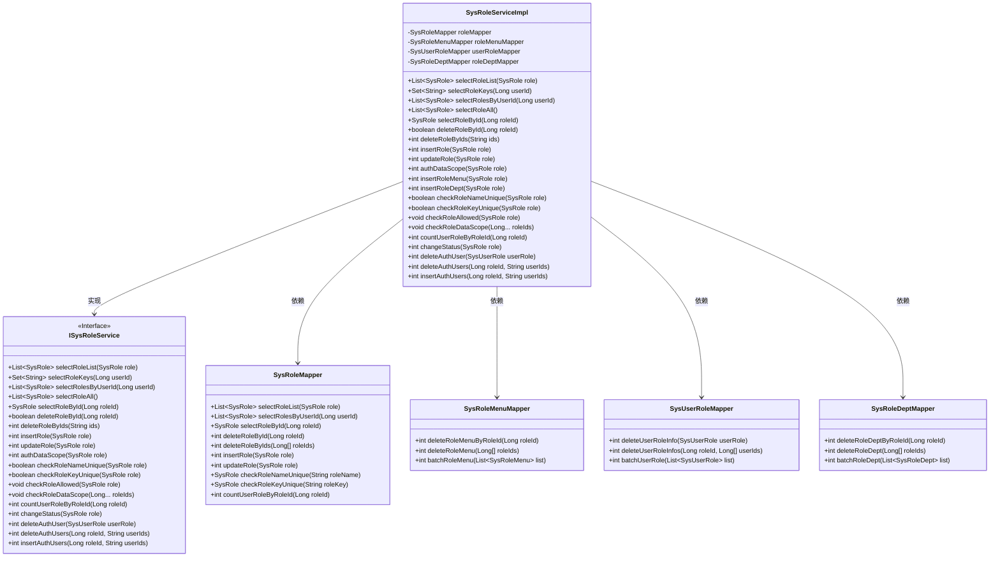

# 基础信息

|      |      |
|------|------|
| 编码语言 | .java |
| 代码路径 | ruoyi-system/ruoyi-system/src/main/java/com/ruoyi/system/service/impl/SysRoleServiceImpl.java |
| 包名 | com.ruoyi.system.service.impl |
| 依赖项 | ['java.util.ArrayList', 'java.util.Arrays', 'java.util.HashSet', 'java.util.List', 'java.util.Set', 'org.springframework.beans.factory.annotation.Autowired', 'org.springframework.stereotype.Service', 'org.springframework.transaction.annotation.Transactional', 'com.ruoyi.common.annotation.DataScope', 'com.ruoyi.common.constant.UserConstants', 'com.ruoyi.common.core.domain.entity.SysRole', 'com.ruoyi.common.core.domain.entity.SysUser', 'com.ruoyi.common.core.text.Convert', 'com.ruoyi.common.exception.ServiceException', 'com.ruoyi.common.utils.ShiroUtils', 'com.ruoyi.common.utils.StringUtils', 'com.ruoyi.common.utils.spring.SpringUtils', 'com.ruoyi.system.domain.SysRoleDept', 'com.ruoyi.system.domain.SysRoleMenu', 'com.ruoyi.system.domain.SysUserRole', 'com.ruoyi.system.mapper.SysRoleDeptMapper', 'com.ruoyi.system.mapper.SysRoleMapper', 'com.ruoyi.system.mapper.SysRoleMenuMapper', 'com.ruoyi.system.mapper.SysUserRoleMapper', 'com.ruoyi.system.service.ISysRoleService'] |
| 概述说明 | SysRoleServiceImpl实现ISysRoleService，提供角色管理功能。 |

# 说明

SysRoleServiceImpl类实现了ISysRoleService接口，主要负责角色管理的各项功能。具体功能包括角色的查询、删除、新增、修改以及校验等操作，涵盖了角色管理的全生命周期。该类通过实现接口定义的方法，提供了对角色信息的全面管理和维护能力，确保系统在角色管理方面的需求得到满足。

# 类列表 Class Summary

| 名称   | 类型  | 说明 |
|-------|------|-------------|
| SysRoleServiceImpl | class | SysRoleServiceImpl实现ISysRoleService，提供角色管理功能，包括查询、删除、新增、修改、校验等操作。 |

## 类 SysRoleServiceImpl

|      |      |
|------|------|
| 访问范围 | @Service;public |
| 类型 | class |
| 名称 | SysRoleServiceImpl |
| 说明 | SysRoleServiceImpl实现ISysRoleService，提供角色管理功能，包括查询、删除、新增、修改、校验等操作。 |

### UML类图

这段代码定义了一个 `SysRoleServiceImpl` 类，实现了 `ISysRoleService` 接口，用于管理系统角色相关的业务逻辑。它依赖于 `SysRoleMapper`、`SysRoleMenuMapper`、`SysUserRoleMapper` 和 `SysRoleDeptMapper` 四个 Mapper 类，分别用于角色、角色菜单、用户角色和角色部门的数据库操作。类图展示了这些类之间的关系，`SysRoleServiceImpl` 实现了 `ISysRoleService` 接口，并通过依赖注入的方式使用各个 Mapper 类来完成具体的数据库操作。

### 内部方法调用关系图

```mermaid
graph TD
    A["类SysRoleServiceImpl"]
    B["属性: SysRoleMapper roleMapper"]
    C["属性: SysRoleMenuMapper roleMenuMapper"]
    D["属性: SysUserRoleMapper userRoleMapper"]
    E["属性: SysRoleDeptMapper roleDeptMapper"]
    F["方法: List<SysRole> selectRoleList(SysRole role)"]
    G["方法: Set<String> selectRoleKeys(Long userId)"]
    H["方法: List<SysRole> selectRolesByUserId(Long userId)"]
    I["方法: List<SysRole> selectRoleAll()"]
    J["方法: SysRole selectRoleById(Long roleId)"]
    K["方法: boolean deleteRoleById(Long roleId)"]
    L["方法: int deleteRoleByIds(String ids)"]
    M["方法: int insertRole(SysRole role)"]
    N["方法: int updateRole(SysRole role)"]
    O["方法: int authDataScope(SysRole role)"]
    P["方法: int insertRoleMenu(SysRole role)"]
    Q["方法: int insertRoleDept(SysRole role)"]
    R["方法: boolean checkRoleNameUnique(SysRole role)"]
    S["方法: boolean checkRoleKeyUnique(SysRole role)"]
    T["方法: void checkRoleAllowed(SysRole role)"]
    U["方法: void checkRoleDataScope(Long... roleIds)"]
    V["方法: int countUserRoleByRoleId(Long roleId)"]
    W["方法: int changeStatus(SysRole role)"]
    X["方法: int deleteAuthUser(SysUserRole userRole)"]
    Y["方法: int deleteAuthUsers(Long roleId, String userIds)"]
    Z["方法: int insertAuthUsers(Long roleId, String userIds)"]

    A --> B
    A --> C
    A --> D
    A --> E
    A --> F
    A --> G
    A --> H
    A --> I
    A --> J
    A --> K
    A --> L
    A --> M
    A --> N
    A --> O
    A --> P
    A --> Q
    A --> R
    A --> S
    A --> T
    A --> U
    A --> V
    A --> W
    A --> X
    A --> Y
    A --> Z
```

这段代码定义了一个名为 `SysRoleServiceImpl` 的服务类，实现了 `ISysRoleService` 接口。该类通过多个 `@Autowired` 注解注入了不同的 Mapper 类，用于处理角色、角色菜单、用户角色和角色部门的相关操作。代码中包含了多个方法，涵盖了角色的查询、插入、更新、删除、权限校验、数据范围校验等功能。每个方法都通过调用相应的 Mapper 方法来完成具体的数据库操作，确保了角色管理的完整性和安全性。

### 字段列表 Field List

| 名称  | 类型  | 说明 |
|-------|-------|------|
| roleDeptMapper | SysRoleDeptMapper | 自动注入SysRoleDeptMapper角色部门映射器。 |
| userRoleMapper | SysUserRoleMapper | 自动注入SysUserRoleMapper对象。 |
| roleMapper | SysRoleMapper | 自动注入SysRoleMapper实例。 |
| roleMenuMapper | SysRoleMenuMapper | 自动注入SysRoleMenuMapper实例。 |

### 方法列表 Method List

| 名称  | 类型  | 说明 |
|-------|-------|------|
| checkRoleAllowed | void | 检查角色权限，禁止操作超级管理员。 |
| deleteAuthUser | int | 删除用户角色信息的公共方法，返回删除结果。 |
| selectRoleById | SysRole | 根据角色ID查询并返回系统角色信息。 |
| deleteRoleById | boolean | 根据角色ID删除角色及其关联的菜单和部门信息。 |
| selectRolesByUserId | List<SysRole> | 根据用户ID查询角色列表并标记用户已有角色。 |
| insertRoleDept | int | 插入角色与部门关联数据，返回影响行数。 |
| changeStatus | int | 重写方法，更新角色状态并返回结果。 |
| insertRoleMenu | int | 插入角色菜单，批量处理角色与菜单关联。 |
| deleteRoleByIds | int | 删除指定角色，检查权限并删除相关关联。 |
| checkRoleDataScope | void | 非管理员用户检查角色数据权限，无权限则抛出异常。 |
| insertAuthUsers | int | 方法insertAuthUsers将用户ID与角色ID绑定并批量插入。 |
| updateRole | int | 更新角色信息并删除关联菜单后插入新关联。 |
| insertRole | int | 重写方法，事务处理插入角色并返回菜单插入结果。 |
| authDataScope | int | 方法authDataScope更新角色信息，删除角色部门关联，并新增角色部门数据权限。 |
| selectRoleKeys | Set<String> | 根据用户ID查询角色键集合并去重返回。 |
| deleteAuthUsers | int | 该方法通过角色ID和用户ID数组删除用户角色信息。 |
| checkRoleKeyUnique | boolean | 检查角色键是否唯一，若存在且ID不同则返回不唯一，否则返回唯一。 |
| countUserRoleByRoleId | int | 该方法通过角色ID统计用户角色数量，调用userRoleMapper实现。 |
| selectRoleAll | List<SysRole> | 重写方法selectRoleAll，调用selectRoleList并返回角色列表。 |
| selectRoleList | List<SysRole> | 重写方法，带部门别名，查询角色列表并返回。 |
| checkRoleNameUnique | boolean | 检查角色名是否唯一，通过角色ID和角色名进行比对，返回唯一性结果。 |

