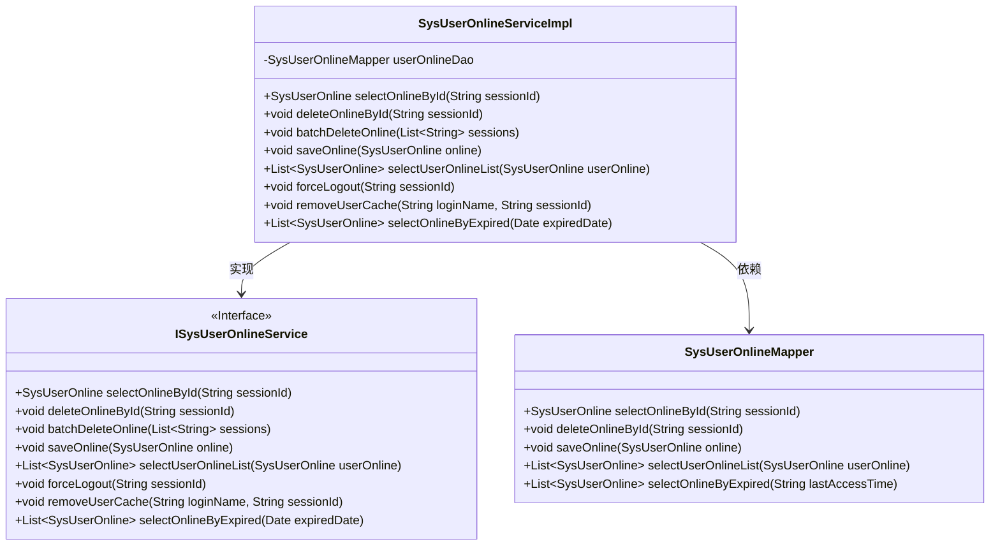
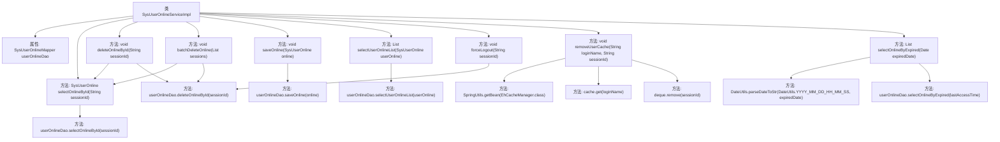

# 基础信息

|      |      |
|------|------|
| 编码语言 | .java |
| 代码路径 | ruoyi-system/ruoyi-system/src/main/java/com/ruoyi/system/service/impl/SysUserOnlineServiceImpl.java |
| 包名 | com.ruoyi.system.service.impl |
| 依赖项 | ['java.io.Serializable', 'java.util.Date', 'java.util.Deque', 'java.util.List', 'com.ruoyi.common.utils.spring.SpringUtils', 'org.apache.shiro.cache.Cache', 'org.apache.shiro.cache.ehcache.EhCacheManager', 'org.springframework.beans.factory.annotation.Autowired', 'org.springframework.stereotype.Service', 'com.ruoyi.common.constant.ShiroConstants', 'com.ruoyi.common.utils.DateUtils', 'com.ruoyi.common.utils.StringUtils', 'com.ruoyi.system.domain.SysUserOnline', 'com.ruoyi.system.mapper.SysUserOnlineMapper', 'com.ruoyi.system.service.ISysUserOnlineService'] |
| 概述说明 | SysUserOnlineServiceImpl实现接口，提供用户会话查询、删除、保存及缓存清理功能。 |

# 说明

SysUserOnlineServiceImpl是一个实现了ISysUserOnlineService接口的类，主要负责在线用户会话的管理。它提供了多种功能，包括查询在线用户会话、删除特定会话、保存会话信息以及清理缓存。通过这些功能，SysUserOnlineServiceImpl能够有效地管理和维护在线用户的状态，确保系统的稳定性和安全性。

# 类列表 Class Summary

| 名称   | 类型  | 说明 |
|-------|------|-------------|
| SysUserOnlineServiceImpl | class | SysUserOnlineServiceImpl实现ISysUserOnlineService接口，提供在线用户会话的查询、删除、保存及缓存清理等功能。 |

## 类 SysUserOnlineServiceImpl

|      |      |
|------|------|
| 访问范围 | @Service;public |
| 类型 | class |
| 名称 | SysUserOnlineServiceImpl |
| 说明 | SysUserOnlineServiceImpl实现ISysUserOnlineService接口，提供在线用户会话的查询、删除、保存及缓存清理等功能。 |

### UML类图

### 描述
`SysUserOnlineServiceImpl` 是一个服务类，实现了 `ISysUserOnlineService` 接口，提供了在线用户管理的功能。它依赖于 `SysUserOnlineMapper` 来进行数据库操作，包括查询、删除、保存在线用户信息，以及批量删除和强制用户退出等操作。类图展示了 `SysUserOnlineServiceImpl` 与接口 `ISysUserOnlineService` 和 `SysUserOnlineMapper` 之间的关系，清晰地表明了类之间的依赖和实现关系。

### 内部方法调用关系图

这段代码是一个名为`SysUserOnlineServiceImpl`的服务类，实现了`ISysUserOnlineService`接口。该类主要负责管理在线用户会话的相关操作，包括查询、删除、保存、强退用户、清理用户缓存等。通过`userOnlineDao`与数据库交互，同时使用`EhCacheManager`管理缓存。代码结构清晰，功能模块化，便于维护和扩展。

### 字段列表 Field List

| 名称  | 类型  | 说明 |
|-------|-------|------|
| userOnlineDao | SysUserOnlineMapper | 自动注入SysUserOnlineMapper实例到userOnlineDao变量。 |

### 方法列表 Method List

| 名称  | 类型  | 说明 |
|-------|-------|------|
| selectOnlineById | SysUserOnline | 根据sessionId查询在线用户信息。 |
| forceLogout | void | 该方法通过sessionId强制注销用户，删除在线记录。 |
| saveOnline | void | 重写saveOnline方法，调用userOnlineDao保存在线用户信息。 |
| selectOnlineByExpired | List<SysUserOnline> | 该方法根据过期日期查询在线用户列表。 |
| batchDeleteOnline | void | 批量删除在线用户会话，逐个检查并删除有效会话。 |
| deleteOnlineById | void | 根据sessionId删除在线用户记录。 |
| removeUserCache | void | 方法移除用户缓存中指定会话ID。 |
| selectUserOnlineList | List<SysUserOnline> | 重写方法，调用DAO层查询在线用户列表。 |

