# 基础信息

|      |      |
|------|------|
| 编码语言 | .java |
| 代码路径 | ruoyi-system/ruoyi-system/src/main/java/com/ruoyi/system/service/impl/SysUserServiceImpl.java |
| 包名 | com.ruoyi.system.service.impl |
| 依赖项 | ['java.util.ArrayList', 'java.util.List', 'java.util.stream.Collectors', 'javax.validation.ConstraintViolationException', 'javax.validation.Validator', 'org.slf4j.Logger', 'org.slf4j.LoggerFactory', 'org.springframework.beans.factory.annotation.Autowired', 'org.springframework.stereotype.Service', 'org.springframework.transaction.annotation.Transactional', 'org.springframework.util.CollectionUtils', 'com.ruoyi.common.annotation.DataScope', 'com.ruoyi.common.constant.UserConstants', 'com.ruoyi.common.core.domain.entity.SysRole', 'com.ruoyi.common.core.domain.entity.SysUser', 'com.ruoyi.common.core.text.Convert', 'com.ruoyi.common.exception.ServiceException', 'com.ruoyi.common.utils.ExceptionUtil', 'com.ruoyi.common.utils.ShiroUtils', 'com.ruoyi.common.utils.StringUtils', 'com.ruoyi.common.utils.bean.BeanValidators', 'com.ruoyi.common.utils.html.EscapeUtil', 'com.ruoyi.common.utils.security.Md5Utils', 'com.ruoyi.common.utils.spring.SpringUtils', 'com.ruoyi.system.domain.SysPost', 'com.ruoyi.system.domain.SysUserPost', 'com.ruoyi.system.domain.SysUserRole', 'com.ruoyi.system.mapper.SysPostMapper', 'com.ruoyi.system.mapper.SysRoleMapper', 'com.ruoyi.system.mapper.SysUserMapper', 'com.ruoyi.system.mapper.SysUserPostMapper', 'com.ruoyi.system.mapper.SysUserRoleMapper', 'com.ruoyi.system.service.ISysConfigService', 'com.ruoyi.system.service.ISysDeptService', 'com.ruoyi.system.service.ISysUserService'] |
| 概述说明 | SysUserServiceImpl实现用户管理功能，涵盖查询、增删改及角色权限管理。 |

# 说明

SysUserServiceImpl是一个实现用户管理功能的类，提供了包括查询、增删改以及角色权限管理在内的多项操作。通过这些功能，可以有效地管理和维护系统中的用户信息，确保用户权限的合理分配和控制。

# 类列表 Class Summary

| 名称   | 类型  | 说明 |
|-------|------|-------------|
| SysUserServiceImpl | class | SysUserServiceImpl实现用户管理功能，包括查询、增删改、角色权限管理等操作。 |

## 类 SysUserServiceImpl

|      |      |
|------|------|
| 访问范围 | @Service;public |
| 类型 | class |
| 名称 | SysUserServiceImpl |
| 说明 | SysUserServiceImpl实现用户管理功能，包括查询、增删改、角色权限管理等操作。 |

### UML类图

```mermaid
classDiagram
    class SysUserServiceImpl {
        -Logger log
        -SysUserMapper userMapper
        -SysRoleMapper roleMapper
        -SysPostMapper postMapper
        -SysUserPostMapper userPostMapper
        -SysUserRoleMapper userRoleMapper
        -ISysConfigService configService
        -ISysDeptService deptService
        -Validator validator
        +List~SysUser~ selectUserList(SysUser user)
        +List~SysUser~ selectAllocatedList(SysUser user)
        +List~SysUser~ selectUnallocatedList(SysUser user)
        +SysUser selectUserByLoginName(String userName)
        +SysUser selectUserByPhoneNumber(String phoneNumber)
        +SysUser selectUserByEmail(String email)
        +SysUser selectUserById(Long userId)
        +List~SysUserRole~ selectUserRoleByUserId(Long userId)
        +int deleteUserById(Long userId)
        +int deleteUserByIds(String ids)
        +int insertUser(SysUser user)
        +boolean registerUser(SysUser user)
        +int updateUser(SysUser user)
        +int updateUserInfo(SysUser user)
        +void insertUserAuth(Long userId, Long[] roleIds)
        +int resetUserPwd(SysUser user)
        +void insertUserRole(Long userId, Long[] roleIds)
        +void insertUserPost(SysUser user)
        +boolean checkLoginNameUnique(SysUser user)
        +boolean checkPhoneUnique(SysUser user)
        +boolean checkEmailUnique(SysUser user)
        +void checkUserAllowed(SysUser user)
        +void checkUserDataScope(Long userId)
        +String selectUserRoleGroup(Long userId)
        +String selectUserPostGroup(Long userId)
        +String importUser(List~SysUser~ userList, Boolean isUpdateSupport, String operName)
        +int changeStatus(SysUser user)
    }

    class ISysUserService {
        <<Interface>>
        +List~SysUser~ selectUserList(SysUser user)
        +List~SysUser~ selectAllocatedList(SysUser user)
        +List~SysUser~ selectUnallocatedList(SysUser user)
        +SysUser selectUserByLoginName(String userName)
        +SysUser selectUserByPhoneNumber(String phoneNumber)
        +SysUser selectUserByEmail(String email)
        +SysUser selectUserById(Long userId)
        +List~SysUserRole~ selectUserRoleByUserId(Long userId)
        +int deleteUserById(Long userId)
        +int deleteUserByIds(String ids)
        +int insertUser(SysUser user)
        +boolean registerUser(SysUser user)
        +int updateUser(SysUser user)
        +int updateUserInfo(SysUser user)
        +void insertUserAuth(Long userId, Long[] roleIds)
        +int resetUserPwd(SysUser user)
        +boolean checkLoginNameUnique(SysUser user)
        +boolean checkPhoneUnique(SysUser user)
        +boolean checkEmailUnique(SysUser user)
        +void checkUserAllowed(SysUser user)
        +void checkUserDataScope(Long userId)
        +String selectUserRoleGroup(Long userId)
        +String selectUserPostGroup(Long userId)
        +String importUser(List~SysUser~ userList, Boolean isUpdateSupport, String operName)
        +int changeStatus(SysUser user)
    }

    class SysUserMapper {
        +List~SysUser~ selectUserList(SysUser user)
        +List~SysUser~ selectAllocatedList(SysUser user)
        +List~SysUser~ selectUnallocatedList(SysUser user)
        +SysUser selectUserByLoginName(String userName)
        +SysUser selectUserByPhoneNumber(String phoneNumber)
        +SysUser selectUserByEmail(String email)
        +SysUser selectUserById(Long userId)
        +int deleteUserById(Long userId)
        +int deleteUserByIds(Long[] userIds)
        +int insertUser(SysUser user)
        +int updateUser(SysUser user)
        +SysUser checkLoginNameUnique(String loginName)
        +SysUser checkPhoneUnique(String phoneNumber)
        +SysUser checkEmailUnique(String email)
    }

    class SysRoleMapper {
        +List~SysRole~ selectRolesByUserId(Long userId)
    }

    class SysPostMapper {
        +List~SysPost~ selectPostsByUserId(Long userId)
    }

    class SysUserPostMapper {
        +void deleteUserPostByUserId(Long userId)
        +void deleteUserPost(Long[] userIds)
        +void batchUserPost(List~SysUserPost~ list)
    }

    class SysUserRoleMapper {
        +List~SysUserRole~ selectUserRoleByUserId(Long userId)
        +void deleteUserRoleByUserId(Long userId)
        +void deleteUserRole(Long[] userIds)
        +void batchUserRole(List~SysUserRole~ list)
    }

    class ISysConfigService {
        <<Interface>>
        +String selectConfigByKey(String key)
    }

    class ISysDeptService {
        <<Interface>>
        +void checkDeptDataScope(Long deptId)
    }

    SysUserServiceImpl --> ISysUserService : 实现
    SysUserServiceImpl --> SysUserMapper : 依赖
    SysUserServiceImpl --> SysRoleMapper : 依赖
    SysUserServiceImpl --> SysPostMapper : 依赖
    SysUserServiceImpl --> SysUserPostMapper : 依赖
    SysUserServiceImpl --> SysUserRoleMapper : 依赖
    SysUserServiceImpl --> ISysConfigService : 依赖
    SysUserServiceImpl --> ISysDeptService : 依赖
```

**描述**：`SysUserServiceImpl` 类实现了 `ISysUserService` 接口，提供了用户管理的核心功能，包括用户查询、新增、修改、删除、角色和岗位管理等。该类依赖多个 Mapper 和 Service 接口来完成数据库操作和业务逻辑。通过这些依赖，`SysUserServiceImpl` 能够处理复杂的用户管理任务，并确保数据的一致性和完整性。

### 内部方法调用关系图

```mermaid
graph TD
    A["类SysUserServiceImpl"]
    B["属性: Logger log"]
    C["属性: SysUserMapper userMapper"]
    D["属性: SysRoleMapper roleMapper"]
    E["属性: SysPostMapper postMapper"]
    F["属性: SysUserPostMapper userPostMapper"]
    G["属性: SysUserRoleMapper userRoleMapper"]
    H["属性: ISysConfigService configService"]
    I["属性: ISysDeptService deptService"]
    J["属性: Validator validator"]
    K["方法: List<SysUser> selectUserList(SysUser user)"]
    L["方法: List<SysUser> selectAllocatedList(SysUser user)"]
    M["方法: List<SysUser> selectUnallocatedList(SysUser user)"]
    N["方法: SysUser selectUserByLoginName(String userName)"]
    O["方法: SysUser selectUserByPhoneNumber(String phoneNumber)"]
    P["方法: SysUser selectUserByEmail(String email)"]
    Q["方法: SysUser selectUserById(Long userId)"]
    R["方法: List<SysUserRole> selectUserRoleByUserId(Long userId)"]
    S["方法: int deleteUserById(Long userId)"]
    T["方法: int deleteUserByIds(String ids)"]
    U["方法: int insertUser(SysUser user)"]
    V["方法: boolean registerUser(SysUser user)"]
    W["方法: int updateUser(SysUser user)"]
    X["方法: int updateUserInfo(SysUser user)"]
    Y["方法: void insertUserAuth(Long userId, Long[] roleIds)"]
    Z["方法: int resetUserPwd(SysUser user)"]
    AA["方法: void insertUserRole(Long userId, Long[] roleIds)"]
    AB["方法: void insertUserPost(SysUser user)"]
    AC["方法: boolean checkLoginNameUnique(SysUser user)"]
    AD["方法: boolean checkPhoneUnique(SysUser user)"]
    AE["方法: boolean checkEmailUnique(SysUser user)"]
    AF["方法: void checkUserAllowed(SysUser user)"]
    AG["方法: void checkUserDataScope(Long userId)"]
    AH["方法: String selectUserRoleGroup(Long userId)"]
    AI["方法: String selectUserPostGroup(Long userId)"]
    AJ["方法: String importUser(List<SysUser> userList, Boolean isUpdateSupport, String operName)"]
    AK["方法: int changeStatus(SysUser user)"]

    A --> B
    A --> C
    A --> D
    A --> E
    A --> F
    A --> G
    A --> H
    A --> I
    A --> J
    A --> K
    A --> L
    A --> M
    A --> N
    A --> O
    A --> P
    A --> Q
    A --> R
    A --> S
    A --> T
    A --> U
    A --> V
    A --> W
    A --> X
    A --> Y
    A --> Z
    A --> AA
    A --> AB
    A --> AC
    A --> AD
    A --> AE
    A --> AF
    A --> AG
    A --> AH
    A --> AI
    A --> AJ
    A --> AK
```

**描述：**
该流程图展示了`SysUserServiceImpl`类的结构及其内部方法。`SysUserServiceImpl`类实现了`ISysUserService`接口，包含多个属性如`userMapper`、`roleMapper`等，以及一系列用于用户管理的方法，如`selectUserList`、`insertUser`、`deleteUserById`等。每个方法都与相应的属性或服务进行交互，以完成用户信息的查询、插入、删除和更新等操作。

### 字段列表 Field List

| 名称  | 类型  | 说明 |
|-------|-------|------|
| log = LoggerFactory.getLogger(SysUserServiceImpl.class) | Logger | SysUserServiceImpl类中定义了一个私有静态日志记录器。 |
| validator | Validator | 自动装配验证器实例。 |
| userPostMapper | SysUserPostMapper | 自动注入SysUserPostMapper实例。 |
| deptService | ISysDeptService | 自动注入部门服务实例。 |
| configService | ISysConfigService | 自动注入系统配置服务实例。 |
| postMapper | SysPostMapper | 自动注入SysPostMapper实例到postMapper变量。 |
| userRoleMapper | SysUserRoleMapper | 自动注入SysUserRoleMapper实例。 |
| roleMapper | SysRoleMapper | 自动注入SysRoleMapper角色映射器。 |
| userMapper | SysUserMapper | 自动注入SysUserMapper实例到userMapper变量。 |

### 方法列表 Method List

| 名称  | 类型  | 说明 |
|-------|-------|------|
| deleteUserById | int | 删除用户及其关联角色和岗位信息。 |
| selectUserRoleByUserId | List<SysUserRole> | 根据用户ID查询用户角色列表。 |
| changeStatus | int | 重写changeStatus方法，调用userMapper更新用户状态。 |
| selectUserRoleGroup | String | 根据用户ID查询角色组并返回角色名称拼接字符串。 |
| checkLoginNameUnique | boolean | 检查登录名唯一性，若存在且非当前用户则返回不唯一。 |
| selectUserByPhoneNumber | SysUser | 通过手机号查询用户信息的方法。 |
| updateUser | int | 更新用户信息，包括角色和岗位关联。 |
| checkEmailUnique | boolean | 检查邮箱唯一性，若存在不同用户则返回不唯一。 |
| selectUserByLoginName | SysUser | 重写方法，通过登录名查询用户信息并返回结果。 |
| insertUserPost | void | 该方法用于插入用户岗位信息，检查并批量处理用户岗位数据。 |
| insertUser | int | 该方法用于插入用户信息，包括用户、岗位和角色关联。 |
| selectUserList | List<SysUser> | 重写方法，带数据权限注解，调用查询用户列表。 |
| insertUserAuth | void | 该方法删除用户角色并插入新角色。 |
| selectUserByEmail | SysUser | 通过邮箱查询用户信息的方法实现。 |
| selectUserPostGroup | String | 根据用户ID查询岗位名称，空则返回空字符串，否则返回岗位名称拼接结果。 |
| selectUnallocatedList | List<SysUser> | 方法selectUnallocatedList查询未分配用户列表，使用@DataScope注解限定数据范围。 |
| checkUserAllowed | void | 检查用户权限，禁止操作超级管理员。 |
| updateUserInfo | int | 重写updateUserInfo方法，调用userMapper更新用户信息。 |
| resetUserPwd | int | 重写resetUserPwd方法，调用updateUserInfo更新用户信息。 |
| checkPhoneUnique | boolean | 检查手机号是否唯一，排除当前用户。 |
| importUser | String | 导入用户数据，验证并处理成功和失败记录，返回结果。 |
| registerUser | boolean | 注册用户方法设置用户类型并插入数据库。 |
| selectAllocatedList | List<SysUser> | 该方法用于查询已分配用户列表，包含部门与用户别名。 |
| deleteUserByIds | int | 该方法通过ID批量删除用户，检查权限后删除用户角色和岗位关联，最后删除用户。 |
| insertUserRole | void | 该方法用于为指定用户批量插入角色，通过遍历角色ID列表创建用户角色对象并批量插入数据库。 |
| selectUserById | SysUser | 重写方法，通过用户ID查询用户信息。 |
| checkUserDataScope | void | 检查用户数据权限，非管理员需验证用户列表，否则抛出无权限异常。 |

