# 基础信息

|      |      |
|------|------|
| 编码语言 | .java |
| 代码路径 | ruoyi-system/ruoyi-system/src/main/java/com/ruoyi/system/service/impl |
| 包名 | ruoyi-system.ruoyi-system.src.main.java.com.ruoyi.system.service.impl |
| 概述说明 | 多个服务类实现系统管理功能，涵盖日志、用户、配置、岗位、角色、登录、字典、公告、部门、在线用户及菜单管理，确保系统安全、高效运行。 |

# 说明

SysOperLogServiceImpl类负责操作日志的增删查清，确保日志完整性和可维护性。SysUserServiceImpl提供用户查询、增删改及角色权限管理，维护用户信息和权限。SysConfigServiceImpl管理系统参数配置，包含缓存管理，提升性能和稳定性。SysPostServiceImpl处理岗位信息的查询、新增、修改和删除，确保岗位唯一性。SysRoleServiceImpl实现角色查询、删除、新增、修改及校验，全面管理角色信息。SysLogininforServiceImpl管理登录日志的增删查清，高效记录用户登录信息。SysDictDataServiceImpl提供字典数据的分页查询、标签查询、ID查询、批量删除、新增和修改。SysNoticeServiceImpl支持公告的查询、新增、修改和删除，维护公告信息。SysDeptServiceImpl处理部门信息的查询、树形结构处理、增删改查及权限校验。SysUserOnlineServiceImpl管理在线用户会话的查询、删除、保存和缓存清理。字典类型管理系统提供缓存管理、增删改查及数据校验，确保数据完整性和高效访问。菜单管理功能涵盖查询、删除、新增、修改，集成权限校验，确保系统安全性和操作合法性。

### 包内部结构视图

```mermaid
graph TD
    impl --> SysOperLogServiceImpl.java
    impl --> SysUserServiceImpl.java
    impl --> SysConfigServiceImpl.java
    impl --> SysPostServiceImpl.java
    impl --> SysRoleServiceImpl.java
    impl --> SysLogininforServiceImpl.java
    impl --> SysDictDataServiceImpl.java
    impl --> SysNoticeServiceImpl.java
    impl --> SysDeptServiceImpl.java
    impl --> SysUserOnlineServiceImpl.java
    impl --> SysDictTypeServiceImpl.java
    impl --> SysMenuServiceImpl.java
```

该流程图展示了`ruoyi-system`项目中`impl`文件夹下的所有服务实现类。`impl`作为根节点，连接了12个不同的服务实现类，每个类都负责处理特定的系统功能，如用户管理、配置管理、角色管理等。这些类共同构成了系统的服务层实现部分，确保了系统功能的完整性和可扩展性。

# 文件列表 File List

| 名称   | 类型  | 说明 |
|-------|------|-------------|
| [SysMenuServiceImpl.java](SysMenuServiceImpl.md) | file | 实现菜单管理功能，支持查询、删除、新增、修改及权限校验。 |
| [SysDictTypeServiceImpl.java](SysDictTypeServiceImpl.md) | file | 实现字典服务，涵盖缓存管理、增删改查及校验功能。 |
| [SysUserOnlineServiceImpl.java](SysUserOnlineServiceImpl.md) | file | SysUserOnlineServiceImpl实现接口，提供用户会话查询、删除、保存及缓存清理功能。 |
| [SysDeptServiceImpl.java](SysDeptServiceImpl.md) | file | SysDeptServiceImpl实现ISysDeptService，提供部门管理和权限校验功能。 |
| [SysNoticeServiceImpl.java](SysNoticeServiceImpl.md) | file | SysNoticeServiceImpl类提供公告的查询、新增、修改和删除功能。 |
| [SysDictDataServiceImpl.java](SysDictDataServiceImpl.md) | file | SysDictDataServiceImpl实现ISysDictDataService，提供字典数据的增删改查功能。 |
| [SysLogininforServiceImpl.java](SysLogininforServiceImpl.md) | file | SysLogininforServiceImpl类负责登录日志的增删查清操作。 |
| [SysRoleServiceImpl.java](SysRoleServiceImpl.md) | file | SysRoleServiceImpl实现ISysRoleService，提供角色管理功能。 |
| [SysPostServiceImpl.java](SysPostServiceImpl.md) | file | SysPostServiceImpl实现岗位的查询、新增、修改、删除及唯一性校验功能。 |
| [SysConfigServiceImpl.java](SysConfigServiceImpl.md) | file | SysConfigServiceImpl实现ISysConfigService，管理参数配置及缓存。 |
| [SysUserServiceImpl.java](SysUserServiceImpl.md) | file | SysUserServiceImpl实现用户管理功能，涵盖查询、增删改及角色权限管理。 |
| [SysOperLogServiceImpl.java](SysOperLogServiceImpl.md) | file | SysOperLogServiceImpl类实现操作日志的增删查清功能。 |
| [SysMenuServiceImpl.java](SysMenuServiceImpl.md) | file | 实现菜单管理功能，支持查询、删除、新增、修改及权限校验。 |
| [SysDictTypeServiceImpl.java](SysDictTypeServiceImpl.md) | file | 实现字典服务，涵盖缓存管理、增删改查及校验功能。 |
| [SysUserOnlineServiceImpl.java](SysUserOnlineServiceImpl.md) | file | SysUserOnlineServiceImpl实现接口，提供用户会话查询、删除、保存及缓存清理功能。 |
| [SysDeptServiceImpl.java](SysDeptServiceImpl.md) | file | SysDeptServiceImpl实现ISysDeptService，提供部门管理和权限校验功能。 |
| [SysNoticeServiceImpl.java](SysNoticeServiceImpl.md) | file | SysNoticeServiceImpl类提供公告的查询、新增、修改和删除功能。 |
| [SysDictDataServiceImpl.java](SysDictDataServiceImpl.md) | file | SysDictDataServiceImpl实现ISysDictDataService，提供字典数据的增删改查功能。 |
| [SysLogininforServiceImpl.java](SysLogininforServiceImpl.md) | file | SysLogininforServiceImpl类负责登录日志的增删查清操作。 |
| [SysRoleServiceImpl.java](SysRoleServiceImpl.md) | file | SysRoleServiceImpl实现ISysRoleService，提供角色管理功能。 |
| [SysPostServiceImpl.java](SysPostServiceImpl.md) | file | SysPostServiceImpl实现岗位的查询、新增、修改、删除及唯一性校验功能。 |
| [SysConfigServiceImpl.java](SysConfigServiceImpl.md) | file | SysConfigServiceImpl实现ISysConfigService，管理参数配置及缓存。 |
| [SysUserServiceImpl.java](SysUserServiceImpl.md) | file | SysUserServiceImpl实现用户管理功能，涵盖查询、增删改及角色权限管理。 |
| [SysOperLogServiceImpl.java](SysOperLogServiceImpl.md) | file | SysOperLogServiceImpl类实现操作日志的增删查清功能。 |

